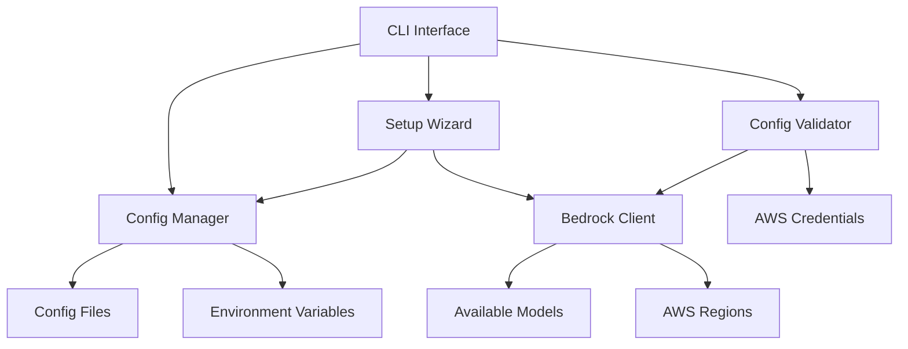

# Design Document

## Overview

This design enhances the existing ThreatForest Bedrock integration with user-friendly configuration management, interactive setup workflows, and flexible model selection capabilities. The solution builds upon the existing robust `BedrockClient` and `ConfigManager` classes while adding new CLI commands and interactive wizards to improve the user experience.

## Architecture

### High-Level Architecture



### Component Integration

The design integrates with existing components:
- **BedrockClient**: Enhanced with model discovery and validation methods
- **ConfigManager**: Extended with interactive configuration workflows
- **CLI**: New commands for setup, model selection, and validation
- **Error Handler**: Enhanced with configuration-specific error handling

## Components and Interfaces

### 1. Enhanced CLI Commands

#### New Command Structure
```
tf setup                    # Interactive setup wizard
tf config model             # Model selection and configuration
tf config validate          # Validate current configuration
tf config reset             # Reset to defaults
tf config show --detailed   # Show detailed configuration with sources
```

#### Setup Wizard Interface
```python
class SetupWizard:
    def run_interactive_setup(self) -> ThreatForestConfig
    def detect_aws_credentials(self) -> CredentialStatus
    def configure_bedrock_settings(self) -> BedrockConfig
    def test_configuration(self, config: ThreatForestConfig) -> ValidationResult
    def save_configuration(self, config: ThreatForestConfig, scope: str) -> None
```

### 2. Model Discovery Service

#### BedrockModelDiscovery Class
```python
class BedrockModelDiscovery:
    def list_available_models(self, region: str) -> List[ModelInfo]
    def get_model_details(self, model_id: str) -> ModelDetails
    def validate_model_region_compatibility(self, model_id: str, region: str) -> bool
    def get_recommended_models(self, use_case: str) -> List[ModelInfo]
```

#### Model Information Structure
```python
@dataclass
class ModelInfo:
    model_id: str
    name: str
    provider: str
    description: str
    supported_regions: List[str]
    pricing_tier: str
    recommended_use_cases: List[str]
    max_tokens: int
    supports_streaming: bool
```

### 3. Configuration Validator

#### Enhanced Validation System
```python
class ConfigurationValidator:
    def validate_full_configuration(self, config: ThreatForestConfig) -> ValidationResult
    def validate_aws_credentials(self) -> CredentialValidation
    def validate_bedrock_access(self, config: BedrockConfig) -> BedrockValidation
    def validate_model_availability(self, model_id: str, region: str) -> ModelValidation
    def suggest_fixes(self, validation_result: ValidationResult) -> List[str]
```

#### Validation Result Structure
```python
@dataclass
class ValidationResult:
    is_valid: bool
    errors: List[ValidationError]
    warnings: List[ValidationWarning]
    suggestions: List[str]
    tested_components: Dict[str, bool]
```

### 4. Interactive Configuration Interface

#### Configuration Prompts
```python
class ConfigurationPrompts:
    def prompt_for_region(self, current: str = None) -> str
    def prompt_for_model(self, region: str, current: str = None) -> str
    def prompt_for_parameters(self, current: Dict[str, Any]) -> Dict[str, Any]
    def confirm_configuration(self, config: ThreatForestConfig) -> bool
    def prompt_for_scope(self) -> str  # user vs project level
```

## Data Models

### Enhanced Configuration Models

#### Extended BedrockConfig
```python
class BedrockConfig(BaseModel):
    region: str = "us-east-1"
    model: str = "anthropic.claude-3-sonnet-20240229-v1:0"
    api_key_source: str = "environment"
    timeout_seconds: int = 300
    
    # New fields for enhanced configuration
    temperature: float = Field(default=0.1, ge=0.0, le=1.0)
    max_tokens: int = Field(default=4000, ge=1, le=100000)
    top_p: float = Field(default=0.9, ge=0.0, le=1.0)
    custom_parameters: Dict[str, Any] = Field(default_factory=dict)
    last_validated: Optional[datetime] = None
    validation_status: str = "unknown"
```

#### Configuration Metadata
```python
@dataclass
class ConfigurationMetadata:
    source: str  # "user", "project", "environment", "default"
    file_path: Optional[str]
    last_modified: datetime
    validation_status: str
    validation_errors: List[str]
```

## Error Handling

### Configuration-Specific Error Types

```python
class ConfigurationError(Exception):
    """Base class for configuration errors."""
    pass

class CredentialError(ConfigurationError):
    """AWS credential related errors."""
    pass

class ModelAvailabilityError(ConfigurationError):
    """Model availability and compatibility errors."""
    pass

class ValidationError(ConfigurationError):
    """Configuration validation errors."""
    pass
```

### Error Recovery Strategies

1. **Credential Issues**: Guide user through AWS credential setup
2. **Model Unavailability**: Suggest alternative models or regions
3. **Network Issues**: Provide offline validation and retry mechanisms
4. **Configuration Corruption**: Offer to reset to defaults with backup

## Testing Strategy

### Unit Tests

1. **Setup Wizard Tests**
   - Test interactive flows with mocked user input
   - Validate configuration generation
   - Test error handling for invalid inputs

2. **Model Discovery Tests**
   - Mock Bedrock API responses
   - Test model filtering and recommendation logic
   - Validate region compatibility checks

3. **Configuration Validator Tests**
   - Test validation logic for various configuration states
   - Mock AWS credential validation
   - Test suggestion generation

4. **CLI Command Tests**
   - Test all new CLI commands with various parameters
   - Validate output formatting and user experience
   - Test error scenarios and help text

### Integration Tests

1. **End-to-End Setup Flow**
   - Test complete setup wizard with real AWS credentials
   - Validate configuration persistence
   - Test configuration loading and validation

2. **Model Selection Workflow**
   - Test model discovery with real Bedrock API
   - Validate model switching and configuration updates
   - Test cross-region model availability

3. **Configuration Management**
   - Test hierarchical configuration loading
   - Validate user vs project level configuration precedence
   - Test configuration migration and updates

### User Experience Tests

1. **Interactive Flow Testing**
   - Test setup wizard with various user scenarios
   - Validate help text and error messages
   - Test configuration modification workflows

2. **Error Scenario Testing**
   - Test behavior with invalid AWS credentials
   - Test network connectivity issues
   - Test invalid model/region combinations

## Implementation Considerations

### Backward Compatibility

- All existing configuration files remain valid
- New fields have sensible defaults
- Existing CLI commands continue to work unchanged
- Migration path for users with existing setups

### Security Considerations

- Never store AWS credentials in configuration files
- Validate all user inputs to prevent injection attacks
- Use secure credential detection methods
- Provide clear warnings about credential security

### Performance Considerations

- Cache model discovery results to avoid repeated API calls
- Implement async validation for better user experience
- Use connection pooling for Bedrock API calls
- Optimize configuration loading for large projects

### User Experience Principles

- Progressive disclosure: Start simple, allow advanced configuration
- Clear error messages with actionable suggestions
- Consistent CLI interface patterns
- Helpful defaults that work for most users
- Non-destructive operations with confirmation prompts