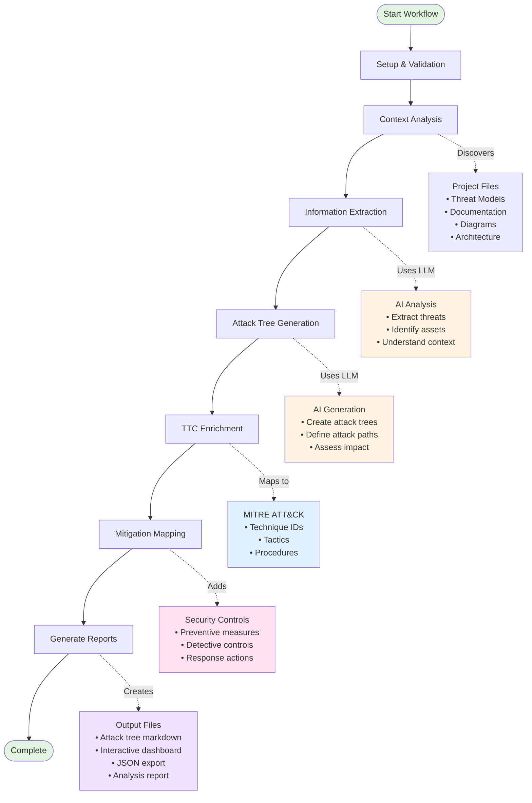

# 🌳 ThreatForest

ThreatForest is an AI-powered threat modeling tool that automatically generates comprehensive attack trees and security analysis for your applications. Built on the [Strands](https://github.com/awslabs/strands) agentic framework, ThreatForest orchestrates multiple AI agents to analyze your systems using Large Language Models (LLMs) and MITRE ATT&CK framework integration. It transforms your project documentation and threat models into actionable security insights with detailed attack paths and mitigation strategies.

## Table of Contents
- [Features](#features)
- [How It Works](#how-it-works)
- [Installation](#installation)
- [Usage](#usage)
- [Workflow Options](#workflow-options)
- [Input Files](#input-files)
- [Output Structure](#output-structure)
- [IDE Integration](#ide-integration)
- [Data Privacy Considerations](#data-privacy-considerations)
- [Contributing](#contributing)
- [License](#license)

## Features

- **🔄 Strands-Powered Architecture**: Built on AWS Labs' [Strands](https://github.com/awslabs/strands) agentic framework for reliable, orchestrated AI workflows with state management and error recovery
- **🤖 Multi-Agent Orchestration**: Coordinates specialized AI agents for context analysis, threat extraction, attack tree generation, and mitigation mapping
- **🤖 AI-Powered Analysis**: Leverages LLMs (AWS Bedrock, Anthropic, OpenAI, Google Gemini, Ollama) to analyze your application and generate threat models
- **🌳 Attack Tree Generation**: Automatically creates detailed attack trees for identified threats with step-by-step attack paths
- **🎯 MITRE ATT&CK Integration**: Maps attack steps to MITRE ATT&CK techniques (TTC) for industry-standard threat intelligence
- **🛡️ Mitigation Recommendations**: Provides actionable security controls and countermeasures for each identified threat
- **📊 Interactive Dashboard**: Visualizes attack trees with an interactive HTML dashboard using vis-network
- **🔄 Flexible Workflows**: Run full analysis or individual stages (generation, enrichment, mitigation) independently
- **📁 Multiple Input Formats**: Supports ThreatComposer workspaces, custom threat models, architecture diagrams, and documentation
- **🎨 Rich CLI Interface**: Beautiful terminal UI with progress tracking and step-by-step guidance
- **💾 State Management**: Resume interrupted workflows from checkpoints with Strands-based state persistence
- **🔌 Kiro IDE Integration**: Edit ThreatComposer files and get instant attack tree generation by using a Kiro hook
- **🔒 No Data Storage**: Application details are processed locally and not stored by ThreatForest

## How It Works

ThreatForest uses a multi-stage workflow to transform your application context into comprehensive security analysis:



### Workflow Stages

1. **Setup & Validation** (5%)
   - Validates AWS credentials and Bedrock access
   - Checks project structure and permissions
   - Initializes logging and state management

2. **Context Analysis** (10-20%)
   - Discovers threat models (ThreatComposer, JSON, YAML)
   - Identifies documentation files (README, architecture docs)
   - Locates architecture diagrams (PNG, PDF, Mermaid, DrawIO)
   - Uses Strands `file_read` tool for intelligent document processing
   - Categorizes files by relevance and type

3. **Information Extraction** (20-40%)
   - Uses LLM to analyze project context
   - Extracts application details (name, technologies, architecture)
   - Identifies or generates threat statements
   - Prioritizes threats by severity (High/Medium/Low)
   - Extracts assets, data flows, and trust boundaries

4. **Attack Tree Generation** (40-70%)
   - Generates detailed attack trees for high-priority threats
   - Creates step-by-step attack paths with prerequisites
   - Assesses impact and likelihood for each path
   - Produces markdown files and Mermaid diagrams
   - Tracks progress with state management for resume capability

5. **TTP Enrichment** (70-85%)
   - Maps attack steps to MITRE ATT&CK techniques
   - Uses semantic similarity matching with embeddings
   - Adds technique IDs, tactics, and descriptions
   - Enriches attack trees with industry-standard intelligence

6. **Mitigation Mapping** (85-95%)
   - Identifies security controls for each technique
   - Provides preventive, detective, and responsive measures
   - Adds implementation guidance and best practices
   - Creates comprehensive mitigation strategies

7. **Report Generation** (95-100%)
   - Generates interactive HTML dashboard
   - Creates JSON export for programmatic access
   - Produces markdown analysis report
   - Compiles summary statistics and metrics

## Installation

### Prerequisites

- **Python 3.8+** installed
- **AWS Account** with Bedrock access (if using AWS Bedrock)
- **AWS CLI** configured (for AWS providers)
- **Node.js 14+** (for UI components)

### Installation

1. Clone the repository:
```bash
git clone https://github.com/yourusername/threatforest.git
cd threatforest
```

2. Create and activate virtual environment:
```bash
# Create virtual environment
python3 -m venv venv

# Activate virtual environment
# On macOS/Linux:
source venv/bin/activate
# On Windows:
venv\Scripts\activate
```

3. Install Python dependencies:
```bash
pip install -r requirements.txt
```

4. Configure your settings:
```bash
# Copy example configuration
cp config.yaml.example config.yaml

# Edit config.yaml with your settings
nano config.yaml
```

5. Set up environment variables (optional):
```bash
# Copy example environment file
cp .env.example .env

# Edit .env with your API keys
nano .env
```


## Usage

### Interactive CLI Mode (Primary Method)

Run ThreatForest with the interactive wizard:

```bash
# Activate virtual environment
source venv/bin/activate

# Run ThreatForest wizard
python threatforest.py
```

The wizard will guide you through:
1. **Mode Selection** - Choose workflow option (Full/Enrich/Mitigate)
2. **Configuration** - AWS profile, model selection, project path
3. **Analysis** - Run selected workflow with progress tracking
4. **Results** - View summary and access output files

### Kiro IDE Integration (Alternative Method)

ThreatForest seamlessly integrates with [Kiro IDE](https://kiro.dev) to provide automatic threat analysis whenever you save ThreatComposer files. This enables a live threat modeling workflow where you can iterate on threats and immediately see the generated attack trees.

For complete setup instructions, troubleshooting, and advanced configuration, see the dedicated [IDE Integration](#ide-integration) section below.


## Workflow Options

ThreatForest offers three workflow modes that can be run independently or sequentially:

### 🌳 Full Analysis (Option 1)

Generate complete attack trees from your project:

**Input:**
- Project directory with documentation
- Optional threat model file
- Architecture diagrams

**Process:**
1. Analyzes project context
2. Extracts or generates threats
3. Creates attack trees for high-priority threats
4. Maps to MITRE ATT&CK techniques
5. Adds mitigation recommendations

**Output:** `project/threatforest/attack_trees/`

```bash
python -m src.cli run --project-path /path/to/project
```

### TTP  Enrichment (Option 2)

Add MITRE ATT&CK technique mappings to existing attack trees:

**Input:** Attack trees from Option 1

**Process:**
1. Reads attack tree markdown files
2. Extracts attack steps
3. Maps to MITRE ATT&CK techniques using semantic similarity
4. Enriches trees with technique IDs and descriptions

**Output:** `project/threatforest/enriched/`

```bash
python -m src.cli run --mode enrich \
  --input-dir ./project/threatforest/attack_trees \
  --output-dir ./project/threatforest/enriched
```

### 🛡️ Mitigation Mapping (Option 3)

Add security controls and mitigation strategies:

**Input:** Enriched attack trees from Option 2

**Process:**
1. Reads enriched attack trees
2. Identifies applicable security controls
3. Adds mitigation strategies for each technique
4. Provides implementation guidance

**Output:** `project/threatforest/mitigated/`

```bash
python -m src.cli run --mode mitigate \
  --input-dir ./project/threatforest/enriched \
  --output-dir ./project/threatforest/mitigated
```

## Input Files

ThreatForest is flexible and works with various input combinations. Threat models are recommended but not required - ThreatForest can generate threats using AI analysis.

### Threat Models (Recommended)

#### ThreatComposer Workspace Files ⭐ **RECOMMENDED**
- **Create at**: https://awslabs.github.io/threat-composer/
- **File patterns**: `*.tc`, `*ThreatComposer*.json`
- **Best for**: Comprehensive threat modeling with priorities
- **Contains**: Threat statements, priorities, application context

**How to create:**
1. Visit https://awslabs.github.io/threat-composer/
2. Create workspace with application details
3. Add threat statements with High/Medium/Low priorities
4. Export workspace as `.tc` file
5. Place in project directory

#### Custom Threat Model Files
- **Files**: Any file with where you have a threat model, e.g. `threats.json`, `security.yaml`, `threat-model.md`
- **Format**: JSON/YAML/Markdown


### Documentation Files

ThreatForest uses the Strands framework's advanced `file_read.py` tool for intelligent document processing with multifaceted capabilities including automatic format detection, content extraction, and semantic analysis.

#### README and Markdown Files
- **Files**: `README.md`, `ARCHITECTURE.md`, `*.md`, `PDF`
- **Processing**: Strands `file_read` tool automatically extracts and analyzes content
- **Should include**:
  - Application description and purpose
  - Technology stack and dependencies
  - Architecture overview
  - Security considerations

#### Architecture Diagrams
- **Formats**: `*.png`, `*.pdf`, `*.jpg`, `*.jpeg`, `*.drawio`, `*.mmd`, `*.puml`
- **Should show**:
  - System components and services
  - Data flows and boundaries
  - Network topology
  - External dependencies

## Output Structure

ThreatForest creates a comprehensive output directory structure:

```
project/
└── threatforest/
    ├── attack_trees/                          # Option 1 output
    │   ├── .threatforest_state.json          # State tracking
    │   ├── attack_tree_T001_sql_injection.md # Individual attack trees
    │   ├── attack_tree_T002_xss_attack.md
    │   ├── attack_trees_dashboard.html       # Interactive visualization
    │   ├── threatforest_data.json            # JSON export
    │   └── threatforest_analysis_report.md   # Summary report
    │
    ├── enriched/                              # Option 2 output
    │   ├── enriched_attack_tree_T001.md      # TTC-enriched trees
    │   └── enriched_attack_tree_T002.md
    │
    └── mitigated/                             # Option 3 output
        ├── mitigated_enriched_attack_tree_T001.md  # With mitigations
        └── mitigated_enriched_attack_tree_T002.md
```

### Output Files

#### Interactive Dashboard (`attack_trees_dashboard.html`) ⭐ **PRIMARY OUTPUT**

The HTML dashboard is the **recommended way to review and explore your attack trees**. It provides an interactive, visual experience that makes understanding complex attack paths intuitive and engaging.

**Features:**
- **Visual Network Graph**: See all attack trees and their relationships at a glance
- **Interactive Node Exploration**: Click nodes to view detailed threat information, attack steps, and MITRE ATT&CK mappings
- **Dynamic Filtering**: Filter by threat severity, MITRE techniques, or attack complexity
- **Search Capabilities**: Quickly find specific threats or attack patterns
- **Zoom and Pan**: Navigate large attack trees with smooth controls
- **Export Options**: Save views or share with team members
- **Real-time Updates**: Automatically refreshes when new analysis completes

**Why Use the Dashboard:**
- 🎯 **Faster Analysis**: Visualize relationships between threats instantly
- 🔍 **Better Understanding**: Interactive exploration reveals attack path dependencies
- 📊 **Executive Presentations**: Professional visualizations for stakeholder reviews
- 🔗 **Connected Intelligence**: See how different threats relate to each other
- 💡 **Pattern Recognition**: Identify common attack vectors across your application

**Opening the Dashboard:**
```bash
# Automatically opens after analysis completes (Kiro integration)
# Or manually open:
open project/threatforest/attack_trees/attack_trees_dashboard.html
```

#### Attack Tree Markdown (`attack_tree_*.md`)

Individual markdown files for each threat, useful for version control and detailed review.

**Contents:**
- Threat description and context
- Step-by-step attack paths with prerequisites
- Impact assessment and likelihood
- Mermaid diagram visualization
- MITRE ATT&CK technique mappings (if enriched)
- Mitigation recommendations (if mitigated)

**Use Cases:**
- Version control tracking of threat evolution
- Detailed technical review and documentation
- Integration with documentation systems
- Offline review and annotation

#### JSON Export (`threatforest_data.json`)

Structured data export for programmatic access and integration.

**Contents:**
- All attack trees with complete metadata
- Threat statements and priorities
- MITRE ATT&CK mappings
- Generation timestamps and configuration
- Application context and assets

**Use Cases:**
- Integration with security tools (SIEM, ticketing systems)
- Custom reporting and analytics
- Automated compliance checking
- CI/CD pipeline integration

#### Analysis Report (`threatforest_analysis_report.md`)

Executive summary and statistics for high-level overview.

**Contents:**
- Executive summary of findings
- Threat statistics and severity distribution
- Coverage analysis (threats analyzed vs. total)
- Key recommendations and next steps
- MITRE ATT&CK technique coverage

**Use Cases:**
- Executive briefings and status reports
- Security posture documentation
- Audit and compliance evidence
- Team communication and planning

## IDE Integration

### Kiro IDE Integration

ThreatForest seamlessly integrates with [Kiro IDE](https://kiro.dev) to provide automatic threat analysis whenever you save ThreatComposer files. This enables a live threat modeling workflow where you can iterate on threats and immediately see the generated attack trees.

#### Why Use Kiro Integration?

- **⚡ Instant Feedback**: See attack trees generated within seconds of saving your threat model
- **🔄 Iterative Workflow**: Refine threats and immediately see updated analysis
- **🎯 Zero Context Switching**: Stay in your IDE while ThreatForest runs in the background
- **📊 Automatic Dashboard**: Interactive visualization updates automatically
- **💾 Version Control Friendly**: All outputs are saved in your project directory

#### Setup Instructions

##### Step 1: Install Kiro IDE

Download and install Kiro IDE from [kiro.dev](https://kiro.dev)

##### Step 2: Open Your Project in Kiro

```bash
# Open your project directory in Kiro IDE
kiro /path/to/your/project
```

##### Step 3: Create the Hook Configuration

**Option A: Using Kiro UI (Recommended)**

1. Open Kiro IDE
2. Open Command Palette (`Cmd+Shift+P` on Mac, `Ctrl+Shift+P` on Windows/Linux)
3. Search for "Open Kiro Hook UI"
4. Click "Create New Hook"
5. Fill in the following details:

   - **Name**: `ThreatForest Analysis`
   - **Description**: `Automatically analyze ThreatComposer files on save`
   - **Trigger**: Select "File Edited"
   - **File Pattern**: `**/*.tc.json`
   - **Action**: Select "Ask Agent"
   - **Prompt**: 
     ```
     execute the following script on the file that was just saved /absolute/path/to/ThreatForest/src/modules/utils/kiro_wrapper.sh {file}
     ```
     
     **Important**: Replace `/absolute/path/to/ThreatForest` with your actual ThreatForest installation path

6. Click "Save Hook"
7. Ensure the hook is **Enabled** (toggle should be green)

**Option B: Manual Configuration**

Create a file at `.kiro/hooks/threatforest-analysis.kiro.hook` in your project:

```json
{
  "enabled": true,
  "name": "ThreatForest Analysis",
  "description": "Automatically analyze ThreatComposer files on save",
  "version": "1",
  "when": {
    "type": "fileEdited",
    "patterns": [
      "**/*.tc.json"
    ]
  },
  "then": {
    "type": "askAgent",
    "prompt": "execute the following script on the file that was just saved /absolute/path/to/ThreatForest/src/modules/utils/kiro_wrapper.sh {file}"
  },
  "shortName": "threatforest-analysis",
  "workspaceFolderName": "your-project-name"
}
```

**Important**: Update these values:
- Replace `/absolute/path/to/ThreatForest` with your ThreatForest installation path
- Replace `your-project-name` with your actual project folder name

##### Step 4: Configure ThreatForest

Ensure your `config.yaml` has the correct settings:

```yaml
# Model configuration (required)
bedrock:
  enabled: true
  model_id: "anthropic.claude-3-sonnet-20240229-v1:0"
  region: "us-east-1"

# AWS configuration
aws:
  default_profile: "default"
  default_region: "us-east-1"

# Kiro integration (optional - for additional features)
kiro_integration:
  enabled: true
  auto_run_on_save: true
```

##### Step 5: Test the Integration

1. Open a ThreatComposer file (`.tc.json`) in Kiro IDE
2. Make a change (e.g., add a new threat or update priority)
3. Save the file (`Cmd+S` or `Ctrl+S`)
4. Watch Kiro's agent panel - you should see:
   ```
   ✓ Using virtual environment: venv
   ThreatForest Kiro Hook
   🔍 ThreatForest Analysis Triggered
   📁 File: your-file.tc.json
   🚀 Starting ThreatForest analysis...
   ```
5. Wait for completion (typically 60-120 seconds)
6. Check output directory: `your-project/threatforest/attack_trees/`

#### Workflow Example

Here's a typical workflow using Kiro integration:

```bash
# 1. Create or edit threat model in ThreatComposer
# Visit https://awslabs.github.io/threat-composer/
# Export as MyApp.tc.json

# 2. Open project in Kiro IDE
kiro /path/to/my-project

# 3. Copy ThreatComposer file to project
cp ~/Downloads/MyApp.tc.json /path/to/my-project/

# 4. Open file in Kiro and make edits
# - Add new threats
# - Update priorities
# - Refine descriptions

# 5. Save file (Cmd+S)
# ThreatForest automatically runs!

# 6. View results
open my-project/threatforest/attack_trees/attack_trees_dashboard.html
```

#### Hook Output Location

When triggered via Kiro hook, ThreatForest creates outputs in:

```
your-project/
└── threatforest/
    └── attack_trees/
        ├── attack_tree_*.md              # Individual attack trees
        ├── attack_trees_dashboard.html   # Interactive visualization
        ├── threatforest_data.json        # JSON export
        └── threatforest_analysis_report.md  # Summary report
```

#### Troubleshooting Kiro Integration

##### Hook Not Triggering

**Check hook is enabled:**
```bash
# View hook status in Kiro
# Open Command Palette → "List Agent Hooks"
```

**Verify file pattern matches:**
- Hook pattern: `**/*.tc.json`
- Your file must end with `.tc.json`
- Try renaming: `threats.json` → `threats.tc.json`

**Check Kiro logs:**
```bash
# View Kiro output panel
# Look for hook execution messages
```

##### Script Path Issues

**Error: "Script not found"**

Solution: Use absolute path in hook configuration:
```json
{
  "prompt": "execute the following script on the file that was just saved /Users/yourname/ThreatForest/src/modules/utils/kiro_wrapper.sh {file}"
}
```

**Find your ThreatForest path:**
```bash
cd /path/to/ThreatForest
pwd
# Copy this absolute path
```

##### Virtual Environment Issues

**Error: "venv not found"**

Solution: Ensure virtual environment exists:
```bash
cd /path/to/ThreatForest
python3 -m venv venv
source venv/bin/activate
pip install -r requirements.txt
```

The wrapper script automatically activates the venv, but it must exist first.

##### AWS Credentials Issues

**Error: "Bedrock access failed"**

Solution: Configure AWS credentials:
```bash
# Set AWS profile
export AWS_PROFILE=default

# Or configure credentials
aws configure

# Test Bedrock access
aws bedrock list-foundation-models --region us-east-1
```

##### Permission Issues

**Error: "Permission denied"**

Solution: Make wrapper script executable:
```bash
chmod +x /path/to/ThreatForest/src/modules/utils/kiro_wrapper.sh
```

#### Advanced Configuration

##### Custom Output Directory

Modify the wrapper script to use custom output location:

```bash
# Edit src/modules/utils/kiro_wrapper.sh
# Add OUTPUT_DIR environment variable
export OUTPUT_DIR="/custom/path/output"
```

##### Multiple File Patterns

Support additional file patterns:

```json
{
  "when": {
    "type": "fileEdited",
    "patterns": [
      "**/*.tc.json",
      "**/threats.json",
      "**/security/*.json"
    ]
  }
}
```

##### Conditional Execution

Only run for specific directories:

```json
{
  "when": {
    "type": "fileEdited",
    "patterns": [
      "security/**/*.tc.json",
      "threat-models/**/*.tc.json"
    ]
  }
}
```

#### Manual Testing

Test the hook manually without Kiro:

```bash
# Test wrapper script directly
/path/to/ThreatForest/src/modules/utils/kiro_wrapper.sh /path/to/your/file.tc.json

# Test Python handler
cd /path/to/ThreatForest
source venv/bin/activate
python3 src/modules/utils/kiro_hook.py /path/to/your/file.tc.json
```

#### Benefits Summary

| Feature | Without Kiro | With Kiro Integration |
|---------|--------------|----------------------|
| **Trigger** | Manual CLI command | Automatic on save |
| **Feedback** | Terminal output | IDE notifications |
| **Context Switching** | Leave IDE to run CLI | Stay in IDE |
| **Iteration Speed** | Slow (manual steps) | Fast (instant) |
| **Dashboard Access** | Manual open | Auto-generated |
| **Version Control** | Manual commit | Automatic tracking |

#### Next Steps

After setting up Kiro integration:

1. **Create Threat Models**: Use ThreatComposer to create comprehensive threat models
2. **Iterate Quickly**: Edit threats and see results immediately
3. **Review Outputs**: Check generated attack trees and dashboard
4. **Refine Analysis**: Update threat priorities based on attack tree insights
5. **Share Results**: Commit generated files to version control

**📖 Additional Resources**:
- [Kiro IDE Documentation](https://docs.kiro.dev)
- [ThreatComposer Guide](https://awslabs.github.io/threat-composer/)
- [ThreatForest Kiro Integration Guide](docs/KIRO_INTEGRATION.md)

## Data Privacy Considerations

### What Data is Sent to LLM Providers

When you run ThreatForest, the following data is sent to your chosen LLM provider (AWS Bedrock, Anthropic, OpenAI, etc.):

- **Application details**: Name, description, technology stack
- **Architecture information**: System components, data flows, trust boundaries
- **Threat statements**: Identified threats and their descriptions
- **Documentation content**: README files, architecture documents
- **Diagram descriptions**: Analysis of uploaded architecture diagrams

### What This Means

- **OpenAI, Anthropic, Google, etc.** may log this data per their privacy policies
- **AWS Bedrock** follows AWS data handling policies
- **Local models (Ollama)** keep all data on your machine

### Best Practices

1. **For Demonstrations**: Use generic or fictional system details
2. **For Sensitive Systems**: 
   - Use local models (Ollama)
   - Use providers with stricter privacy guarantees
   - Sanitize system descriptions before input
3. **Review Policies**: Check your LLM provider's data retention and privacy policies
4. **Consider Compliance**: Ensure your usage meets organizational data handling requirements

### Local Deployment Options

For maximum privacy, ThreatForest supports local LLM deployment:

```yaml
# config.yaml
ollama:
  enabled: true
  base_url: "http://localhost:11434"
  model_id: "llama3:70b"
```

## Configuration

### config.yaml

ThreatForest uses a YAML configuration file for settings:

```yaml
# Model Provider Configuration
bedrock:
  enabled: true
  model_id: "anthropic.claude-3-sonnet-20240229-v1:0"
  region: "us-east-1"

# Alternative: Anthropic Direct
anthropic:
  enabled: false
  model_id: "claude-3-sonnet-20240229"
  api_key: "${ANTHROPIC_API_KEY}"

# Alternative: OpenAI
openai:
  enabled: false
  model_id: "gpt-4-turbo-preview"
  api_key: "${OPENAI_API_KEY}"

# Alternative: Local Ollama
ollama:
  enabled: false
  base_url: "http://localhost:11434"
  model_id: "llama3:70b"

# Embeddings Configuration
embeddings:
  model: "cisco-ai/SecureBERT2.0-biencoder"
  graph_file: "data/graphs/mitre_attack_graph.json"
  ttc_threshold: 0.3

# AWS Configuration
aws:
  default_profile: "default"
  default_region: "us-east-1"
```

### Environment Variables

Create a `.env` file for sensitive credentials:

```bash
# AWS Credentials
AWS_PROFILE=default
AWS_REGION=us-east-1

# API Keys (if not using AWS Bedrock)
ANTHROPIC_API_KEY=your_key_here
OPENAI_API_KEY=your_key_here
GOOGLE_API_KEY=your_key_here
```

## Troubleshooting

### Common Issues

#### "No threat models found"
**Solution**: Add a ThreatComposer export or create `threats.json` in your project directory. ThreatForest can also generate threats from documentation alone.

#### "Bedrock access failed"
**Solution**: 
1. Check AWS credentials: `aws sts get-caller-identity`
2. Verify Bedrock permissions in us-east-1
3. Request Bedrock model access in AWS Console

#### "externally-managed-environment"
**Solution**: Always use virtual environment:
```bash
python3 -m venv venv
source venv/bin/activate
pip install -r requirements.txt
```

#### Virtual Environment Issues
```bash
# Recreate virtual environment
rm -rf venv
python3 -m venv venv
source venv/bin/activate
pip install -r requirements.txt
```

### Getting Help

- Check AWS credentials: `aws configure list`
- Test Bedrock access: `aws bedrock list-foundation-models --region us-east-1`
- Review logs: `./output/threatforest.log`
- Open an issue: https://github.com/yourusername/threatforest/issues

## Security

ThreatForest follows security best practices:

- ✅ No data storage - all processing is ephemeral
- ✅ Automated security scanning (Bandit, Semgrep, ASH)
- ✅ Dependency vulnerability monitoring (Dependabot)
- ✅ Regular security audits
- ✅ Secure credential handling

**Security Report**: See [docs/ASH_SECURITY_SCAN_REPORT.md](docs/ASH_SECURITY_SCAN_REPORT.md) for latest security scan results.

**Reporting Issues**: Found a security issue? Please report it responsibly via GitHub Security Advisories.

## Contributing

Contributions are welcome! Please follow these guidelines:

1. Fork the repository
2. Create a feature branch (`git checkout -b feature/amazing-feature`)
3. Commit your changes (`git commit -m 'Add amazing feature'`)
4. Push to the branch (`git push origin feature/amazing-feature`)
5. Open a Pull Request

### Development Setup

```bash
# Clone your fork
git clone https://github.com/yourusername/threatforest.git
cd threatforest

# Create virtual environment
python3 -m venv venv
source venv/bin/activate

# Install development dependencies
pip install -r requirements.txt
pip install -r requirements-dev.txt

# Run tests
pytest tests/

# Run security scans
bandit -r src/
```

## License

[MIT](https://choosealicense.com/licenses/mit/)

## Acknowledgments

- **AWS ThreatComposer** - Excellent threat modeling tool and inspiration
- **MITRE ATT&CK** - Comprehensive threat intelligence framework
- **STRIDE GPT** - Inspiration for AI-powered threat modeling
- **AWS Bedrock** - Powerful LLM infrastructure
- **vis-network** - Interactive graph visualization

---

**Ready to start?** Follow the [Installation](#installation) guide and run your first threat analysis!

For questions, issues, or feature requests, please visit our [GitHub repository](https://github.com/yourusername/threatforest).
