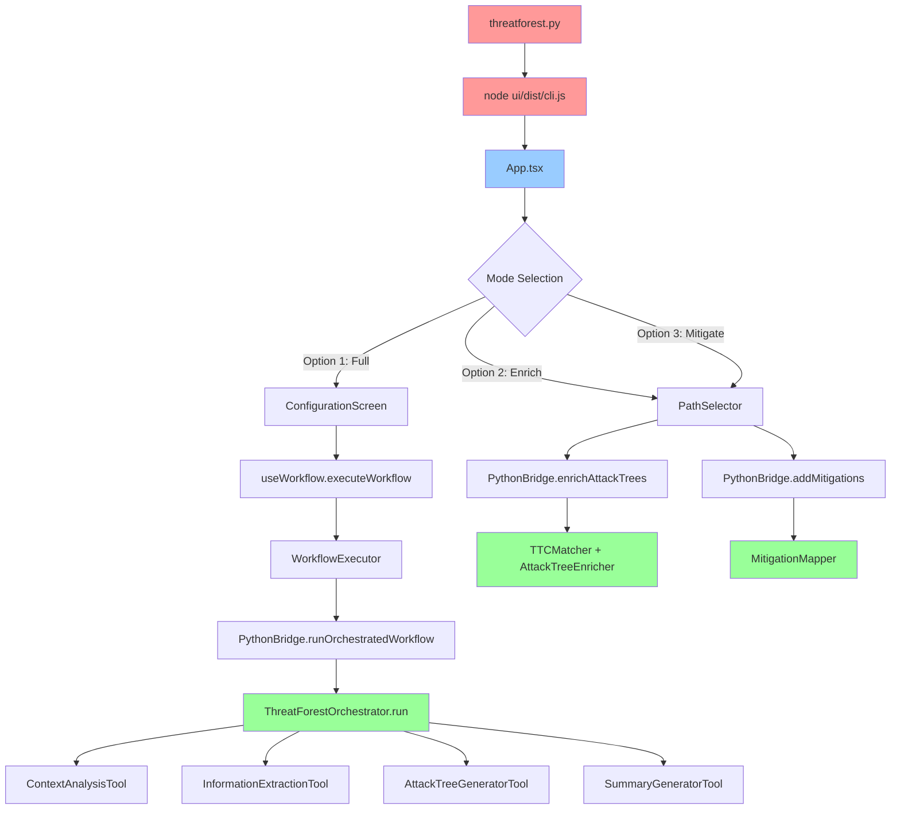

# Task 0.1: Entry Points and Execution Flow Analysis

**Backlog Reference**: [docs/Backlog.md - Task 0.1](../Backlog.md#task-01-map-application-entry-points-and-execution-flow)

## Objective
Create a complete execution flow diagram from entry points to all reachable code.

## Analysis Results

### 1. Primary Entry Point Analysis
✅ **Entry Point**: `threatforest.py`
- Activates venv if exists
- Launches React UI: `node ui/dist/cli.js`
- Passes venv python path to UI via `PYTHON_PATH` env var

✅ **UI Entry**: `ui/dist/cli.js` (built from `ui/src/`)
- Main component: `App.tsx`
- Uses `useWorkflow` hook for state management
- Imports `PythonBridge` for Python communication

### 2. E2E Test Analysis (Supplementary)
✅ **E2E Entry Point**: `tests/automated_e2e_test.py`
- Directly imports: `from strands_agent import ThreatForestOrchestrator, ThreatForestConfig`
- Bypasses UI entirely
- Calls: `await orchestrator.run()`
- Validates output files: threat_model.json, attack_trees.json, mitre_mappings.json

**Note**: E2E test shows core workflow without UI layer

### 3. Python Bridge Analysis
✅ **Python Bridge**: `ui/src/utils/pythonBridge.ts`

**All Python Methods Called from UI:**

1. **enrichAttackTrees(inputDir, outputDir)**
   - Imports: `from src.modules.ttc_mappings import TTCMatcher, AttackTreeEnricher`
   - Used in: Option 2 (Enrich mode)

2. **addMitigations(inputDir, outputDir)**
   - Imports: `from src.modules.ttc_mappings.mitigation_mapper import MitigationMapper`
   - Imports: `from src.config import config`
   - Used in: Option 3 (Mitigate mode)

3. **discoverFiles(projectPath)**
   - Imports: `from src.modules.core.file_discovery import FileDiscovery`
   - Used in: Configuration screen

4. **loadState(projectPath)**
   - Imports: `from src.modules.core.state_manager import StateManager`
   - Used in: Resume functionality

5. **saveState(state, projectPath)**
   - Imports: `from src.modules.core.state_manager import StateManager`
   - Imports: `from src.modules.core.state import ThreatForestState`
   - Used in: State persistence

6. **validateInput(inputType, data)**
   - Imports: `from src.modules.core.validation import ${className}` (dynamic)
   - Used in: Input validation

7. **getAwsProfiles()**
   - Imports: `from src.modules.utils.logger import ThreatForestLogger`
   - Used in: AWS profile selection

8. **validateAwsCredentials(awsProfile)**
   - Imports: `from src.modules.utils.logger import ThreatForestLogger`
   - Used in: AWS credential validation

9. **parseThreats(content, filePath)**
   - No direct imports shown
   - Used in: Threat parsing

10. **runContextAnalysis(projectPath)**
    - Imports: `from src.modules.utils.logger import ThreatForestLogger`
    - Imports: `from src.modules.tools.context_analysis_tool import ContextAnalysisTool`
    - Used in: Option 1 workflow

11. **runInformationExtraction(params)**
    - Imports: `from src.modules.tools.information_extraction_tool import InformationExtractionTool`
    - Imports: `from src.modules.utils.logger import ThreatForestLogger`
    - Used in: Option 1 workflow

12. **runAttackTreeGeneration(params)**
    - Imports: `from src.modules.tools.attack_tree_generator_tool import AttackTreeGeneratorTool`
    - Imports: `from src.modules.utils.logger import ThreatForestLogger`
    - Used in: Option 1 workflow

13. **runSummaryGeneration(params)**
    - Imports: `from src.modules.tools.summary_generator_tool import SummaryGeneratorTool`
    - Imports: `from src.modules.utils.logger import ThreatForestLogger`
    - Used in: Option 1 workflow

14. **runOrchestratedWorkflow(params)**
    - Imports: `from src.strands_agent import ThreatForestOrchestrator, ThreatForestConfig`
    - Imports: `from src.modules.utils.logger import ThreatForestLogger`
    - Used in: Option 1 full workflow

### 4. UI Component Tree
✅ **React Components Used:**

**App.tsx** (root)
├── WelcomeScreen.tsx (mode selection)
├── PathSelector.tsx (for enrich/mitigate modes)
├── ConfigurationScreen.tsx (AWS/model config)
├── ProgressScreen.tsx (workflow progress)
│   └── ProgressDetails.tsx (detailed progress)
├── SummaryScreen.tsx (results display)
├── ContinuePrompt.tsx (continue to next option)
└── ErrorDisplay.tsx (error handling)

**Hooks:**
- useWorkflow.ts (workflow state management)
  - Uses: WorkflowExecutor from utils/workflowExecutor.ts

**Utils:**
- pythonBridge.ts (Python communication)
- workflowExecutor.ts (workflow orchestration)

### 5. Direct Python Module Imports (from Bridge)

**Core Modules:**
- ✅ `src.modules.core.file_discovery` → FileDiscovery
- ✅ `src.modules.core.state_manager` → StateManager
- ✅ `src.modules.core.state` → ThreatForestState
- ✅ `src.modules.core.validation` → (dynamic class loading)

**Tools:**
- ✅ `src.modules.tools.context_analysis_tool` → ContextAnalysisTool
- ✅ `src.modules.tools.information_extraction_tool` → InformationExtractionTool
- ✅ `src.modules.tools.attack_tree_generator_tool` → AttackTreeGeneratorTool
- ✅ `src.modules.tools.summary_generator_tool` → SummaryGeneratorTool

**TTC Mappings:**
- ✅ `src.modules.ttc_mappings` → TTCMatcher, AttackTreeEnricher
- ✅ `src.modules.ttc_mappings.mitigation_mapper` → MitigationMapper

**Utils:**
- ✅ `src.modules.utils.logger` → ThreatForestLogger

**Agent:**
- ✅ `src.strands_agent` → ThreatForestOrchestrator, ThreatForestConfig

**Config:**
- ✅ `src.config` → config

## Execution Flow Diagram

## Reachable Python Modules (from UI)

### Confirmed Used:
1. `src/strands_agent.py` - ThreatForestOrchestrator, ThreatForestConfig
2. `src/config.py` - config
3. `src/modules/core/file_discovery.py` - FileDiscovery
4. `src/modules/core/state_manager.py` - StateManager
5. `src/modules/core/state.py` - ThreatForestState
6. `src/modules/core/validation.py` - (dynamic validation classes)
7. `src/modules/tools/context_analysis_tool.py` - ContextAnalysisTool
8. `src/modules/tools/information_extraction_tool.py` - InformationExtractionTool
9. `src/modules/tools/attack_tree_generator_tool.py` - AttackTreeGeneratorTool
10. `src/modules/tools/summary_generator_tool.py` - SummaryGeneratorTool
11. `src/modules/ttc_mappings/__init__.py` - TTCMatcher, AttackTreeEnricher
12. `src/modules/ttc_mappings/mitigation_mapper.py` - MitigationMapper
13. `src/modules/utils/logger.py` - ThreatForestLogger

### Needs Further Analysis:
- All dependencies of the above modules
- Modules imported by ThreatForestOrchestrator
- Modules imported by the 4 main tools
- Parser modules (if used by tools)
- Bedrock client modules (if used by tools)

## Deliverables
- ✅ Execution flow diagram (Mermaid)
- ✅ List of reachable Python modules (13 confirmed from UI)
- ✅ List of reachable UI components (9 components + 2 utils)
- ✅ Data flow documentation (UI → PythonBridge → Python modules)

## Next Steps
- Task 0.2: Analyze dependencies of the 13 confirmed modules
- Task 0.2: Trace imports in strands_agent.py and tools
- Task 0.2: Build complete import dependency graph
