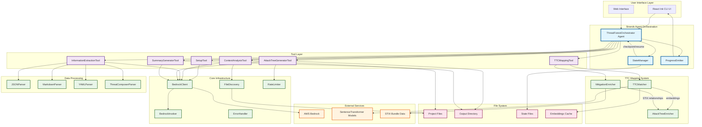

# ThreatForest Application Architecture

```mermaid
graph TB
    %% User Interface Layer
    subgraph "User Interface Layer"
        UI[React Ink CLI UI]
        WebUI[Web Interface]
    end

    %% Orchestration Layer - Strands Agent
    subgraph "Strands Agent Orchestration"
        TFO[ThreatForestOrchestrator Agent]
        SM[StateManager]
        PE[ProgressEmitter]
        
        TFO --> SM
        TFO --> PE
    end

    %% Tool Layer - Specialized Capabilities
    subgraph "Tool Layer"
        ST[SetupTool]
        CAT[ContextAnalysisTool] 
        IET[InformationExtractionTool]
        ATGT[AttackTreeGeneratorTool]
        TTCT[TTCMappingTool]
        SGT[SummaryGeneratorTool]
    end

    %% Core Infrastructure
    subgraph "Core Infrastructure"
        BC[BedrockClient]
        BI[BedrockInvoker]
        FD[FileDiscovery]
        RL[RateLimiter]
        EH[ErrorHandler]
        
        BC --> BI
    end

    %% TTC Mapping System
    subgraph "TTC Mapping System"
        TM[TTCMatcher]
        ME[MitigationEnricher]
        ATE[AttackTreeEnricher]
        
        TM --> |embeddings| ATE
        ME --> |STIX relationships| ATE
    end

    %% Data Processing
    subgraph "Data Processing"
        JP[JSONParser]
        MP[MarkdownParser]
        YP[YAMLParser]
        TCP[ThreatComposerParser]
    end

    %% External Services
    subgraph "External Services"
        AWS[AWS Bedrock]
        ST_MODELS[SentenceTransformer Models]
        STIX[STIX Bundle Data]
    end

    %% File System
    subgraph "File System"
        PROJECT[Project Files]
        OUTPUT[Output Directory]
        STATE[State Files]
        EMBEDDINGS[Embeddings Cache]
    end

    %% Workflow Connections
    UI --> TFO
    WebUI --> TFO
    
    TFO --> ST
    TFO --> CAT
    TFO --> IET
    TFO --> ATGT
    TFO --> TTCT
    TFO --> SGT

    %% Tool Dependencies
    ST --> BC
    CAT --> FD
    CAT --> BC
    IET --> BC
    IET --> JP
    IET --> MP
    IET --> YP
    IET --> TCP
    ATGT --> BC
    ATGT --> RL
    TTCT --> TM
    TTCT --> ME
    SGT --> BC

    %% Core Infrastructure Connections
    BC --> AWS
    TM --> ST_MODELS
    ME --> STIX
    FD --> PROJECT
    
    %% Data Flow
    CAT --> PROJECT
    ATGT --> OUTPUT
    SGT --> OUTPUT
    SM --> STATE
    TM --> EMBEDDINGS

    %% Progress and State Management
    PE --> UI
    SM --> |checkpoint/resume| TFO

    %% Styling
    classDef agentClass fill:#e1f5fe,stroke:#01579b,stroke-width:3px
    classDef toolClass fill:#f3e5f5,stroke:#4a148c,stroke-width:2px
    classDef coreClass fill:#e8f5e8,stroke:#1b5e20,stroke-width:2px
    classDef externalClass fill:#fff3e0,stroke:#e65100,stroke-width:2px
    classDef dataClass fill:#fce4ec,stroke:#880e4f,stroke-width:2px

    class TFO,SM,PE agentClass
    class ST,CAT,IET,ATGT,TTCT,SGT toolClass
    class BC,BI,FD,RL,EH,TM,ME,ATE,JP,MP,YP,TCP coreClass
    class AWS,ST_MODELS,STIX externalClass
    class PROJECT,OUTPUT,STATE,EMBEDDINGS dataClass
```