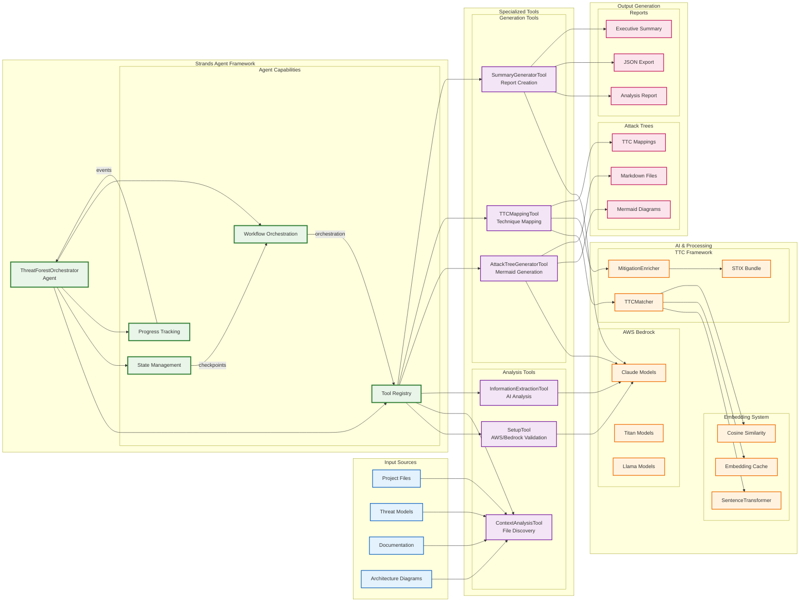

# ThreatForest Component Interactions

```mermaid
graph LR
    %% Input Sources
    subgraph "Input Sources"
        PM[Project Files]
        TM[Threat Models]
        README[Documentation]
        ARCH[Architecture Diagrams]
    end

    %% Strands Agent Framework
    subgraph "Strands Agent Framework"
        direction TB
        AGENT[ThreatForestOrchestrator<br/>Agent]
        
        subgraph "Agent Capabilities"
            TOOLS[Tool Registry]
            STATE[State Management]
            PROGRESS[Progress Tracking]
            WORKFLOW[Workflow Orchestration]
        end
        
        AGENT --> TOOLS
        AGENT --> STATE
        AGENT --> PROGRESS
        AGENT --> WORKFLOW
    end

    %% Tool Ecosystem
    subgraph "Specialized Tools"
        direction TB
        
        subgraph "Analysis Tools"
            SETUP[SetupTool<br/>AWS/Bedrock Validation]
            CONTEXT[ContextAnalysisTool<br/>File Discovery]
            EXTRACT[InformationExtractionTool<br/>AI Analysis]
        end
        
        subgraph "Generation Tools"
            TREEGEN[AttackTreeGeneratorTool<br/>Mermaid Generation]
            MAPPING[TTCMappingTool<br/>Technique Mapping]
            SUMMARY[SummaryGeneratorTool<br/>Report Creation]
        end
    end

    %% AI & Processing Layer
    subgraph "AI & Processing"
        direction TB
        
        subgraph "AWS Bedrock"
            CLAUDE[Claude Models]
            TITAN[Titan Models]
            LLAMA[Llama Models]
        end
        
        subgraph "Embedding System"
            SENTENCE[SentenceTransformer]
            EMBEDDINGS[Embedding Cache]
            SIMILARITY[Cosine Similarity]
        end
        
        subgraph "TTC Framework"
            MATCHER[TTCMatcher]
            ENRICHER[MitigationEnricher]
            STIXDATA[STIX Bundle]
        end
    end

    %% Output Generation
    subgraph "Output Generation"
        direction TB
        
        subgraph "Attack Trees"
            MERMAID[Mermaid Diagrams]
            MARKDOWN[Markdown Files]
            TECHNIQUES[TTC Mappings]
        end
        
        subgraph "Reports"
            ANALYSIS[Analysis Report]
            JSONEXPORT[JSON Export]
            SUMMARY_OUT[Executive Summary]
        end
    end

    %% Data Flow Connections
    PM --> CONTEXT
    TM --> CONTEXT
    README --> CONTEXT
    ARCH --> CONTEXT

    TOOLS --> SETUP
    TOOLS --> CONTEXT
    TOOLS --> EXTRACT
    TOOLS --> TREEGEN
    TOOLS --> MAPPING
    TOOLS --> SUMMARY

    SETUP --> CLAUDE
    EXTRACT --> CLAUDE
    TREEGEN --> CLAUDE
    SUMMARY --> CLAUDE

    MAPPING --> MATCHER
    MATCHER --> SENTENCE
    MATCHER --> EMBEDDINGS
    MATCHER --> SIMILARITY

    MAPPING --> ENRICHER
    ENRICHER --> STIXDATA

    TREEGEN --> MERMAID
    TREEGEN --> MARKDOWN
    MAPPING --> TECHNIQUES

    SUMMARY --> ANALYSIS
    SUMMARY --> JSONEXPORT
    SUMMARY --> SUMMARY_OUT

    %% Progress and State Flow
    STATE --> |checkpoints| WORKFLOW
    PROGRESS --> |events| AGENT
    WORKFLOW --> |orchestration| TOOLS

    %% Styling
    classDef inputClass fill:#e3f2fd,stroke:#1565c0,stroke-width:2px
    classDef agentClass fill:#e8f5e8,stroke:#2e7d32,stroke-width:3px
    classDef toolClass fill:#f3e5f5,stroke:#7b1fa2,stroke-width:2px
    classDef aiClass fill:#fff3e0,stroke:#ef6c00,stroke-width:2px
    classDef outputClass fill:#fce4ec,stroke:#c2185b,stroke-width:2px

    class PM,TM,README,ARCH inputClass
    class AGENT,TOOLS,STATE,PROGRESS,WORKFLOW agentClass
    class SETUP,CONTEXT,EXTRACT,TREEGEN,MAPPING,SUMMARY toolClass
    class CLAUDE,TITAN,LLAMA,SENTENCE,EMBEDDINGS,SIMILARITY,MATCHER,ENRICHER,STIXDATA aiClass
    class MERMAID,MARKDOWN,TECHNIQUES,ANALYSIS,JSONEXPORT,SUMMARY_OUT outputClass
```