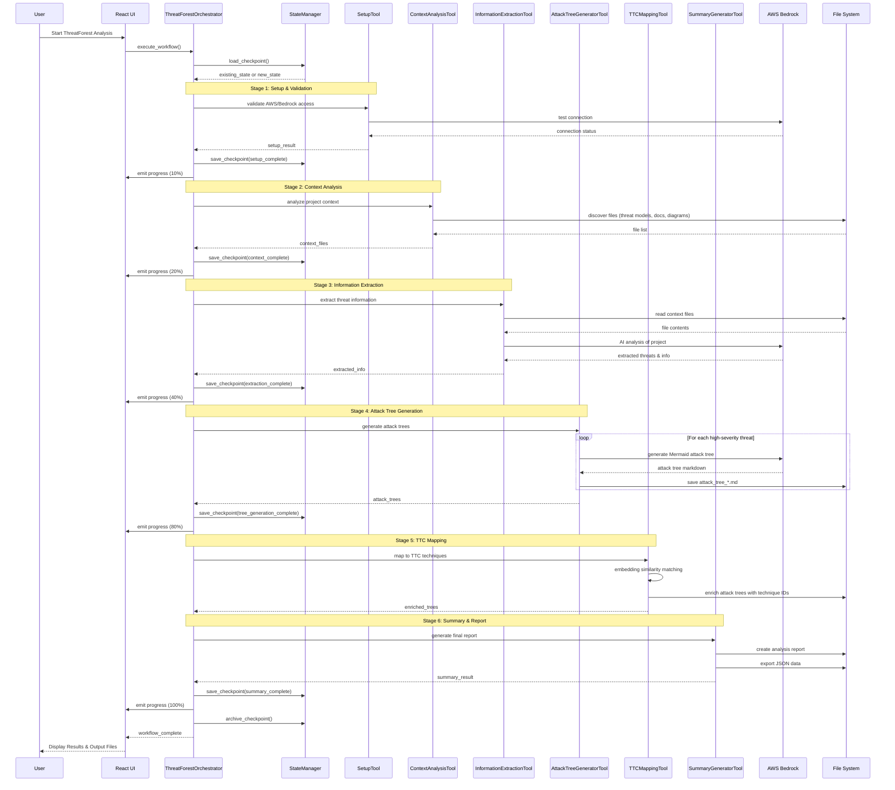

# ThreatForest Workflow Sequence

```mermaid
sequenceDiagram
    participant User
    participant UI as React UI
    participant TFO as ThreatForestOrchestrator
    participant SM as StateManager
    participant ST as SetupTool
    participant CAT as ContextAnalysisTool
    participant IET as InformationExtractionTool
    participant ATGT as AttackTreeGeneratorTool
    participant TTCT as TTCMappingTool
    participant SGT as SummaryGeneratorTool
    participant AWS as AWS Bedrock
    participant FS as File System

    User->>UI: Start ThreatForest Analysis
    UI->>TFO: execute_workflow()
    
    %% State Management
    TFO->>SM: load_checkpoint()
    SM-->>TFO: existing_state or new_state
    
    %% Stage 1: Setup
    Note over TFO,ST: Stage 1: Setup & Validation
    TFO->>ST: validate AWS/Bedrock access
    ST->>AWS: test connection
    AWS-->>ST: connection status
    ST-->>TFO: setup_result
    TFO->>SM: save_checkpoint(setup_complete)
    TFO->>UI: emit progress (10%)

    %% Stage 2: Context Analysis
    Note over TFO,CAT: Stage 2: Context Analysis
    TFO->>CAT: analyze project context
    CAT->>FS: discover files (threat models, docs, diagrams)
    FS-->>CAT: file list
    CAT-->>TFO: context_files
    TFO->>SM: save_checkpoint(context_complete)
    TFO->>UI: emit progress (20%)

    %% Stage 3: Information Extraction
    Note over TFO,IET: Stage 3: Information Extraction
    TFO->>IET: extract threat information
    IET->>FS: read context files
    FS-->>IET: file contents
    IET->>AWS: AI analysis of project
    AWS-->>IET: extracted threats & info
    IET-->>TFO: extracted_info
    TFO->>SM: save_checkpoint(extraction_complete)
    TFO->>UI: emit progress (40%)

    %% Stage 4: Attack Tree Generation
    Note over TFO,ATGT: Stage 4: Attack Tree Generation
    TFO->>ATGT: generate attack trees
    loop For each high-severity threat
        ATGT->>AWS: generate Mermaid attack tree
        AWS-->>ATGT: attack tree markdown
        ATGT->>FS: save attack_tree_*.md
    end
    ATGT-->>TFO: attack_trees
    TFO->>SM: save_checkpoint(tree_generation_complete)
    TFO->>UI: emit progress (80%)

    %% Stage 5: TTC Mapping (Optional)
    Note over TFO,TTCT: Stage 5: TTC Mapping
    TFO->>TTCT: map to TTC techniques
    TTCT->>TTCT: embedding similarity matching
    TTCT->>FS: enrich attack trees with technique IDs
    TTCT-->>TFO: enriched_trees

    %% Stage 6: Summary Generation
    Note over TFO,SGT: Stage 6: Summary & Report
    TFO->>SGT: generate final report
    SGT->>FS: create analysis report
    SGT->>FS: export JSON data
    SGT-->>TFO: summary_result
    TFO->>SM: save_checkpoint(summary_complete)
    TFO->>UI: emit progress (100%)

    %% Completion
    TFO->>SM: archive_checkpoint()
    TFO-->>UI: workflow_complete
    UI-->>User: Display Results & Output Files
```