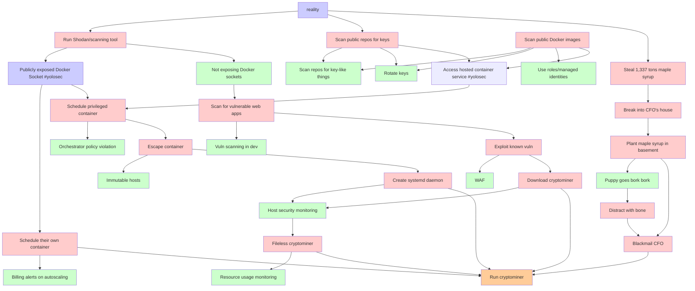

# Cryptominer in Container - Attack Tree

```mermaid
graph TD
    reality["reality"] --> shodan["Run Shodan/scanning tool"]
    reality --> scan_repos["Scan public repos for keys"]
    reality --> steal_maple["Steal 1,337 tons maple syrup"]
    
    shodan --> public_socket["Publicly exposed Docker Socket #yolosec"]
    shodan --> private_socket["Not exposing Docker sockets"]
    
    public_socket --> schedule_container["Schedule their own container"]
    public_socket --> schedule_priv["Schedule privileged container"]
    
    private_socket --> scan_apps["Scan for vulnerable web apps"]
    scan_apps --> vuln_scan["Vuln scanning in dev"]
    scan_apps --> exploit_vuln["Exploit known vuln"]
    
    exploit_vuln --> waf["WAF"]
    exploit_vuln --> download_miner["Download cryptominer"]
    
    scan_repos --> key_scan["Scan repos for key-like things"]
    scan_repos --> key_rotation["Rotate keys"]
    scan_repos --> access_con["Access hosted container service #yolosec"]
    
    scan_dock["Scan public Docker images"] --> key_scan
    scan_dock --> key_rotation
    scan_dock --> roles_ids["Use roles/managed identities"]
    scan_dock --> access_con
    
    access_con --> schedule_priv
    schedule_container --> bill_alerts["Billing alerts on autoscaling"]
    schedule_container --> cryptomining["Run cryptominer"]
    
    schedule_priv --> policy_violation["Orchestrator policy violation"]
    schedule_priv --> escape_container["Escape container"]
    
    escape_container --> immutable_hosts["Immutable hosts"]
    escape_container --> create_systemd["Create systemd daemon"]
    
    create_systemd --> host_monitoring["Host security monitoring"]
    create_systemd --> cryptomining
    
    download_miner --> host_monitoring
    download_miner --> cryptomining
    
    host_monitoring --> fileless_miner["Fileless cryptominer"]
    fileless_miner --> resource_monitoring["Resource usage monitoring"]
    fileless_miner --> cryptomining
    
    steal_maple --> cfo_breakin["Break into CFO's house"]
    cfo_breakin --> plant_syrup["Plant maple syrup in basement"]
    plant_syrup --> good_boi["Puppy goes bork bork"]
    plant_syrup --> blackmail_cfo["Blackmail CFO"]
    good_boi --> bone_distract["Distract with bone"]
    bone_distract --> blackmail_cfo
    blackmail_cfo --> cryptomining
    
    classDef attack fill:#ffcccc
    classDef mitigation fill:#ccffcc
    classDef goal fill:#ffcc99
    classDef fact fill:#ccccff
    
    class shodan,scan_apps,exploit_vuln,scan_repos,scan_dock,schedule_container,schedule_priv,escape_container,create_systemd,download_miner,fileless_miner,steal_maple,cfo_breakin,plant_syrup,bone_distract,blackmail_cfo attack
    class private_socket,vuln_scan,waf,key_scan,key_rotation,roles_ids,bill_alerts,policy_violation,immutable_hosts,host_monitoring,resource_monitoring,good_boi mitigation
    class cryptomining goal
    class reality,public_socket fact
```
