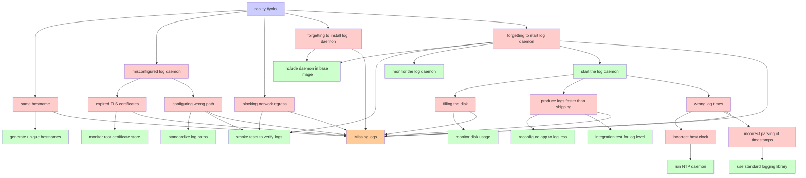

# Missing Logs - Attack Tree

```mermaid
graph TD
    reality["reality #yolo"] --> same_hostname["same hostname"]
    reality --> misconfigured["misconfigured log daemon"]
    reality --> block_egress["blocking network egress"]
    reality --> forgetting_daemon["forgetting to install log daemon"]
    reality --> no_start["forgetting to start log daemon"]
    
    same_hostname --> unique_names["generate unique hostnames"]
    same_hostname --> missing_logs["Missing logs"]
    
    misconfigured --> expired_certs["expired TLS certificates"]
    misconfigured --> wrong_path["configuring wrong path"]
    
    expired_certs --> monitor_cert["monitor root certificate store"]
    expired_certs --> missing_logs
    
    wrong_path --> standardize_path["standardize log paths"]
    wrong_path --> smoke_test["smoke tests to verify logs"]
    wrong_path --> missing_logs
    
    forgetting_daemon --> base_daemon["include daemon in base image"]
    forgetting_daemon --> missing_logs
    
    no_start --> base_daemon
    no_start --> smoke_test
    no_start --> monitor_daemon["monitor the log daemon"]
    no_start --> start_daemon["start the log daemon"]
    no_start --> missing_logs
    
    start_daemon --> fill_disk["filling the disk"]
    start_daemon --> log_jam["produce logs faster than shipping"]
    start_daemon --> wrong_time["wrong log times"]
    
    fill_disk --> monitor_disk["monitor disk usage"]
    fill_disk --> missing_logs
    
    log_jam --> log_less["reconfigure app to log less"]
    log_jam --> integration_test["integration test for log level"]
    log_jam --> missing_logs
    
    wrong_time --> host_clock["incorrect host clock"]
    wrong_time --> wrong_parsing["incorrect parsing of timestamps"]
    wrong_time --> missing_logs
    
    host_clock --> run_ntp["run NTP daemon"]
    wrong_parsing --> standard_lib["use standard logging library"]
    
    block_egress --> smoke_test
    block_egress --> missing_logs
    
    classDef attack fill:#ffcccc
    classDef mitigation fill:#ccffcc
    classDef goal fill:#ffcc99
    classDef fact fill:#ccccff
    
    class same_hostname,misconfigured,block_egress,forgetting_daemon,expired_certs,wrong_path,no_start,fill_disk,log_jam,wrong_time,host_clock,wrong_parsing attack
    class unique_names,monitor_cert,standardize_path,smoke_test,base_daemon,monitor_daemon,start_daemon,monitor_disk,log_less,integration_test,run_ntp,standard_lib mitigation
    class missing_logs goal
    class reality fact
```
