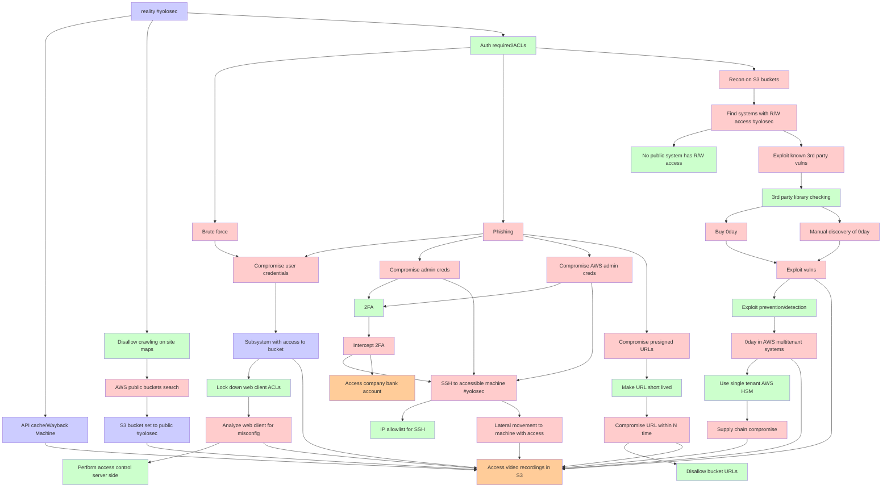

# S3 Bucket Video Recordings - Attack Tree

```mermaid
graph TD
    reality["reality #yolosec"] --> wayback["API cache/Wayback Machine"]
    reality --> disallow_crawling["Disallow crawling on site maps"]
    reality --> private_bucket["Auth required/ACLs"]
    
    wayback --> s3_asset["Access video recordings in S3"]
    
    disallow_crawling --> bucket_search["AWS public buckets search"]
    bucket_search --> public_bucket["S3 bucket set to public #yolosec"]
    public_bucket --> s3_asset
    
    private_bucket --> brute_force["Brute force"]
    private_bucket --> phishing["Phishing"]
    private_bucket --> recon_on_s3["Recon on S3 buckets"]
    
    brute_force --> compromise_user_creds["Compromise user credentials"]
    phishing --> compromise_user_creds
    phishing --> compromise_admin_creds["Compromise admin creds"]
    phishing --> compromise_aws_creds["Compromise AWS admin creds"]
    phishing --> compromise_presigned["Compromise presigned URLs"]
    
    compromise_user_creds --> subsystem_with_access["Subsystem with access to bucket"]
    subsystem_with_access --> lock_down_acls["Lock down web client ACLs"]
    subsystem_with_access --> s3_asset
    
    lock_down_acls --> analyze_web_client["Analyze web client for misconfig"]
    analyze_web_client --> access_control_server_side["Perform access control server side"]
    analyze_web_client --> s3_asset
    
    compromise_admin_creds --> 2fa["2FA"]
    compromise_admin_creds --> ssh_to_public_machine["SSH to accessible machine #yolosec"]
    
    compromise_aws_creds --> 2fa
    compromise_aws_creds --> ssh_to_public_machine
    
    2fa --> intercept_2fa["Intercept 2FA"]
    intercept_2fa --> ssh_to_public_machine
    intercept_2fa --> company_bank_account["Access company bank account"]
    
    ssh_to_public_machine --> ip_allowlist_for_ssh["IP allowlist for SSH"]
    ssh_to_public_machine --> lateral_movement_to_machine_with_access["Lateral movement to machine with access"]
    lateral_movement_to_machine_with_access --> s3_asset
    
    compromise_presigned --> short_lived_presigning["Make URL short lived"]
    short_lived_presigning --> compromise_quickly["Compromise URL within N time"]
    compromise_quickly --> disallow_bucket_urls["Disallow bucket URLs"]
    compromise_quickly --> s3_asset
    
    recon_on_s3 --> find_systems_with_access["Find systems with R/W access #yolosec"]
    find_systems_with_access --> internal_only_bucket["No public system has R/W access"]
    find_systems_with_access --> exploit_known_vulns["Exploit known 3rd party vulns"]
    
    exploit_known_vulns --> vuln_scanning["3rd party library checking"]
    vuln_scanning --> buy_0day["Buy 0day"]
    vuln_scanning --> discover_0day["Manual discovery of 0day"]
    
    buy_0day --> exploit_vulns["Exploit vulns"]
    discover_0day --> exploit_vulns
    exploit_vulns --> ips["Exploit prevention/detection"]
    exploit_vulns --> s3_asset
    
    ips --> aws_0day["0day in AWS multitenant systems"]
    aws_0day --> single_tenant_hsm["Use single tenant AWS HSM"]
    aws_0day --> s3_asset
    
    single_tenant_hsm --> supply_chain_backdoor["Supply chain compromise"]
    supply_chain_backdoor --> s3_asset
    
    classDef attack fill:#ffcccc
    classDef mitigation fill:#ccffcc
    classDef goal fill:#ffcc99
    classDef fact fill:#ccccff
    
    class bucket_search,brute_force,phishing,compromise_user_creds,compromise_admin_creds,compromise_aws_creds,compromise_presigned,analyze_web_client,intercept_2fa,ssh_to_public_machine,lateral_movement_to_machine_with_access,compromise_quickly,recon_on_s3,find_systems_with_access,exploit_known_vulns,buy_0day,discover_0day,exploit_vulns,aws_0day,supply_chain_backdoor attack
    class disallow_crawling,private_bucket,lock_down_acls,access_control_server_side,2fa,ip_allowlist_for_ssh,short_lived_presigning,disallow_bucket_urls,internal_only_bucket,vuln_scanning,ips,single_tenant_hsm mitigation
    class s3_asset,company_bank_account goal
    class reality,wayback,public_bucket,subsystem_with_access fact
```
