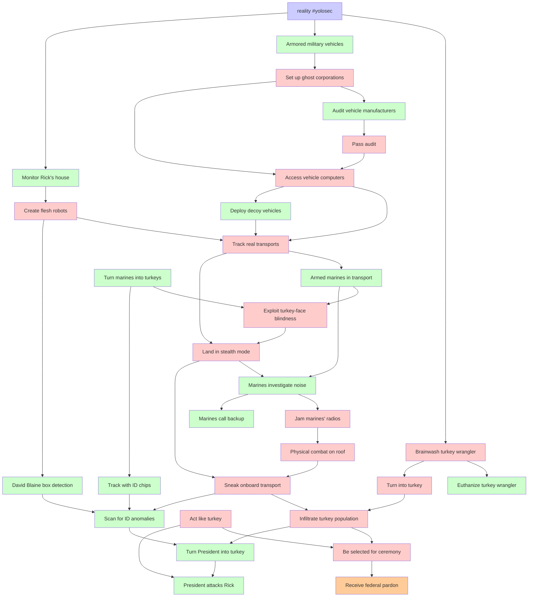

# Rick & Morty's Thanksploitation - Attack Tree

```mermaid
graph TD
    reality["reality #yolosec"] --> brainwash_wrangler["Brainwash turkey wrangler"]
    reality --> armored_transport["Armored military vehicles"]
    reality --> monitor_home["Monitor Rick's house"]
    
    brainwash_wrangler --> euthanize_wrangler["Euthanize turkey wrangler"]
    brainwash_wrangler --> become_turkey["Turn into turkey"]
    
    become_turkey --> infiltrate_turkeys["Infiltrate turkey population"]
    
    sneak_onboard["Sneak onboard transport"] --> infiltrate_turkeys
    
    infiltrate_turkeys --> chosen_turkey["Be selected for ceremony"]
    infiltrate_turkeys --> president_turkey["Turn President into turkey"]
    
    chosen_turkey --> receive_pardon["Receive federal pardon"]
    
    turkey_behavior["Act like turkey"] --> chosen_turkey
    
    armored_transport --> ghost_corp["Set up ghost corporations"]
    
    ghost_corp --> audit_vehicles["Audit vehicle manufacturers"]
    ghost_corp --> access_computers["Access vehicle computers"]
    
    audit_vehicles --> pass_audit["Pass audit"]
    pass_audit --> access_computers
    
    access_computers --> track_transport["Track real transports"]
    access_computers --> decoy_vehicles["Deploy decoy vehicles"]
    
    flesh_robots["Create flesh robots"] --> track_transport
    decoy_vehicles --> track_transport
    
    track_transport --> armed_marines["Armed marines in transport"]
    track_transport --> stealth_mode["Land in stealth mode"]
    
    face_blind["Exploit turkey-face blindness"] --> stealth_mode
    armed_marines --> face_blind
    armed_marines --> investigate_noise["Marines investigate noise"]
    
    stealth_mode --> investigate_noise
    stealth_mode --> sneak_onboard
    
    investigate_noise --> jam_radios["Jam marines' radios"]
    investigate_noise --> call_backup["Marines call backup"]
    
    jam_radios --> roof_combat["Physical combat on roof"]
    roof_combat --> sneak_onboard
    
    turkey_marines["Turn marines into turkeys"] --> face_blind
    turkey_marines --> id_chips["Track with ID chips"]
    
    monitor_home --> flesh_robots
    flesh_robots --> blaine_box["David Blaine box detection"]
    
    blaine_box --> scan_transport["Scan for ID anomalies"]
    id_chips --> scan_transport
    sneak_onboard --> scan_transport
    
    scan_transport --> president_turkey
    president_turkey --> attack_rick["President attacks Rick"]
    turkey_behavior --> attack_rick
    
    classDef attack fill:#ffcccc
    classDef mitigation fill:#ccffcc
    classDef goal fill:#ffcc99
    classDef fact fill:#ccccff
    
    class brainwash_wrangler,become_turkey,infiltrate_turkeys,chosen_turkey,ghost_corp,pass_audit,access_computers,track_transport,stealth_mode,sneak_onboard,face_blind,flesh_robots,jam_radios,roof_combat,turkey_behavior attack
    class euthanize_wrangler,armored_transport,audit_vehicles,decoy_vehicles,armed_marines,turkey_marines,id_chips,monitor_home,investigate_noise,call_backup,blaine_box,scan_transport,president_turkey,attack_rick mitigation
    class receive_pardon goal
    class reality fact
```
