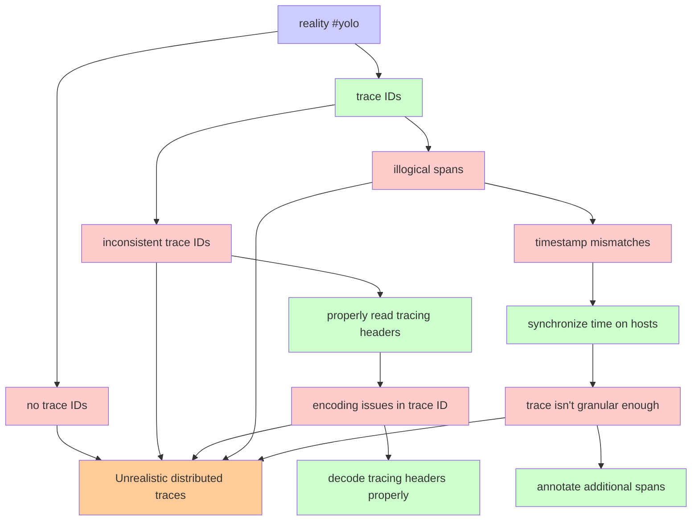

# Unrealistic Distributed Traces - Attack Tree

```mermaid
graph TD
    reality["reality #yolo"] --> no_trace_ids["no trace IDs"]
    reality --> trace_ids["trace IDs"]
    
    no_trace_ids --> unrealistic_traces["Unrealistic distributed traces"]
    
    trace_ids --> incon_trace_ids["inconsistent trace IDs"]
    trace_ids --> illogical_spans["illogical spans"]
    
    incon_trace_ids --> read_headers["properly read tracing headers"]
    incon_trace_ids --> unrealistic_traces
    
    read_headers --> encoding_issues["encoding issues in trace ID"]
    encoding_issues --> decode_headers["decode tracing headers properly"]
    encoding_issues --> unrealistic_traces
    
    illogical_spans --> timestamp_mismatch["timestamp mismatches"]
    illogical_spans --> unrealistic_traces
    
    timestamp_mismatch --> sync_time["synchronize time on hosts"]
    sync_time --> general_trace["trace isn't granular enough"]
    general_trace --> annotate_spans["annotate additional spans"]
    general_trace --> unrealistic_traces
    
    classDef attack fill:#ffcccc
    classDef mitigation fill:#ccffcc
    classDef goal fill:#ffcc99
    classDef fact fill:#ccccff
    
    class no_trace_ids,incon_trace_ids,encoding_issues,illogical_spans,timestamp_mismatch,general_trace attack
    class trace_ids,read_headers,decode_headers,sync_time,annotate_spans mitigation
    class unrealistic_traces goal
    class reality fact
```
