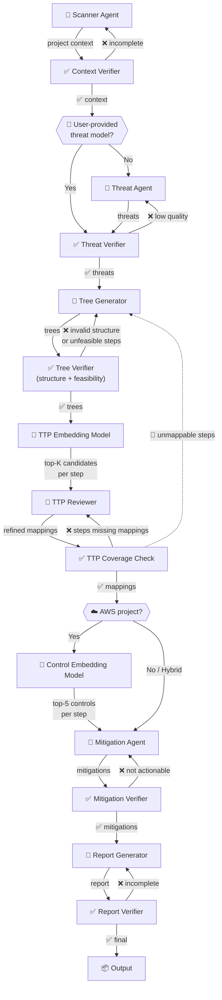
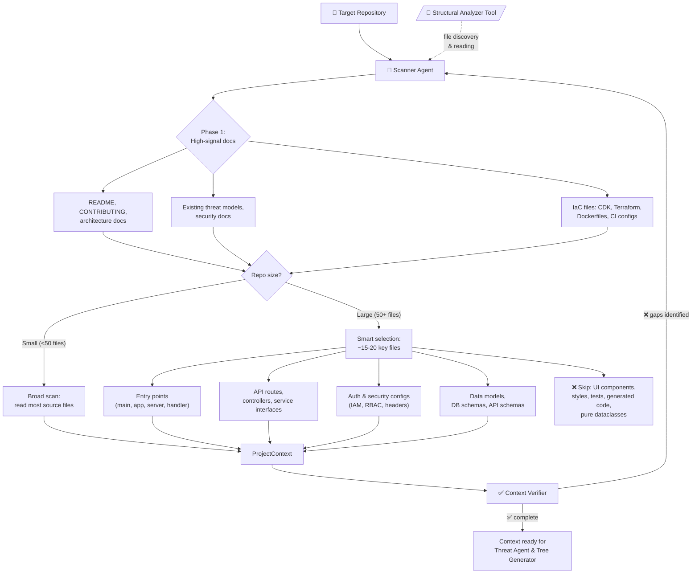
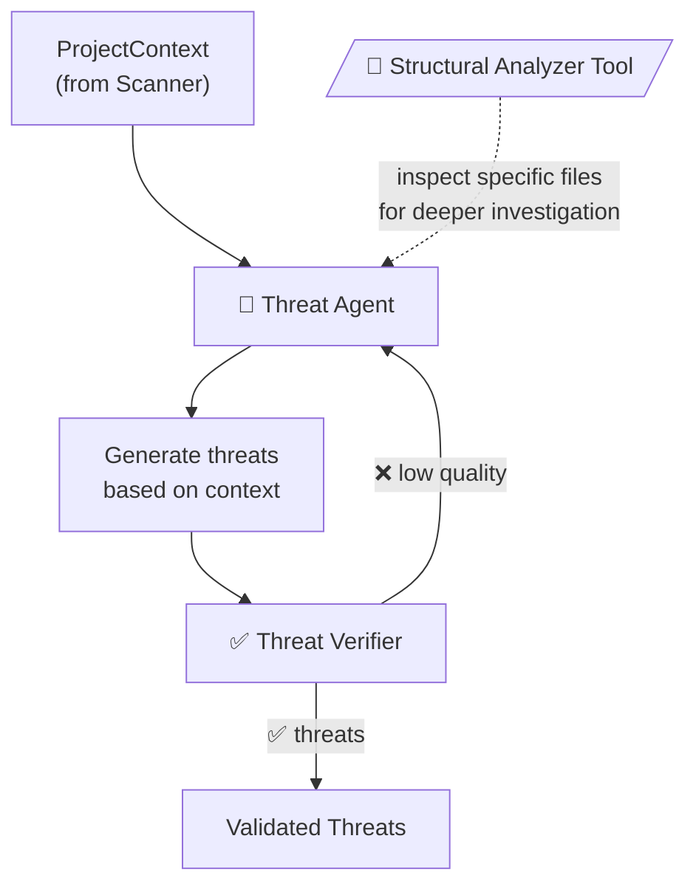
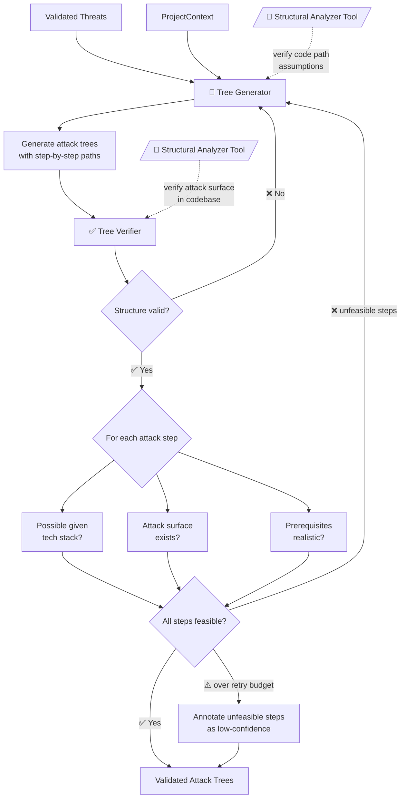
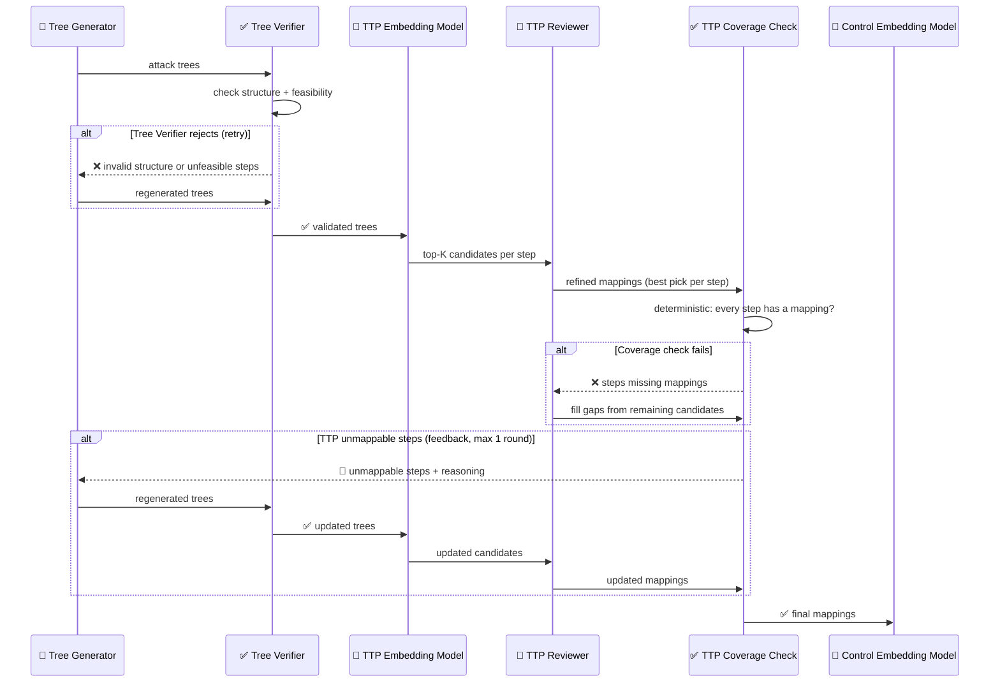
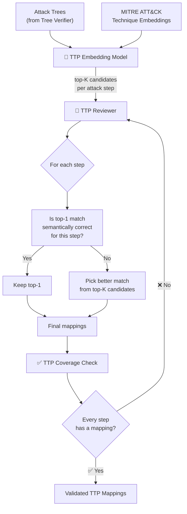
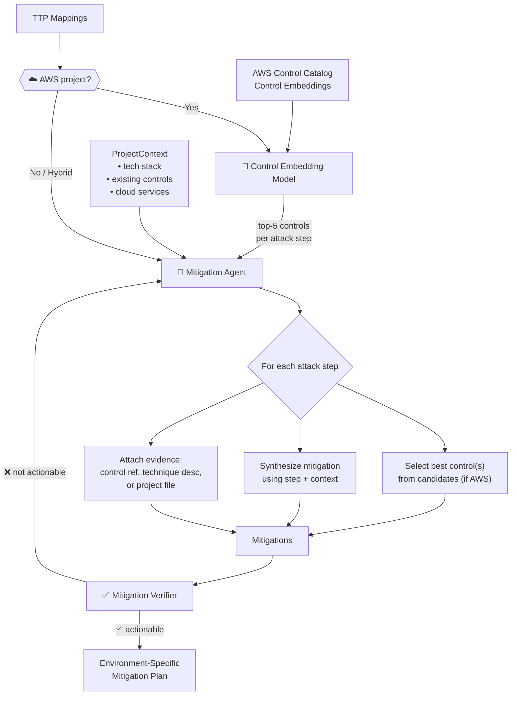
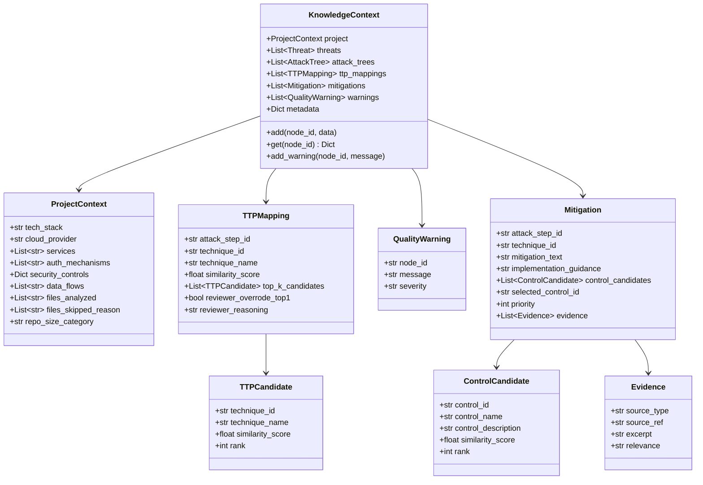

# ThreatForest v2 — Graph/Swarm Architecture

## Current Architecture (v1)

Sequential pipeline where each stage runs as an isolated process. No knowledge sharing between stages — each tool/agent operates independently.

```
SETUP → CONTEXT_ANALYSIS → EXTRACTION → TREE_GENERATION → MAPPING → SUMMARY
```

### Problems
- No feedback loops — if attack trees are unrealistic, nothing catches it
- MITRE mitigations are generic, not adapted to the user's environment
- No verification of agent outputs before passing downstream
- Knowledge is lost between stages (no shared context graph)

---

## Proposed Architecture (v2) — Graph of Agents

A directed graph where every agent and every verifier is its own node. The graph topology defines execution order, retry loops, parallel fan-out, and feedback — no hidden orchestration logic inside nodes. One execution model for everything.

### Why Verifiers Are Separate Nodes (Not Embedded in Swarms)

| Embedded verifier (swarm) | Separate verifier node (graph) |
|---|---|
| Needs internal orchestration to enforce agent→verifier order | Graph topology enforces order — edges are the orchestration |
| Two execution models: graph-level + swarm-internal | One execution model: everything is a node + edge |
| Retry loop is custom logic per swarm | Retry loop is just an edge from verifier → agent |
| Same pattern as feedback loops, but implemented differently | Same pattern as feedback loops, implemented the same way |
| Harder to observe — retries are hidden inside the swarm | Every execution is a visible node with its own trace |

### Scanner Agent

The Scanner Agent replaces the previous Structural Analyzer + Security Posture Analyzer pair. It is the first node in the graph and its job is to build a high-quality project context that steers every downstream agent.

**What it does:**

1. **README & docs** — Reads README, architecture docs, and any threat model files to understand what the project is and how it's designed.
2. **Intelligent file selection** — For code repos, it doesn't read everything. It prioritizes files that reveal architecture:
   - Entry points (main, app, server, handler files)
   - API route definitions, controller layers, service interfaces
   - Infrastructure-as-code (CDK, Terraform, CloudFormation, Dockerfiles)
   - Configuration files (auth configs, IAM policies, security headers)
   - Data models / schemas (DB models, API schemas, protobuf definitions)
   - It explicitly deprioritizes UI components, stylesheets, test fixtures, generated code, and pure data-class boilerplate.
3. **Adaptive depth** — For small repos (<50 files), it can afford to scan broadly. For large repos (hundreds/thousands of files), it uses directory structure heuristics and file naming conventions to narrow down to the ~15-20 most architecturally significant files.
4. **Output** — A `ProjectContext` object that captures tech stack, services, auth mechanisms, security controls, data flows, and attack surface — everything the Threat Agent and Tree Generator need to do their jobs well.

**Why a single agent instead of two:**

The structural analysis and security posture analysis are deeply intertwined — you can't understand the security posture without understanding the structure, and the structure analysis naturally surfaces security-relevant details (auth mechanisms, IAM configs, network boundaries). Splitting them created redundant file reads and a lossy merge step. One agent that does both produces a more coherent context.

### Structural Analyzer Tool

The structural analysis capability (file discovery, directory traversal, file content reading, repo structure mapping) is extracted into a **shared tool** available to all agents in the graph. This means:

- The Scanner Agent uses it as its primary tool during context building
- The Threat Agent can call it to inspect specific files when a threat needs deeper investigation
- The Tree Generator can call it to verify assumptions about code paths

This avoids the v1 problem where downstream agents had to work purely from the context summary and couldn't go back to the source when they needed more detail.

### High-Level Graph



### Edge Types

| Edge | Style | Description |
|------|-------|-------------|
| `→` solid | **Data flow** | Output of one node feeds into the next |
| `→` solid with ❌ | **Retry edge** | Verifier rejects, routes back to its agent (max 2 retries) |
| `-.->` dashed | **Feedback loop** | Cross-graph rejection — downstream verifier sends back to upstream agent (max 1 round) |
| `◇` diamond | **Conditional** | Route based on whether user provided threat model |

### Execution Model

#### How Strands Graph Passes Context

Strands' `Graph` automatically propagates outputs between nodes. When a node completes, `_build_node_input` collects the `AgentResult` from every satisfied dependency and injects them as `ContentBlock(text=...)` into the downstream node's prompt:

```
Original Task: <the initial task>

Inputs from previous nodes:

From scanner_agent:
  - Agent: <full string representation of AgentResult>

From threat_verifier:
  - Agent: <full string representation of AgentResult>
```

This works fine for small outputs, but is a problem for ThreatForest because:
- The Scanner Agent's `ProjectContext` can be very large (file contents, tech stack details, data flows)
- Attack trees grow combinatorially — a project with 10 threats can produce hundreds of attack steps
- Passing all of this as inline text in the prompt wastes context window and risks truncation

#### File-Based State Passing

Instead of relying on Strands' automatic context propagation for large payloads, each agent writes its output to a **state file** on disk. The downstream agent receives a lightweight pointer (the file path) and reads only what it needs using line-range reads.

```
.threatforest/state/
├── scanner_context.json        # Scanner Agent output
├── threats.json                # Threat Agent output
├── attack_trees.json           # Tree Generator output
├── ttp_candidates.json         # TTP Embedding Model output (top-K per step)
├── ttp_mappings.json           # TTP Reviewer output (final mappings)
├── control_candidates.json     # Control Embedding Model output (top-5 per step)
└── mitigations.json            # Mitigation Agent output
```

Each agent:
1. Receives a short message via Strands' built-in context propagation (routing decision, file path, summary)
2. Reads the state file(s) it needs — selectively, by line range or by key — using the `file_read` tool
3. Does its work
4. Writes its output to its own state file using `file_write`
5. Returns a short `AgentResult` (just the routing decision + file path + brief summary) that Strands propagates downstream

This means the LLM prompt stays small regardless of how large the accumulated state gets. The agent can read 50 lines of attack tree detail when it needs them, instead of having 500 lines injected into every prompt.

#### Node Contract

```python
class NodeResult:
    state_file: str                # path to this node's output file
    summary: str                   # brief description for downstream prompt
    route: str                     # "pass" | "reject" | "feedback"
    feedback: Optional[str]        # reasoning for rejection
    retry_count: int               # how many times this node has been called
    max_retries: int = 2           # after this, emit best-effort + warning
```

The graph engine follows edges based on `route`:
- `"pass"` → follow the ✅ edge
- `"reject"` → follow the ❌ edge back to the agent (if under retry budget)
- `"feedback"` → follow the 🔄 dashed edge to an upstream agent (if under feedback budget)
- Over budget → emit output with `QualityWarning`, follow ✅ edge anyway

No special swarm logic. No internal orchestration. The graph is the orchestration.

---

### Scanner Agent Detail



---

### Threat Agent Detail



---

### Tree Generator Detail



---

### Feedback Loop Timing



---

### TTP Mapping Pipeline Detail

The TTP pipeline is a three-stage process where each stage has a different execution model:

1. **TTP Embedding Model** (`📐`) — Not an LLM. A vector similarity search against pre-embedded MITRE ATT&CK technique descriptions. For each attack step, it returns the top-K (e.g., K=5) candidate technique matches with similarity scores.
2. **TTP Reviewer** (`🤖`) — An LLM agent. It receives the top-K candidates per step, evaluates whether the top-1 match is semantically correct for the attack step in context, and if not, picks a better one from the remaining candidates. This is where judgment happens.
3. **TTP Coverage Check** (`✅`) — Deterministic. No LLM. It simply checks that every attack step in every tree has exactly one final mapping. If any step is missing, it routes back to the Reviewer with the list of unmapped steps.



**Why this split matters:**

- The embedding model is fast and cheap — no LLM call, just vector math. It narrows the search space from ~700 ATT&CK techniques to ~5 candidates per step.
- The Reviewer only needs to judge between a handful of pre-filtered candidates, not the entire ATT&CK matrix. This makes it faster and more accurate than asking an LLM to map from scratch.
- The Coverage Check is deterministic and instant — no LLM cost, no hallucination risk. It's a simple completeness assertion.

---

### Mitigation Pipeline Detail

The Mitigation pipeline adapts based on the project's cloud provider (determined by the Scanner Agent's `ProjectContext`):

**AWS projects** — Full embedding → agent → verifier pipeline, same pattern as TTP:

1. **Control Embedding Model** (`📐`) — Not an LLM. Vector similarity search against pre-embedded AWS Control Catalog controls. For each attack step, it returns the top-5 most relevant controls with similarity scores.
2. **Mitigation Agent** (`🤖`) — Receives the top-5 control candidates plus full context and synthesizes an actionable mitigation with evidence.

**Non-AWS or hybrid projects** — The Control Embedding Model is skipped. The Mitigation Agent works directly from context (attack step, TTP mapping, project context) to generate mitigations without control catalog references. It still produces evidence, but sourced from the ATT&CK technique description and project files rather than a control catalog.

In both cases:

3. **Mitigation Verifier** (`✅`) — LLM verifier. Checks that each mitigation is actionable and specific (not generic boilerplate), that it actually addresses the attack step it's mapped to, and that evidence is present and relevant.



---

### Knowledge Context Object



---

## Design Decisions

| Decision | Choice | Rationale |
|----------|--------|-----------|
| Single Scanner Agent (not split analyzers) | Yes | Structure and security posture are intertwined — one agent avoids redundant file reads and produces a more coherent context |
| Structural Analyzer as shared tool | Yes | Downstream agents (Threat, Tree Gen) can go back to source code when they need more detail, instead of working purely from the context summary |
| Scanner adaptive depth | By repo size | Small repos (<50 files) scan broadly; large repos use heuristics to pick ~15-20 architecturally significant files |
| Scanner file prioritization | Architecture-revealing files | Entry points, API routes, IaC, auth configs, data models — not UI, styles, tests, or generated code |
| TTP Mapper is embedding model, not LLM | Yes | Vector similarity is fast, cheap, and deterministic — narrows ~700 techniques to ~5 candidates per step without an LLM call |
| TTP Reviewer (LLM) picks from top-K | Yes | Judging between 5 pre-filtered candidates is faster and more accurate than mapping from scratch against the full ATT&CK matrix |
| TTP Coverage Check is deterministic | Yes | Completeness is a simple assertion (every step has a mapping) — no LLM needed, no hallucination risk |
| Tree Verifier checks feasibility | Yes | Feasibility (is this attack step realistic given the tech stack?) is a natural part of tree validation — splitting it into a separate agent added a parallel branch, a merge barrier, and a feedback loop, all for a check that the Tree Verifier can do in the same pass as structural validation |
| Verifiers as separate nodes | Yes | One execution model — graph topology is the orchestration |
| File-based state passing | Yes | Strands injects full `AgentResult` text into downstream prompts — fine for small outputs, but Scanner context and attack trees can be huge. Writing to files and reading selectively keeps prompts small and lets agents read only what they need |
| Retry budget (verifier → agent) | Max 2 | Diminishing returns; fallback with warning after 2 |
| Feedback budget (cross-graph) | Max 1 round | Prevents infinite loops between TTP and Tree Gen |
| Mitigation uses Control Catalog embeddings | AWS only | Same pattern as TTP — embedding narrows controls to top-5 per step. For non-AWS or hybrid projects, the Control Embedding Model is skipped and the Mitigation Agent works directly from context |
| Mitigation Agent (LLM) synthesizes from controls + context | Yes | Needs to combine control candidates with attack step, TTP mapping, and project context to produce actionable guidance |
| Verifier model | Cheaper than task agent | Verification is simpler than generation |
| Over-budget handling | Annotate, don't drop | Preserves coverage; user decides what to ignore |
| Conditional skip | User threats bypass Threat Agent | Still validated by Threat Verifier |
| Tool-level path sandboxing | Yes | Each agent gets its own `file_read`/`file_write` instances restricted to only the paths it needs — prevents prompt injection from reading sensitive files or writing outside state dir |
| Per-agent least privilege | Yes | Scanner can read repo but only write its own state file; TTP Embedding Model can't read the repo at all — minimizes blast radius if any single agent is compromised |

## Agent Sandboxing

Strands' built-in `file_read` and `file_write` tools have **no path restrictions** — they can read/write anywhere the process has OS-level access. Since ThreatForest agents are LLM-driven and could be prompt-injected via malicious file contents in the target repo, we need to enforce strict filesystem boundaries.

### Threat Model

An attacker could craft a file in the target repo (e.g., a README or config file) containing prompt injection that instructs the agent to:
- Read sensitive files outside the repo (`~/.aws/credentials`, `~/.ssh/id_rsa`, `/etc/passwd`)
- Write malicious content to arbitrary paths
- Exfiltrate repo contents by writing them to unexpected locations

### Sandboxing Rules

| Agent | Read access | Write access |
|-------|------------|--------------|
| Scanner Agent | `{target_repo}/**` | `.threatforest/state/scanner_context.json` |
| Threat Agent | `{target_repo}/**`, `.threatforest/state/scanner_context.json` | `.threatforest/state/threats.json` |
| Tree Generator | `{target_repo}/**`, `.threatforest/state/scanner_context.json`, `.threatforest/state/threats.json` | `.threatforest/state/attack_trees.json` |
| Tree Verifier | `{target_repo}/**`, `.threatforest/state/attack_trees.json` | `.threatforest/state/attack_trees.json` (annotate) |
| TTP Embedding Model | `.threatforest/state/attack_trees.json` | `.threatforest/state/ttp_candidates.json` |
| TTP Reviewer | `.threatforest/state/ttp_candidates.json`, `.threatforest/state/attack_trees.json` | `.threatforest/state/ttp_mappings.json` |
| TTP Coverage Check | `.threatforest/state/ttp_mappings.json` | — (deterministic, no file write) |
| Control Embedding Model | `.threatforest/state/attack_trees.json` | `.threatforest/state/control_candidates.json` |
| Mitigation Agent | `.threatforest/state/control_candidates.json`, `.threatforest/state/ttp_mappings.json`, `.threatforest/state/scanner_context.json` | `.threatforest/state/mitigations.json` |
| Report Generator | `.threatforest/state/*` | `.threatforest/output/` |

### Implementation: Sandboxed Tool Wrappers

ThreatForest already wraps Strands tools (see `read_only_editor.py`). We extend this pattern with path validation:

```python
from pathlib import Path
from strands import tool

def _validate_path(path: str, allowed_prefixes: list[str]) -> Path:
    """Resolve path and check it falls within allowed prefixes."""
    resolved = Path(path).resolve()
    for prefix in allowed_prefixes:
        if resolved.is_relative_to(Path(prefix).resolve()):
            return resolved
    raise PermissionError(f"Access denied: {resolved} is outside allowed paths")


def make_sandboxed_file_read(allowed_read_paths: list[str]):
    """Create a file_read tool restricted to specific paths."""
    @tool
    def sandboxed_file_read(path: str, mode: str = "view", **kwargs) -> dict:
        """Read file content — restricted to allowed paths for this agent."""
        _validate_path(path, allowed_read_paths)
        from strands_tools import file_read
        return file_read(path=path, mode=mode, **kwargs)
    return sandboxed_file_read


def make_sandboxed_file_write(allowed_write_paths: list[str]):
    """Create a file_write tool restricted to specific paths."""
    @tool
    def sandboxed_file_write(path: str, content: str, **kwargs) -> dict:
        """Write file content — restricted to allowed paths for this agent."""
        _validate_path(path, allowed_write_paths)
        from strands_tools import file_write
        return file_write(path=path, content=content, **kwargs)
    return sandboxed_file_write
```

Each agent gets its own tool instances with the minimum paths it needs:

```python
# Scanner Agent gets read access to repo, write access to its state file only
scanner_read = make_sandboxed_file_read([target_repo_path])
scanner_write = make_sandboxed_file_write([state_dir / "scanner_context.json"])

scanner_agent = Agent(
    tools=[scanner_read, scanner_write],
    system_prompt="..."
)
```

### Why Not OS-Level Sandboxing?

OS-level sandboxing (containers, seccomp, chroot) would be stronger but adds deployment complexity. The tool-wrapper approach is sufficient because:

1. **The LLM never gets raw shell access** — it can only call the tools we give it, and every tool validates paths before delegating to the real implementation
2. **Path traversal is handled** — `Path.resolve()` canonicalizes `../` and symlinks before the prefix check
3. **Defense in depth** — even if a wrapper is bypassed, the process runs as the user (not root), so OS permissions still apply
4. **Auditable** — every tool call is traced by Strands, so we can see exactly what paths each agent accessed

### Symlink Handling

`Path.resolve()` follows symlinks, so a symlink inside the repo pointing to `/etc/passwd` would resolve to `/etc/passwd` and be rejected by the prefix check. This is the correct behavior — we validate the real target, not the symlink path.

## Resolved Decisions (formerly Open Questions)

1. **Mitigation depth** — The Mitigation Agent includes **evidence** with each mitigation: references to the specific Control Catalog entry, ATT&CK technique description, or project file that supports the recommendation. This makes mitigations verifiable without requiring IaC generation (which would be brittle across different environments).
2. **Streaming** — Nodes publish results **on completion only**. Partial streaming adds complexity (what does a half-finished attack tree look like to a downstream node?) with little benefit — the file-based state passing already decouples nodes, and the graph engine handles sequencing. Simpler to reason about, simpler to implement.
3. **Graph engine** — **Strands Graph**. No need for LangGraph, CrewAI, or a custom engine. Strands' `Graph` class already provides node execution, edge-based dependency resolution, conditional edges, parallel execution, cycle support (for retry/feedback loops), and session persistence. We use it directly.
4. **Observability** — **One OpenTelemetry trace per node**. Strands already creates spans via `start_multiagent_span` (graph-level) and `start_agent_span` (per-node), using its built-in `get_tracer()`. Each node gets its own trace with parent-child relationships following graph edges. We export to Langfuse via their OpenTelemetry integration — no custom tracing code needed.

## Open Questions

(None currently — all resolved above.)
