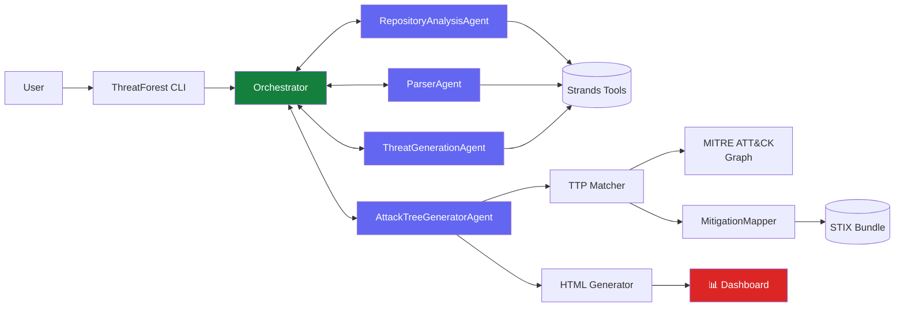

# Architecture Overview

ThreatForest is built on a modular architecture that combines autonomous AI agents with industry-standard security frameworks. The system orchestrates multiple specialized components to deliver comprehensive threat modeling and attack tree generation.

## System Architecture

## Key Components

### Orchestrator
The central coordinator that manages the entire threat modeling workflow. It handles:

- **Stage Coordination**: Sequences agent execution and tool operations
- **Error Handling**: Manages failures and provides recovery mechanisms
- **Progress Tracking**: Reports real-time status to users

### Autonomous Agents
Powered by AWS Labs' [Strands](https://github.com/awslabs/strands) framework, three specialized agents work together:

- **RepositoryAnalysisAgent**: Explores project files using Strands community tools to understand architecture and identify security-relevant information
- **ParserAgent**: Intelligently parses threat statements from various formats (ThreatComposer, JSON, YAML, Markdown)
- **ThreatGenerationAgent**: Creates contextual threats when none exist by analyzing application architecture
- **AttackTreeGeneratorAgent**: Utilizes all the context provided to generate relevant attack steps

### TTP Matcher
Implements semantic similarity matching to map attack steps to MITRE ATT&CK techniques using:

- **Vector Embeddings**: Sentence transformers for semantic understanding
- **Graph Integration**: MITRE ATT&CK knowledge graph navigation
- **Confidence Scoring**: Multi-factor relevance assessment

### Mitigation Mapper
Maps identified threats to STIX-based mitigations using:

- **STIX Bundle Processing**: Parses MITRE's ATT&CK STIX data
- **Course of Action Extraction**: Links techniques to mitigation strategies
- **Contextual Recommendations**: Tailors mitigations to specific threats

### Visualization Engine
Generates interactive HTML dashboards featuring:

- **Network Graphs**: Interactive vis-network visualizations
- **Real-time Filtering**: Dynamic search and category filtering
- **MITRE Integration**: Direct links to technique documentation
- **Export Capabilities**: JSON data export for further analysis

## Data Flow

The threat modeling workflow follows a structured pipeline:

1. **Discovery Phase**: RepositoryAnalysisAgent explores the project
2. **Parsing Phase**: ParserAgent extracts or generates threat statements
3. **Generation Phase**: AttackTreeGenerator creates attack trees for each threat
4. **Enrichment Phase**: TTP Matcher maps attack steps to MITRE ATT&CK
5. **Mitigation Phase**: MitigationMapper identifies defensive strategies
6. **Visualization Phase**: HTML Generator creates interactive dashboards

## Technology Stack

### Core Framework
- **Strands**: AWS Labs' agentic framework for autonomous AI agents
- **Python 3.11+**: Modern Python with type hints and async support

### AI/ML Components
- **Sentence Transformers**: Semantic similarity and embeddings
- **PyTorch**: Neural network backend for embeddings
- **scikit-learn**: Vector similarity calculations

### Security Frameworks
- **MITRE ATT&CK**: Enterprise attack patterns and techniques
- **STIX 2.0**: Structured Threat Information Expression

### Visualization
- **vis-network**: Interactive network graph visualizations
- **HTML/CSS/JS**: Modern web technologies for dashboards

### LLM Providers
- AWS Bedrock
- Anthropic Claude
- OpenAI GPT
- Google Gemini
- Ollama (local)
- LiteLLM (proxy)

## Design Principles

### Modularity

Each component is independently testable and replaceable, enabling:

- Easy updates to individual modules
- Flexible LLM provider selection
- Custom workflow configurations

### Autonomy

Agents operate independently using Strands tools, reducing manual intervention and enabling:

- Automated repository exploration
- Intelligent file parsing
- Context-aware threat generation

### Extensibility

The architecture supports custom extensions:

- Custom agents for specialized analysis
- Additional MITRE ATT&CK frameworks (ICS, Mobile)
- Custom visualization templates
- Integration with CI/CD pipelines

### Privacy-First

Data handling prioritizes user privacy:

- No data storage beyond local outputs
- LLM provider choice for data governance
- Support for fully local models (Ollama)
