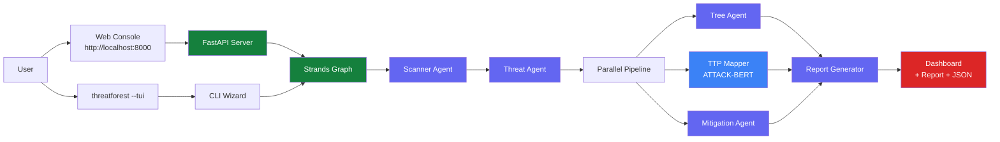

# Architecture Overview

ThreatForest is built on a modular architecture that combines autonomous AI agents with industry-standard security frameworks. The system orchestrates multiple specialized components to deliver comprehensive threat modeling and attack tree generation.

## System Architecture

```mermaid
graph LR
    A[User] --> B[Web Console\nhttp://localhost:8000]
    A --> C[threatforest --tui]
    B --> D[FastAPI Server]
    C --> E[CLI Wizard]
    D --> F[Strands Graph]
    E --> F

    F --> G[Scanner Agent]
    G --> H[Threat Agent]
    H --> I[Parallel Pipeline]

    I --> J[Tree Agent]
    I --> K[TTP Mapper\nATTACK-BERT]
    I --> L[Mitigation Agent]

    J --> M[Report Generator]
    K --> M
    L --> M

    M --> N[Dashboard\n+ Report + JSON]

    style D fill:#15803d,color:#fff
    style F fill:#15803d,color:#fff
    style G fill:#6366f1,color:#fff
    style H fill:#6366f1,color:#fff
    style J fill:#6366f1,color:#fff
    style K fill:#3b82f6,color:#fff
    style L fill:#6366f1,color:#fff
    style M fill:#6366f1,color:#fff
    style N fill:#dc2626,color:#fff
```

## Key Components

### Web Console
A FastAPI server with a React SPA served at `http://localhost:8000`. It handles:

- **Application Registry**: discovers projects in your home directory and `sample-applications/`
- **Run Management**: spawns analysis runs in background threads, streams progress over WebSocket
- **Configuration UI**: edit provider settings and Langfuse credentials from the browser

### Strands Graph
The v2 pipeline, defined in `agents/graph.py`. Each node is a Strands agent or function wrapped as a `GraphNode`. Verifier nodes run after each stage — if verification fails, the graph retries that stage automatically.

### Agents

- **Scanner Agent**: explores the repository with sandboxed file tools; writes `scanner_context.json` (tech stack, cloud provider, services, auth mechanisms)
- **Threat Agent**: reads scanner context and produces a structured `threats.json` list
- **Tree Agent**: generates detailed attack trees per threat; writes `attack_trees.json`
- **TTP Mapper**: uses ATTACK-BERT sentence embeddings to match attack steps against the bundled MITRE ATT&CK STIX graph; writes `ttp_mappings.json`
- **Mitigation Agent**: maps identified techniques to MITRE mitigation controls; writes `mitigations.json`
- **Report Generator**: deterministic (no LLM) — compiles state files into the final dashboard and report

All threats in the parallel pipeline run **concurrently** via `asyncio.gather`.

### TTP Matcher
Semantic similarity matching using:

- **Embedding model**: `basel/ATTACK-BERT` (sentence-transformers)
- **STIX bundle**: bundled `enterprise-attack-18.0.json`
- **Graph cache**: `.threatforest/graphs/mitre_attack_graph_<model>.json` (built once, reused)
- **Threshold**: configurable via `embeddings.ttc_threshold` (default `0.3`)

## Data Flow

1. **Scanner** — explores repo, writes `scanner_context.json`
2. **Threat** — reads scanner context, writes `threats.json`
3. **Parallel Pipeline** — fan-out per threat (concurrent):
   - Tree Agent → `attack_trees.json`
   - TTP Mapper → `ttp_mappings.json`
   - Mitigation Agent → `mitigations.json`
4. **Report** — compiles state files into `output/`

## Technology Stack

### Core Framework
- **Strands**: AWS Labs' agentic framework for autonomous AI agents
- **Python 3.11+**: Modern Python with type hints and async support

### Web Console
- **FastAPI + uvicorn**: REST API and WebSocket server
- **React**: SPA front-end (Vite build, served as static files)

### AI/ML Components
- **Sentence Transformers**: Semantic similarity and embeddings
- **PyTorch**: Neural network backend for embeddings
- **scikit-learn**: Vector similarity calculations

### Security Frameworks
- **MITRE ATT&CK v18.0**: Enterprise attack patterns and techniques
- **STIX 2.0**: Structured Threat Information Expression

### Visualization
- **vis-network**: Interactive network graph visualizations
- **HTML/CSS/JS**: Modern web technologies for dashboards

### LLM Providers
- AWS Bedrock (recommended)
- Anthropic Claude
- OpenAI GPT
- Google Gemini
- Ollama (local)
- LiteLLM (proxy)
- AWS SageMaker

## Design Principles

### Modularity
Each component is independently testable and replaceable, enabling:

- Easy updates to individual modules
- Flexible LLM provider selection
- Custom workflow configurations

### Autonomy
Agents operate independently using Strands tools, reducing manual intervention and enabling:

- Automated repository exploration
- Intelligent file parsing
- Context-aware threat generation

### Extensibility
The architecture supports custom extensions:

- Custom agents for specialized analysis
- Additional MITRE ATT&CK frameworks (ICS, Mobile)
- Custom visualization templates
- Integration with CI/CD pipelines

### Privacy-First
Data handling prioritizes user privacy:

- No data storage beyond local outputs
- LLM provider choice for data governance
- Support for fully local models (Ollama)
