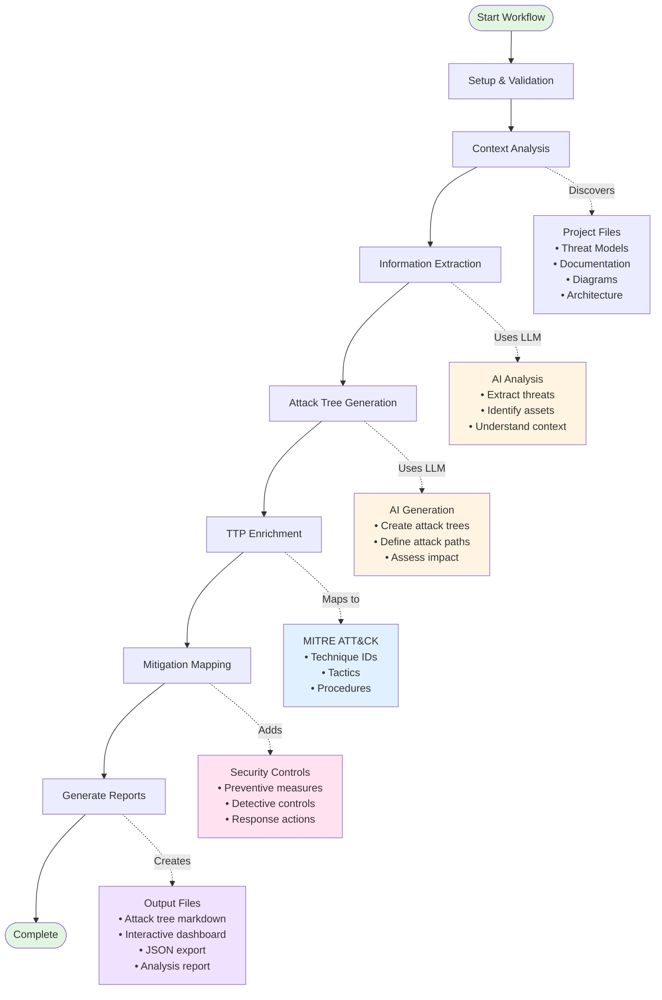

# How ThreatForest Works

This guide provides a technical deep dive into ThreatForest's multi-stage workflow, explaining what happens during analysis and how the AI-powered pipeline transforms your project into comprehensive attack trees.

## Overview

ThreatForest uses a multi-stage workflow powered by the Strands agentic framework to transform your application context into comprehensive security analysis. The complete analysis includes attack tree generation, MITRE ATT&CK mapping, and mitigation recommendations—all in a single integrated pipeline.

## The Multi-Stage Workflow

### Workflow Diagram



### Timeline and Progress

The workflow runs through seven integrated stages:

1. **Setup & Validation** (0-5%) - Validates configuration and project structure
2. **Context Analysis** (5-15%) - Discovers and categorizes project files
3. **Information Extraction** (15-30%) - Analyzes documentation and diagrams
4. **Attack Tree Generation** (30-70%) - Creates detailed attack trees for each threat
5. **TTP Enrichment** (70-85%) - Maps attack steps to MITRE ATT&CK techniques
6. **Mitigation Mapping** (85-95%) - Adds security controls and recommendations
7. **Report Generation** (95-100%) - Creates dashboard and analysis report

## Phase 1: Attack Tree Generation (30-70%)

This is the core phase where ThreatForest creates detailed attack trees for each identified threat.

### What Happens

**1. Discovers Project Context**
- Scans project directory recursively
- Identifies threat models, documentation, and diagrams
- Categorizes files by type and relevance
- Prioritizes content for analysis

**Discovery Patterns:**
```
Threat Models: *.tc.json, threats.json, threats.yaml
Documentation: README.md, ARCHITECTURE.md, docs/**/*.md
Diagrams: *.png, *.mmd, *.drawio, *.puml
```

**2. Analyzes Application**
- Uses AI to understand system architecture
- Identifies technologies and frameworks
- Maps data flows and trust boundaries
- Extracts security-relevant information

**What AI Analyzes:**
- Component relationships
- Authentication mechanisms
- Data storage and transmission
- External dependencies
- Security controls in place

**3. Extracts or Generates Threats**

**If ThreatComposer File Exists:**
- Parses threat statements
- Extracts threat metadata (priority, STRIDE, etc.)
- Identifies affected components
- Prioritizes based on severity

**If No Threat Model Exists:**
- AI analyzes architecture documentation
- Identifies potential security concerns
- Generates STRIDE-categorized threats
- Assigns priority levels

**4. Creates Attack Trees**
- Generates detailed attack trees for high-priority threats
- Develops multiple attack paths per threat
- Defines step-by-step attack sequences
- Assesses prerequisites for each step
- Evaluates impact and likelihood

**Attack Tree Structure:**
```
Attack Tree
├── Threat Statement
├── Attack Path 1
│   ├── Step 1 (with prerequisites)
│   ├── Step 2 (with prerequisites)
│   └── Step 3 (with prerequisites)
├── Attack Path 2
│   ├── Step 1
│   └── Step 2
└── Impact Assessment
```

**5. Produces Base Visualizations**
- Creates markdown files for each attack tree
- Generates Mermaid diagrams
- Structures data for subsequent phases

### Technologies Used

**Strands Framework:**
- Multi-agent orchestration
- Error recovery

**AI Models:**
- Claude 3.5 Sonnet (default)
- Claude 3 Haiku (faster)
- Claude 3 Opus (highest quality)
- Other models via configuration

**File Analysis:**
- Strands `file_read` tool for intelligent parsing
- PDF text extraction
- Image analysis for diagrams
- Mermaid diagram interpretation

### Output from Phase 1

```
project/threatforest/attack_trees/
├── attack_tree_T001_sql_injection.md
├── attack_tree_T002_xss_attack.md
├── attack_tree_T003_auth_bypass.md
└── .threatforest_state.json
```

## Phase 2: TTP Enrichment (70-85%)

This phase maps attack steps to MITRE ATT&CK techniques using semantic similarity.

### What Happens

**1. Reads Attack Trees**
- Loads generated attack tree markdown files
- Parses attack paths and steps
- Extracts attack descriptions

**2. Extracts Attack Steps**
- Identifies individual steps in each path
- Extracts step descriptions and context
- Prepares for semantic matching

**3. Semantic Matching**

**Vector Embeddings:**
- Uses `sentence-transformers` models
- Generates embeddings for attack steps
- Compares against MITRE ATT&CK database
- Calculates similarity scores

**MITRE ATT&CK Database:**
- Enterprise ATT&CK v13.0+
- 14 tactics (Initial Access, Execution, etc.)
- 200+ techniques and sub-techniques
- Pre-computed embeddings for fast matching

**Matching Process:**
```
Attack Step → Embedding → Compare → Find Best Match
                              ↓
                    MITRE Technique ID
                    Tactic Category
                    Confidence Score
```

**4. Enriches Trees**
- Adds MITRE ATT&CK technique IDs to each step
- Includes tactic categorization
- Adds technique descriptions
- Records confidence scores (0.0-1.0)

**5. Generates Enhanced Output**
- Updates markdown files with TTP mappings
- Preserves original attack tree structure
- Adds MITRE context to each step

### Semantic Similarity Threshold

**Default Threshold:** 0.3

**Confidence Levels:**
- 0.8-1.0: High confidence match
- 0.5-0.8: Medium confidence match
- 0.3-0.5: Low confidence match
- <0.3: No match (step not mapped)

### Enhanced Output

```markdown
**Step 3:** Craft payload to bypass authentication

- **MITRE ATT&CK:** T1078 - Valid Accounts
- **Tactic:** Defense Evasion, Persistence, Privilege Escalation
- **Description:** Adversaries may obtain and abuse credentials
- **Confidence:** 0.87
```

## Phase 3: Mitigation Mapping (85-95%)

This phase adds security controls and implementation guidance.

### What Happens

**1. Reads Enriched Trees**
- Loads TTP-enriched attack trees
- Extracts MITRE ATT&CK technique IDs
- Prepares for mitigation lookup

**2. Identifies Techniques**
- Collects all technique IDs from attack tree
- Groups by tactic
- Prioritizes by threat severity

**3. Maps Mitigations**

**MITRE Mitigation Database:**
- 40+ mitigation controls (M1001-M1057)
- Mapped to techniques
- Implementation guidance
- Best practices

**Common Mitigations:**
- M1027: Password Policies
- M1032: Multi-factor Authentication
- M1050: Exploit Protection
- M1026: Privileged Account Management
- M1018: User Account Management

**4. Adds Recommendations**
- Includes mitigation IDs and descriptions
- Provides implementation guidance
- Suggests best practices
- Estimates implementation effort

**5. Generates Complete Trees**
- Creates fully enriched attack trees
- Includes all previous information
- Adds actionable mitigations
- Provides implementation priorities

**6. Produces Final Dashboard**
- Creates interactive HTML dashboard
- Includes complete analysis data
- Enables filtering by mitigations
- Supports export options

### Mitigation Output

```markdown
**Step 3:** Craft payload to bypass authentication

- **MITRE ATT&CK:** T1078 - Valid Accounts
- **Mitigations:**
  - **M1027 - Password Policies**
    - Enforce strong password requirements
    - Implement password expiration
    - Prevent password reuse
  
  - **M1032 - Multi-factor Authentication**
    - Require MFA for all accounts
    - Use hardware tokens or authenticator apps
    - Implement adaptive authentication

**Implementation Priority:** High
**Estimated Effort:** Medium (2-4 weeks)
```

## Phase 4: Report Generation (95-100%)

Final phase creates comprehensive outputs for different audiences.

### What Happens

**1. Aggregates Data**
- Collects all attack tree data
- Calculates statistics
- Generates metrics

**2. Creates JSON Export**
- Structures data in JSON format
- Includes metadata
- Enables programmatic access

**3. Generates Analysis Report**
- Creates executive summary
- Lists key findings
- Provides recommendations
- Includes statistics

**4. Builds Interactive Dashboard**
- Generates HTML visualization
- Includes all threat data
- Enables interactive exploration
- Supports filtering and search

**5. Finalizes State**
- Updates state file to "completed"
- Records completion timestamp
- Archives interim data

### Final Output Structure

```
project/threatforest/attack_trees/
├── attack_tree_T001_sql_injection.md       # Markdown
├── attack_tree_T002_xss_attack.md
├── attack_tree_T003_auth_bypass.md
├── attack_trees_dashboard.html              # Dashboard
├── threatforest_data.json                   # JSON
├── threatforest_analysis_report.md          # Report
└── .threatforest_state.json                 # State
```

## Performance Characteristics

### Analysis Duration

**Time Breakdown by Phase:**
- Setup & Validation: 5-10 seconds
- Context Analysis: 10-30 seconds
- Information Extraction: 20-60 seconds
- Attack Tree Generation: 30-120 seconds per threat
- TTP Enrichment: 10-30 seconds per threat
- Mitigation Mapping: 5-15 seconds per threat
- Report Generation: 10-30 seconds

**Total Time Examples:**
- 3 threats: 5-10 minutes
- 5 threats: 10-15 minutes
- 10 threats: 20-30 minutes

### Factors Affecting Speed

**Threat Complexity:**
- Number of attack paths
- Step detail level
- Component interactions

**Model Selection:**
- Claude 3 Haiku: Fastest
- Claude 3.5 Sonnet: Balanced
- Claude 3 Opus: Slowest, highest quality

**Network Latency:**
- AWS Bedrock API calls
- MITRE ATT&CK database queries
- Embedding calculations

**Project Size:**
- Documentation volume
- Number of diagrams
- Architecture complexity

## Error Handling and Recovery

### Automatic Recovery

**Network Failures:**
- Retries with exponential backoff
- Saves progress before retry
- Continues from last checkpoint

**Model Errors:**
- Catches API errors
- Logs error details
- Attempts alternative approaches
- Preserves partial results

**Validation Errors:**
- Validates inputs before processing
- Provides clear error messages
- Suggests corrections
- Prevents invalid state

### Manual Recovery

**State Corruption:**
- Delete state file
- Restart analysis
- Manually resume from specific threat

**Partial Results:**
- Review state file
- Identify completed threats
- Resume or restart as needed

## Technical Architecture

### Components

**Orchestrator:**
- Manages workflow stages
- Coordinates agents
- Handles state transitions

**Agents:**
- Repository Analysis Agent
- Threat Generation Agent
- Parser Agent

**Services:**
- Embedding Service (sentence-transformers)
- Graph Builder (MITRE ATT&CK)
- Visualization Service

**Tools:**
- Strands community tools
- File operations
- LLM invocations

### Integration Points

**Strands Framework:**
- Agent orchestration
- Tool execution
- State management
- Progress tracking

**AWS Bedrock:**
- Model invocations
- Streaming responses
- Error handling

**MITRE ATT&CK:**
- Technique database
- Mitigation mappings
- Embedding lookups

## Best Practices for Optimal Results

### Input Quality

**Provide Detailed Documentation:**
- Clear architecture descriptions
- Component responsibilities
- Data flow explanations
- Security control documentation

**Use ThreatComposer:**
- Structured threat format
- Priority assignments
- Rich context
- STRIDE categorization

**Include Diagrams:**
- Data flow diagrams
- Component diagrams
- Network topology
- Deployment architecture

### Configuration

**Choose Appropriate Model:**
- Development: Claude 3 Haiku (fast iteration)
- Production: Claude 3.5 Sonnet (balanced)
- Critical: Claude 3 Opus (highest quality)

**Optimize Threshold:**
- Default 0.3 works for most cases
- Increase for more specific matches
- Decrease for broader coverage

### Workflow Management

**Plan Analysis Time:**
- Allow sufficient time for completion
- Don't interrupt during critical stages
- Monitor progress indicators

**Review Results:**
- Validate attack trees for accuracy
- Check MITRE mappings for relevance
- Verify mitigation applicability

## Next Steps

- **[Running ThreatForest](user-guide/running-threatforest.md)** - Learn to execute analysis
- **[Preparing Your Project](user-guide/preparing-your-project.md)** - Optimize inputs
- **[Understanding Your Results](user-guide/understanding-results.md)** - Explore outputs
