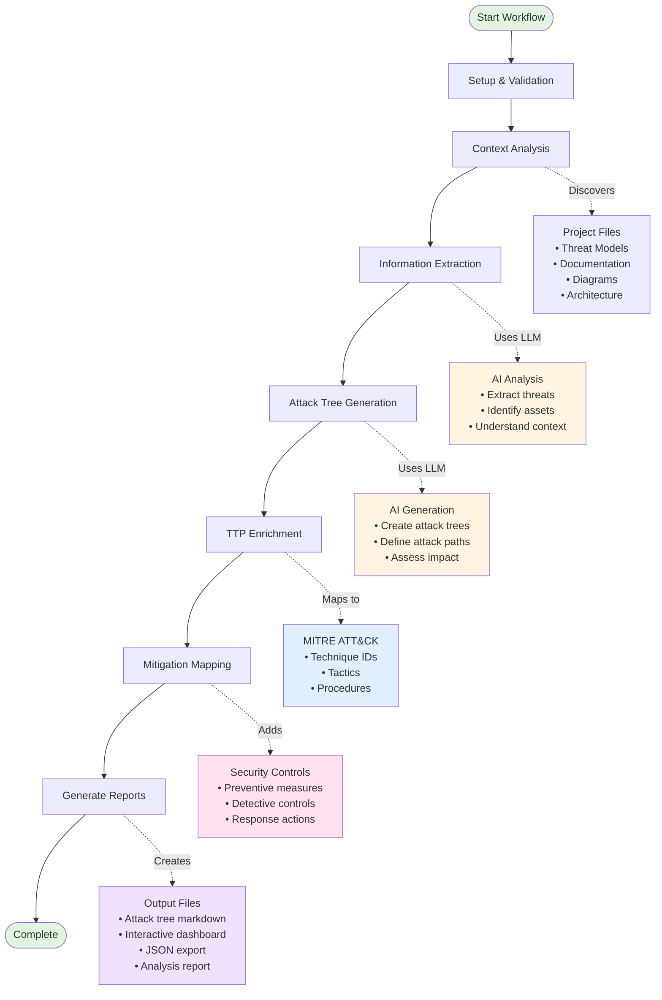

# How ThreatForest Works

!!! tip "TL;DR - Quick Summary"
    ThreatForest uses a 7-stage AI-powered pipeline to transform your project into comprehensive attack trees:
    
    1. **Setup** - Validates configuration
    2. **Discovery** - Finds threat models, docs, diagrams
    3. **Extraction** - AI analyzes application context
    4. **Generation** - Creates detailed attack trees
    5. **Enrichment** - Maps to MITRE ATT&CK techniques
    6. **Mitigation** - Adds security controls
    7. **Reporting** - Generates interactive dashboard
    
    **Time**: 5-30 minutes depending on project size  
    **Output**: Attack trees, dashboard, JSON export, analysis report

## Overview

ThreatForest uses a multi-stage workflow powered by the Strands agentic framework to transform your application context into comprehensive security analysis. The complete analysis includes attack tree generation, MITRE ATT&CK mapping, and mitigation recommendations—all in a single integrated pipeline.

## The Multi-Stage Workflow

### Workflow Diagram


```mermaid
graph TB
    Start([Start Workflow]) --> Setup[Setup & Validation]
    Setup --> Context[Context Analysis]
    Context --> Extract[Information Extraction]
    Extract --> Generate[Attack Tree Generation]
    Generate --> Enrich[TTP Enrichment]
    Enrich --> Mitigate[Mitigation Mapping]
    Mitigate --> Summary[Generate Reports]
    Summary --> End([Complete])

    Context -.->|Discovers| Files[Project Files<br/>• Threat Models<br/>• Documentation<br/>• Diagrams<br/>• Architecture]

    Extract -.->|Uses LLM| AI1[AI Analysis<br/>• Extract threats<br/>• Identify assets<br/>• Understand context]

    Generate -.->|Uses LLM| AI2[AI Generation<br/>• Create attack trees<br/>• Define attack paths<br/>• Assess impact]

    Enrich -.->|Maps to| MITRE[MITRE ATT&CK<br/>• Technique IDs<br/>• Tactics<br/>• Procedures]

    Mitigate -.->|Adds| Controls[Security Controls<br/>• Preventive measures<br/>• Detective controls<br/>• Response actions]

    Summary -.->|Creates| Output[Output Files<br/>• Attack tree markdown<br/>• Interactive dashboard<br/>• JSON export<br/>• Analysis report]

    style Start fill:#e1f5e1
    style End fill:#e1f5e1
    style AI1 fill:#fff4e1
    style AI2 fill:#fff4e1
    style MITRE fill:#e1f0ff
    style Controls fill:#ffe1f0
    style Output fill:#f0e1ff
```

### Timeline and Progress

The workflow runs through seven integrated stages:

| Stage | Progress | Duration | Description |
|-------|----------|----------|-------------|
| **Setup & Validation** | 0-5% | 5-10s | Validates configuration and project structure |
| **Context Analysis** | 5-15% | 10-30s | Discovers and categorizes project files |
| **Information Extraction** | 15-30% | 20-60s | Analyzes documentation and diagrams |
| **Attack Tree Generation** | 30-70% | 30-120s per threat | Creates detailed attack trees |
| **TTP Enrichment** | 70-85% | 10-30s per threat | Maps to MITRE ATT&CK techniques |
| **Mitigation Mapping** | 85-95% | 5-15s per threat | Adds security controls |
| **Report Generation** | 95-100% | 10-30s | Creates dashboard and reports |

## Detailed Phase Breakdown

### Phase 1: Attack Tree Generation (30-70%)

This is the core phase where ThreatForest creates detailed attack trees for each identified threat.

**What Happens:**

1. **Discovers Project Context** - Scans project directory, identifies threat models, documentation, and diagrams
2. **Analyzes Application** - Uses AI to understand system architecture, technologies, and security boundaries
3. **Extracts or Generates Threats** - Parses existing threats or generates new ones using AI
4. **Creates Attack Trees** - Generates detailed attack trees with multiple paths and prerequisites
5. **Produces Base Visualizations** - Creates markdown files and Mermaid diagrams

**Technologies Used:**

- Strands Framework for multi-agent orchestration
- Claude 3.5 Sonnet (default) or other LLM models
- Strands `file_read` tool for intelligent parsing

**Output:**
```
project/threatforest/attack_trees/
├── attack_tree_T001_sql_injection.md
├── attack_tree_T002_xss_attack.md
└── .threatforest_state.json
```

[→ Learn More About Attack Tree Generation](phases.md#phase-1-attack-tree-generation)

### Phase 2: TTP Enrichment (70-85%)

Maps attack steps to MITRE ATT&CK techniques using semantic similarity.

**What Happens:**

1. **Reads Attack Trees** - Loads generated attack tree markdown files
2. **Extracts Attack Steps** - Identifies individual steps in each path
3. **Semantic Matching** - Uses vector embeddings to match against MITRE ATT&CK database
4. **Enriches Trees** - Adds MITRE technique IDs, tactics, and descriptions
5. **Generates Enhanced Output** - Updates markdown with TTP mappings

**Semantic Similarity Threshold:** 0.3 (configurable)

**Confidence Levels:**
- 0.8-1.0: High confidence match
- 0.5-0.8: Medium confidence match
- 0.3-0.5: Low confidence match
- <0.3: No match (step not mapped)

[→ Learn More About TTP Enrichment](phases.md#phase-2-ttp-enrichment)

### Phase 3: Mitigation Mapping (85-95%)

Adds security controls and implementation guidance.

**What Happens:**

1. **Reads Enriched Trees** - Loads TTP-enriched attack trees
2. **Identifies Techniques** - Collects all technique IDs from attack tree
3. **Maps Mitigations** - Looks up MITRE mitigation controls (M1001-M1057)
4. **Adds Recommendations** - Includes implementation guidance and best practices
5. **Generates Complete Trees** - Creates fully enriched attack trees
6. **Produces Final Dashboard** - Creates interactive HTML visualization

**Common Mitigations:**
- M1027: Password Policies
- M1032: Multi-factor Authentication
- M1050: Exploit Protection
- M1026: Privileged Account Management

[→ Learn More About Mitigation Mapping](phases.md#phase-3-mitigation-mapping)

### Phase 4: Report Generation (95-100%)

Creates comprehensive outputs for different audiences.

**What Happens:**

1. **Aggregates Data** - Collects all attack tree data and calculates statistics
2. **Creates JSON Export** - Structures data for programmatic access
3. **Generates Analysis Report** - Creates executive summary with recommendations
4. **Builds Interactive Dashboard** - Generates HTML visualization with filtering
5. **Finalizes State** - Updates state file to "completed"

**Final Output:**
```
project/threatforest/attack_trees/
├── attack_tree_T001_sql_injection.md
├── attack_trees_dashboard.html
├── threatforest_data.json
├── threatforest_analysis_report.md
└── .threatforest_state.json
```

[→ Learn More About Report Generation](phases.md#phase-4-report-generation)

## Performance Characteristics

### Analysis Duration

**Time Breakdown by Phase:**

=== "Small Project (3 threats)"
    - Setup & Validation: 5-10 seconds
    - Context Analysis: 10-20 seconds
    - Information Extraction: 20-40 seconds
    - Attack Tree Generation: 90-180 seconds (30-60s per threat)
    - TTP Enrichment: 30-60 seconds
    - Mitigation Mapping: 15-30 seconds
    - Report Generation: 10-20 seconds
    
    **Total: 5-10 minutes**

=== "Medium Project (5 threats)"
    - Setup & Validation: 5-10 seconds
    - Context Analysis: 15-30 seconds
    - Information Extraction: 30-60 seconds
    - Attack Tree Generation: 150-300 seconds (30-60s per threat)
    - TTP Enrichment: 50-100 seconds
    - Mitigation Mapping: 25-50 seconds
    - Report Generation: 15-30 seconds
    
    **Total: 10-15 minutes**

=== "Large Project (10 threats)"
    - Setup & Validation: 10-15 seconds
    - Context Analysis: 20-40 seconds
    - Information Extraction: 40-80 seconds
    - Attack Tree Generation: 300-600 seconds (30-60s per threat)
    - TTP Enrichment: 100-200 seconds
    - Mitigation Mapping: 50-100 seconds
    - Report Generation: 20-40 seconds
    
    **Total: 20-30 minutes**

[→ Learn More About Performance](performance.md)

## Technical Architecture

### Components

**Orchestrator** - Manages workflow stages, coordinates agents, handles state transitions

**Agents:**

- Repository Analysis Agent
- Threat Generation Agent
- Parser Agent

**Services:**

- Embedding Service (sentence-transformers)
- Graph Builder (MITRE ATT&CK)
- Visualization Service

**Tools:**

- Strands community tools
- File operations
- LLM invocations

[→ Learn More About Architecture](../architecture/overview.md)

## Best Practices for Optimal Results

### Input Quality

!!! tip "Provide Detailed Documentation"
    - Clear architecture descriptions
    - Component responsibilities
    - Data flow explanations
    - Security control documentation

!!! tip "Use ThreatComposer"
    - Structured threat format
    - Priority assignments
    - Rich context
    - STRIDE categorization

!!! tip "Include Diagrams"
    - Data flow diagrams
    - Component diagrams
    - Network topology
    - Deployment architecture

### Configuration

**Choose Appropriate Model:**

- Development: Claude 3 Haiku (fast iteration)
- Production: Claude 3.5 Sonnet (balanced)
- Critical: Claude 3 Opus (highest quality)

**Optimize Threshold:**

- Default 0.3 works for most cases
- Increase for more specific matches
- Decrease for broader coverage

### Workflow Management

**Plan Analysis Time:**

- Allow sufficient time for completion
- Don't interrupt during critical stages
- Monitor progress indicators

**Review Results:**

- Validate attack trees for accuracy
- Check MITRE mappings for relevance
- Verify mitigation applicability

## Next Steps

<div class="grid cards" markdown>

-   📊 __Detailed Phase Breakdown__

    ---

    Deep dive into each workflow phase

    [→ Workflow Phases](phases.md)

-   ⚡ __Performance Guide__

    ---

    Optimize analysis speed and quality

    [→ Performance](performance.md)

-   🏗️ __Architecture Details__

    ---

    System design and components

    [→ Architecture](../architecture/overview.md)

</div>
