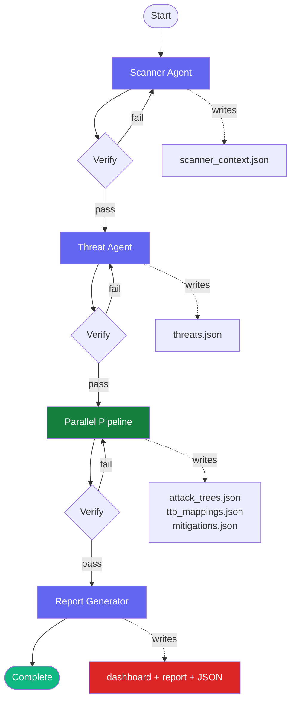
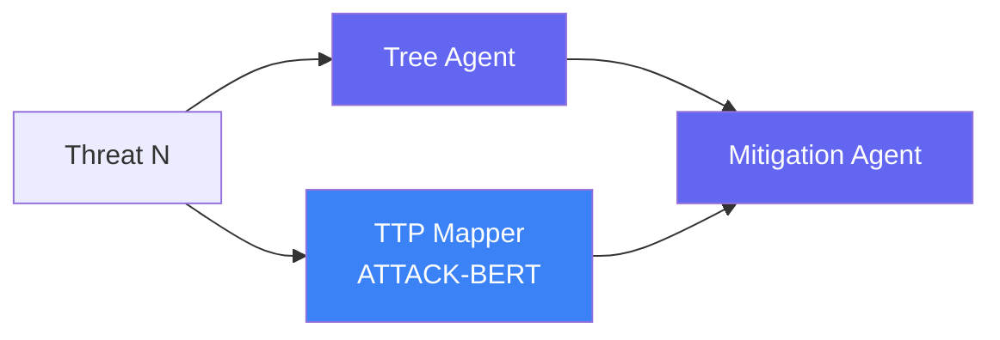

# How ThreatForest Works

!!! tip "TL;DR - Quick Summary"
    ThreatForest uses a 4-stage AI pipeline to transform your project into comprehensive attack trees:

    1. **Scanner** — explores repo, identifies tech stack and architecture
    2. **Threat** — produces a structured threat list
    3. **Parallel Pipeline** — for every threat concurrently: attack tree + TTP mapping + mitigations
    4. **Report** — compiles outputs into dashboard, report, and JSON export

    **Time**: 5-30 minutes depending on project size and model
    **Output**: Interactive dashboard, markdown report, JSON export

## Overview

ThreatForest uses a Strands Graph to orchestrate specialized agents. Each stage writes state files that the next stage reads. The parallel pipeline runs all threats concurrently for speed.

## Pipeline Overview

```mermaid
graph TB
    Start([Start]) --> Scanner[Scanner Agent]
    Scanner --> ScanVerify{Verify}
    ScanVerify -->|pass| Threat[Threat Agent]
    ScanVerify -->|fail| Scanner
    Threat --> ThreatVerify{Verify}
    ThreatVerify -->|pass| Parallel[Parallel Pipeline]
    ThreatVerify -->|fail| Threat
    Parallel --> ParVerify{Verify}
    ParVerify -->|pass| Report[Report Generator]
    ParVerify -->|fail| Parallel
    Report --> End([Complete])

    Scanner -.->|writes| SC[scanner_context.json]
    Threat -.->|writes| TH[threats.json]
    Parallel -.->|writes| PP[attack_trees.json\nttp_mappings.json\nmitigations.json]
    Report -.->|writes| OUT[dashboard + report + JSON]

    style Scanner fill:#6366f1,color:#fff
    style Threat fill:#6366f1,color:#fff
    style Parallel fill:#15803d,color:#fff
    style Report fill:#6366f1,color:#fff
    style End fill:#10b981,color:#fff
    style OUT fill:#dc2626,color:#fff
```

### Parallel Pipeline (per threat, concurrent)

```mermaid
graph LR
    T[Threat N] --> Tree[Tree Agent]
    T --> TTP[TTP Mapper\nATTACK-BERT]
    Tree --> Mit[Mitigation Agent]
    TTP --> Mit

    style Tree fill:#6366f1,color:#fff
    style TTP fill:#3b82f6,color:#fff
    style Mit fill:#6366f1,color:#fff
```

All threats run through the parallel pipeline at the same time via `asyncio.gather`.

[→ Detailed phase breakdown](phases.md)

## Best Practices for Optimal Results

### Input Quality

!!! tip "Provide Detailed Documentation"
    - Clear architecture descriptions
    - Component responsibilities
    - Data flow explanations
    - Security control documentation

!!! tip "Use ThreatComposer"
    - Structured threat format
    - Priority assignments
    - Rich context
    - STRIDE categorization

!!! tip "Include Diagrams"
    - Data flow diagrams
    - Component diagrams
    - Network topology
    - Deployment architecture

## Next Steps

-   📊 __Detailed Phase Breakdown__

    ---

    Deep dive into each workflow phase

    [→ Workflow Phases](phases.md)

-   🏗️ __Architecture Details__

    ---

    System design and components

    [→ Architecture](../architecture/overview.md)

