# How ThreatForest Works

!!! tip "TL;DR - Quick Summary"
    ThreatForest uses a 7-stage AI-powered pipeline to transform your project into comprehensive attack trees:
    
    1. **Setup** - Validates configuration
    2. **Discovery** - Finds threat models, docs, diagrams
    3. **Extraction** - AI analyzes application context
    4. **Generation** - Creates detailed attack trees
    5. **Enrichment** - Maps to MITRE ATT&CK techniques
    6. **Mitigation** - Adds security controls
    7. **Reporting** - Generates interactive dashboard
    
    **Time**: 5-9 minutes depending on project size  
    **Output**: Attack trees, dashboard, JSON export, analysis report

## Overview

ThreatForest uses a multi-stage workflow powered by the Strands agentic framework to transform your application context into comprehensive security analysis. The complete analysis includes attack tree generation, MITRE ATT&CK mapping, and mitigation recommendations—all in a single integrated pipeline.

## The Multi-Stage Workflow

### Workflow Diagram

```mermaid
graph TB
    Start([Start Workflow]) --> Setup[Setup & Validation]
    Setup --> Context[Context Analysis]
    Context --> Extract[Information Extraction]
    Extract --> Generate[Attack Tree Generation]
    Generate --> Enrich[TTP Enrichment]
    Enrich --> Mitigate[Mitigation Mapping]
    Mitigate --> Summary[Generate Reports]
    Summary --> End([Complete])

    Context -.->|Discovers| Files[Project Files<br/>• Threat Models<br/>• Documentation<br/>• Diagrams<br/>• Architecture]

    Extract -.->|Uses LLM| AI1[AI Analysis<br/>• Extract threats<br/>• Identify assets<br/>• Understand context]

    Generate -.->|Uses LLM| AI2[AI Generation<br/>• Create attack trees<br/>• Define attack paths<br/>• Assess impact]

    Enrich -.->|Maps to| MITRE[MITRE ATT&CK<br/>• Technique IDs<br/>• Tactics<br/>• Procedures]

    Mitigate -.->|Adds| Controls[Security Controls<br/>• Preventive measures<br/>• Detective controls<br/>• Response actions]

    Summary -.->|Creates| Output[Output Files<br/>• Attack tree markdown<br/>• Interactive dashboard<br/>• JSON export<br/>• Analysis report]

    style Start fill:#10b981,stroke:#059669,stroke-width:3px,color:#fff
    style End fill:#10b981,stroke:#059669,stroke-width:3px,color:#fff
    style AI1 fill:#f59e0b,stroke:#d97706,stroke-width:2px,color:#000
    style AI2 fill:#f59e0b,stroke:#d97706,stroke-width:2px,color:#000
    style MITRE fill:#3b82f6,stroke:#2563eb,stroke-width:2px,color:#fff
    style Controls fill:#ec4899,stroke:#db2777,stroke-width:2px,color:#fff
    style Output fill:#8b5cf6,stroke:#7c3aed,stroke-width:2px,color:#fff
```

[→ Learn More About Report Generation](phases.md#phase-4-report-generation)

## Best Practices for Optimal Results

### Input Quality

!!! tip "Provide Detailed Documentation"
    - Clear architecture descriptions
    - Component responsibilities
    - Data flow explanations
    - Security control documentation

!!! tip "Use ThreatComposer"
    - Structured threat format
    - Priority assignments
    - Rich context
    - STRIDE categorization

!!! tip "Include Diagrams"
    - Data flow diagrams
    - Component diagrams
    - Network topology
    - Deployment architecture

## Next Steps

-   📊 __Detailed Phase Breakdown__

    ---

    Deep dive into each workflow phase

    [→ Workflow Phases](phases.md)

-   🏗️ __Architecture Details__

    ---

    System design and components

    [→ Architecture](../architecture/overview.md)

