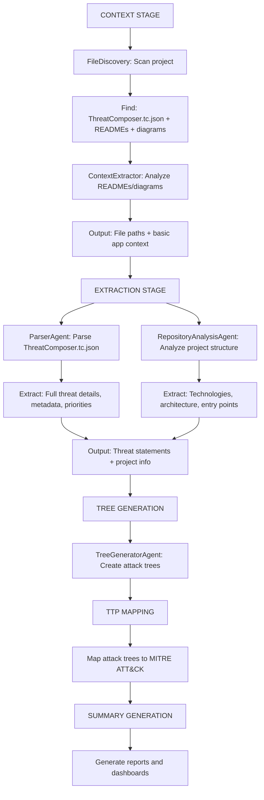
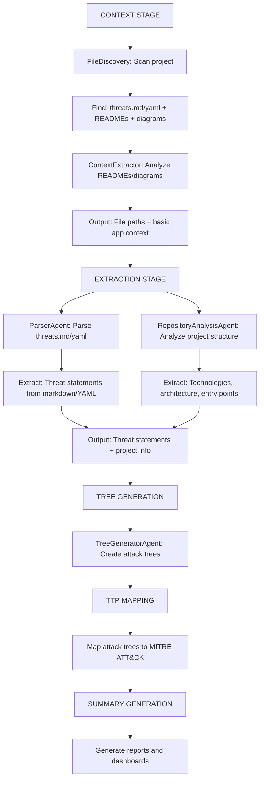
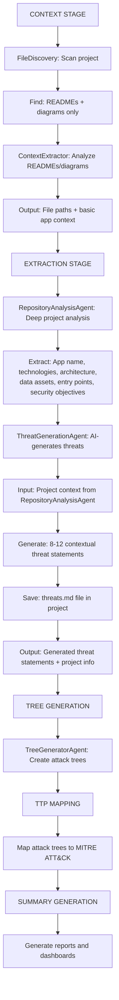
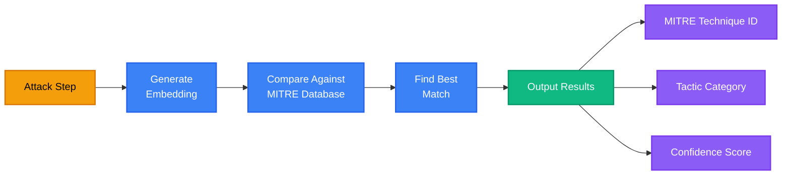

# Workflow Phases

This page provides detailed information about each phase of the ThreatForest workflow.

## Workflow Scenarios

ThreatForest adapts its analysis workflow based on the input files available in your project. Below are the three main scenarios:

### :dart: Scenario 1: ThreatComposer File Provided

When a ThreatComposer file (`*.tc.json`) is present, ThreatForest uses it as the authoritative source for threat statements.



!!! success "Best Practice"
    This scenario provides the most accurate results since threats are explicitly defined in the ThreatComposer format with full metadata.

### :page_facing_up: Scenario 2: Threat Statement File Provided

When threat statements are provided in Markdown (`.md`) or YAML (`.yaml`) format, ThreatForest parses them to extract threat information.



!!! tip "Supported Formats"
    - **Markdown**: `threats.md`, `THREATS.md`
    - **YAML**: `threats.yaml`, `threats.yml`

### :robot: Scenario 3: No Threat Files Provided

When no threat files exist, ThreatForest uses AI to analyze your project and generate contextual threat statements automatically.



!!! info "AI-Generated Threats"
    The ThreatGenerationAgent analyzes your project's:
    
    - Application architecture and components
    - Technologies and frameworks used
    - Data flows and storage mechanisms
    - External dependencies and APIs
    - Security-relevant configuration
    
    It generates **8-12 contextual threat statements** based on STRIDE methodology, automatically saved to `threats.md` in your project directory.

---

## Phase 1: Attack Tree Generation 

This is the core phase where ThreatForest creates detailed attack trees for each identified threat.

### What Happens

#### 1. Discovers Project Context
- Scans project directory recursively
- Identifies threat models, documentation, and diagrams
- Categorizes files by type and relevance
- Prioritizes content for analysis

**Discovery Patterns:**

```
Threat Models: *.tc.json, threats.json, threats.yaml
Documentation: README.md, ARCHITECTURE.md, docs/**/*.md
Diagrams: *.png, *.mmd, *.drawio, *.puml
```

#### 2. Analyzes Application
- Uses AI to understand system architecture
- Identifies technologies and frameworks
- Maps data flows and trust boundaries
- Extracts security-relevant information

**What AI Analyzes:**

- Component relationships
- Authentication mechanisms
- Data storage and transmission
- External dependencies
- Security controls in place

#### 3. Extracts or Generates Threats

=== "If ThreatComposer File Exists"
    - Parses threat statements
    - Extracts threat metadata (priority, STRIDE, etc.)
    - Identifies affected components
    - Prioritizes based on severity

=== "If No Threat Model Exists"
    - AI analyzes architecture documentation
    - Identifies potential security concerns
    - Generates relevant threat statements
    - Assigns priority levels

#### 4. Creates Attack Trees
- Generates detailed attack trees for high-priority threats
- Develops multiple attack paths per threat
- Defines step-by-step attack sequences
- Assesses prerequisites for each step
- Evaluates impact and likelihood


#### 5. Produces Base Visualizations
- Creates markdown files for each attack tree
- Generates Mermaid diagrams
- Structures data for subsequent phases

**File Analysis:**

- Strands `file_read` tool for intelligent parsing
- PDF text extraction
- Image analysis for diagrams
- Mermaid diagram interpretation


---

## Phase 2: TTP Enrichment 

This phase maps attack steps to MITRE ATT&CK techniques using semantic similarity.

### What Happens

#### 1. Reads Attack Trees
- Loads generated attack tree markdown files
- Parses attack paths and steps
- Extracts attack descriptions

#### 2. Extracts Attack Steps
- Identifies individual steps in each path
- Extracts step descriptions and context
- Prepares for semantic matching

#### 3. Semantic Matching

**Vector Embeddings:**
- Uses `sentence-transformers` models
- Generates embeddings for attack steps
- Compares against MITRE ATT&CK database
- Calculates similarity scores

**MITRE ATT&CK Database:**

- Enterprise ATT&CK v13.0+
- 14 tactics (Initial Access, Execution, etc.)
- 200+ techniques and sub-techniques
- Pre-computed embeddings for fast matching

**Matching Process:**



#### 4. Enriches Trees
- Adds MITRE ATT&CK technique IDs to each step
- Includes tactic categorization
- Adds technique descriptions
- Records confidence scores (0.0-1.0)

#### 5. Generates Enhanced Output
- Updates markdown files with TTP mappings
- Preserves original attack tree structure
- Adds MITRE context to each step

### Semantic Similarity Threshold

**Default Threshold:** 0.3

**Confidence Levels:**

| Score Range | Confidence | Meaning |
|-------------|------------|---------|
| 0.8-1.0 | High | Strong semantic match |
| 0.5-0.8 | Medium | Reasonable match |
| 0.3-0.5 | Low | Weak but relevant match |
| <0.3 | None | No match (step not mapped) |


---

## Phase 3: Mitigation Mapping 

This phase adds security controls and implementation guidance.

### What Happens

#### 1. Reads Enriched Trees
- Loads TTP-enriched attack trees
- Extracts MITRE ATT&CK technique IDs
- Prepares for mitigation lookup

#### 2. Identifies Techniques
- Collects all technique IDs from attack tree
- Groups by tactic
- Prioritizes by threat severity

#### 3. Maps Mitigations

**MITRE Mitigation Database:**

- 40+ mitigation controls (M1001-M1057)
- Mapped to techniques
- Implementation guidance
- Best practices

#### 4. Adds Recommendations
- Includes mitigation IDs and descriptions
- Provides implementation guidance
- Suggests best practices
- Estimates implementation effort

#### 5. Generates Complete Trees
- Creates fully enriched attack trees
- Includes all previous information
- Adds actionable mitigations
- Provides implementation priorities
o

---

## Phase 4: Report Generation 

Final phase creates comprehensive outputs for different audiences.

### What Happens

#### 1. Aggregates Data
- Collects all attack tree data
- Calculates statistics
- Generates metrics

**Metrics Collected:**

- Total threats analyzed
- Attack paths identified
- MITRE techniques mapped
- Mitigations recommended
- High/Medium/Low priority breakdown

#### 2. Creates JSON Export
- Structures data in JSON format
- Includes metadata
- Enables programmatic access
**JSON Structure:**
```json
{
  "metadata": {
    "analysis_date": "2025-12-02T17:00:00Z",
    "project_name": "MyApp",
    "total_threats": 5
  },
  "threats": [
    {
      "id": "T001",
      "title": "SQL Injection",
      "priority": "High",
      "attack_paths": [...],
      "mitre_techniques": [...],
      "mitigations": [...]
    }
  ]
}
```

#### 3. Generates Analysis Report
- Creates executive summary
- Lists key findings
- Provides recommendations
- Includes statistics

**Report Sections:**

- Executive Summary
- Threat Overview
- Key Findings
- Recommended Actions
- Appendix (detailed statistics)

#### 4. Builds Interactive Dashboard
- Generates HTML visualization
- Includes all threat data
- Enables interactive exploration
- Supports filtering and search

**Dashboard Features:**

- Visual network graph
- Interactive node exploration
- Dynamic filtering
- Search capabilities
- Export options

#### 5. Finalizes State
- Updates state file to "completed"
- Records completion timestamp
- Archives interim data

### Final Output Structure

```
project/threatforest/attack_trees/
├── attack_tree_T001_sql_injection.md       # Individual attack trees
├── attack_tree_T002_xss_attack.md
├── attack_tree_T003_auth_bypass.md
├── attack_trees_dashboard.html              # Interactive dashboard ⭐
├── threatforest_data.json                   # JSON export
├── threatforest_analysis_report.md          # Executive report
└── .threatforest_state.json                 # State tracking
```

---

## Error Handling and Recovery

### Automatic Recovery

**Network Failures:**

- Retries with exponential backoff
- Saves progress before retry
- Continues from last checkpoint

**Model Errors:**

- Catches API errors
- Logs error details
- Attempts alternative approaches
- Preserves partial results

**Validation Errors:**

- Validates inputs before processing
- Provides clear error messages
- Suggests corrections
- Prevents invalid state

---

## Next Steps

<div class="grid cards" markdown>

-   🏗️ __Architecture Details__

    ---

    System design and components

    [→ Architecture](../architecture/overview.md)

-   📖 __User Guide__

    ---

    Learn to run ThreatForest effectively

    [→ User Guide](../user-guide/index.md)

</div>
