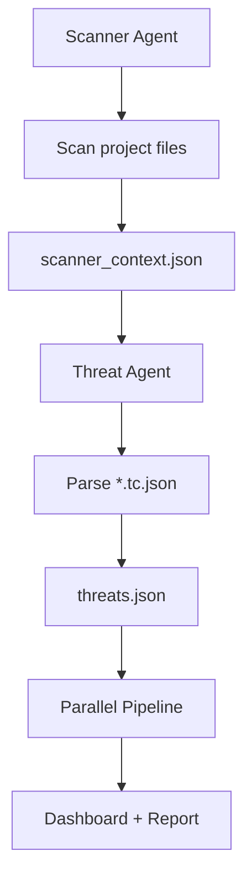
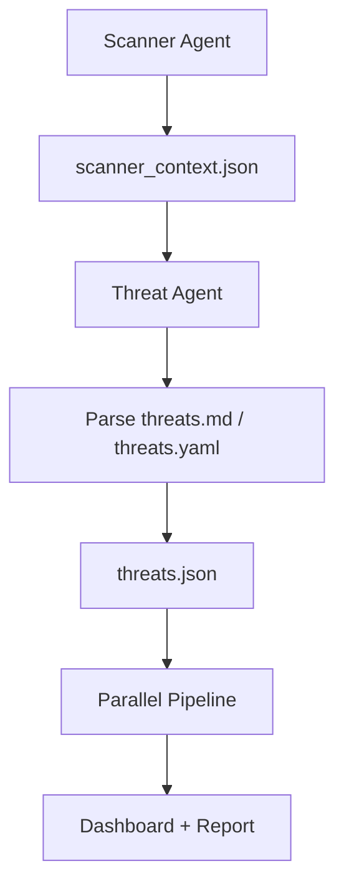
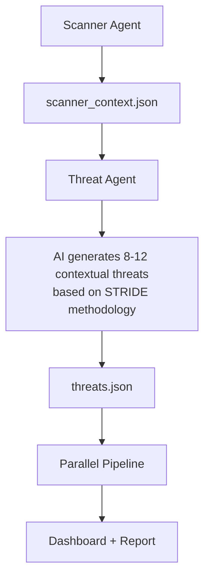
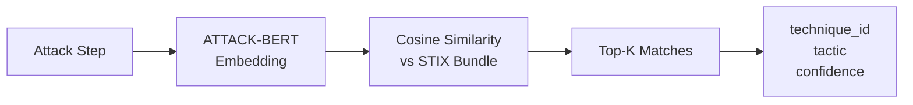

# Workflow Phases

This page provides detailed information about each phase of the ThreatForest workflow.

## Workflow Scenarios

The **Threat Agent** adapts based on what it finds in your project:

### :dart: Scenario 1: ThreatComposer File Provided

When a `*.tc.json` file is present, the Threat Agent uses it as the authoritative source.


```mermaid
graph TD
    A[Scanner Agent] --> B[Scan project files]
    B --> C[scanner_context.json]
    C --> D[Threat Agent]
    D --> E[Parse *.tc.json]
    E --> F[threats.json]
    F --> G[Parallel Pipeline]
    G --> H[Dashboard + Report]
```

!!! success "Best Practice"
    ThreatComposer provides the most accurate results — threats are explicitly defined with full metadata, priority, and STRIDE categorization.

### :page_facing_up: Scenario 2: Threat File Provided

When a `threats.md` or `threats.yaml` file is present, the Threat Agent parses it.


```mermaid
graph TD
    A[Scanner Agent] --> B[scanner_context.json]
    B --> C[Threat Agent]
    C --> D[Parse threats.md / threats.yaml]
    D --> E[threats.json]
    E --> F[Parallel Pipeline]
    F --> G[Dashboard + Report]
```

!!! tip "Supported Formats"
    - **Markdown**: `threats.md`, `THREATS.md`
    - **YAML**: `threats.yaml`, `threats.yml`
    - **JSON**: `threats.json`

### :robot: Scenario 3: No Threat Files Provided

When no threat file exists, the Threat Agent generates threats from scanner context.


```mermaid
graph TD
    A[Scanner Agent] --> B[scanner_context.json]
    B --> C[Threat Agent]
    C --> D[AI generates 8-12 contextual threats\nbased on STRIDE methodology]
    D --> E[threats.json]
    E --> F[Parallel Pipeline]
    F --> G[Dashboard + Report]
```

!!! info "AI-Generated Threats"
    The Threat Agent analyzes tech stack, architecture, data flows, and entry points from the scanner context to generate relevant, context-aware threat statements.

---

## Phase 1: Scanner Agent

The Scanner Agent explores the repository using sandboxed file tools and builds a structured picture of the project.

### What It Does

- Recursively scans project files
- Identifies tech stack, frameworks, and cloud provider
- Discovers services, data stores, and auth mechanisms
- Reads READMEs, architecture docs, and diagrams

**Files it reads:**

```
Threat Models: *.tc.json, threats.json, threats.yaml
Documentation: README.md, ARCHITECTURE.md, docs/**/*.md
Diagrams: *.png, *.mmd, *.drawio, *.puml
```

**Output:** `.threatforest/state/scanner_context.json`

---

## Phase 2: Threat Agent

Reads `scanner_context.json` and produces a structured threat list.

### What It Does

=== "ThreatComposer file found"
    - Parses `*.tc.json`
    - Extracts threat metadata (priority, STRIDE, affected components)

=== "Markdown/YAML file found"
    - Parses `threats.md` or `threats.yaml`
    - Extracts threat statements

=== "No threat file found"
    - AI generates 8-12 contextual threats from scanner context
    - Based on STRIDE methodology

**Output:** `.threatforest/state/threats.json`

---

## Phase 3: Parallel Pipeline

For each threat in `threats.json`, three agents run **concurrently**:

### Tree Agent

Generates a detailed attack tree for the threat:

- Multiple attack paths with step-by-step sequences
- Prerequisites and impact ratings per step
- Structured for TTP matching

### TTP Mapper

Maps each attack step to MITRE ATT&CK techniques using `basel/ATTACK-BERT` embeddings:


```mermaid
graph LR
    A[Attack Step] --> B[ATTACK-BERT\nEmbedding]
    B --> C[Cosine Similarity\nvs STIX Bundle]
    C --> D[Top-K Matches]
    D --> E[technique_id\ntactic\nconfidence]
```

**MITRE ATT&CK database:** Enterprise v18.0 (bundled STIX)

**Confidence levels:**

| Score | Confidence |
|---|---|
| 0.8-1.0 | High — strong semantic match |
| 0.5-0.8 | Medium — reasonable match |
| 0.3-0.5 | Low — weak but relevant |
| <0.3 | No match (step not mapped) |

Default threshold: `0.3` — configurable via `embeddings.ttc_threshold`

### Mitigation Agent

Reads attack trees and TTP mappings, then maps technique IDs to MITRE mitigation controls (M1001-M1057) from the STIX bundle.

**Outputs (all written in parallel):**
- `.threatforest/state/attack_trees.json`
- `.threatforest/state/ttp_mappings.json`
- `.threatforest/state/mitigations.json`

---

## Phase 4: Report Generator

Deterministic — no LLM calls. Reads all state files and compiles the final outputs.

### What It Produces

```
project/.threatforest/output/
├── attack_trees_dashboard.html   # Interactive visualization ⭐
├── threat_model_report.md        # Executive summary
└── threatforest_data.json        # JSON export
```

**Dashboard features:**

- Visual network graph (vis-network)
- Interactive node exploration
- Dynamic filtering and search
- MITRE ATT&CK technique details
- Expandable mitigation strategies

---

## Error Handling and Recovery

### Automatic Recovery

**Network Failures:**

- Retries with exponential backoff
- Saves progress before retry
- Continues from last checkpoint

**Model Errors:**

- Catches API errors
- Logs error details
- Attempts alternative approaches
- Preserves partial results

**Validation Errors:**

- Validates inputs before processing
- Provides clear error messages
- Suggests corrections
- Prevents invalid state

---

## Next Steps

<div class="grid cards" markdown>

-   🏗️ __Architecture Details__

    ---

    System design and components

    [→ Architecture](../architecture/overview.md)

-   📖 __User Guide__

    ---

    Learn to run ThreatForest effectively

    [→ User Guide](../user-guide/index.md)

</div>
