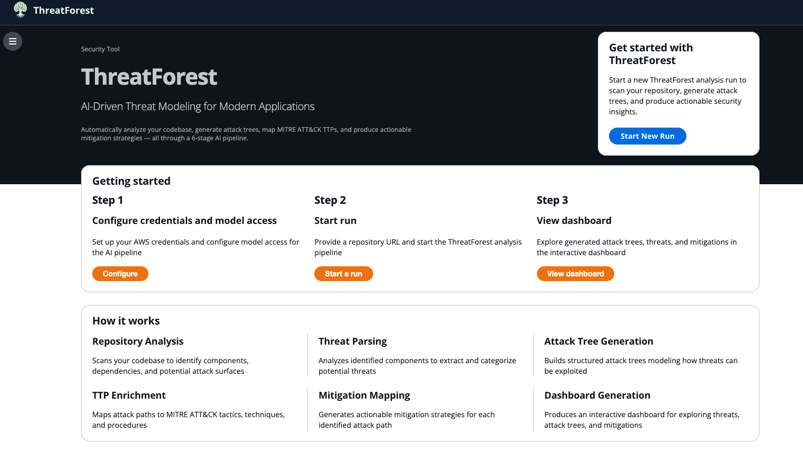
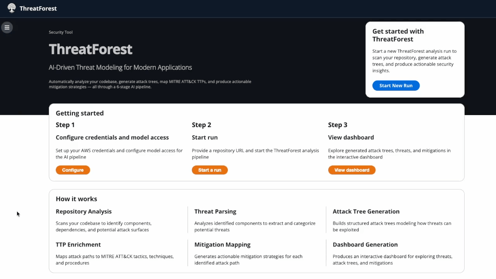

# 🌳 ThreatForest [samples-agentic-attack-tree-generator]

AI powered threat modeling and attack tree generator
 

Get comprehensive threat models for your application, with autonomous AI agents that analyze, generate, and visualize attack trees mapped to MITRE ATT&CK

    

[Get Started](getting-started/index.md){ .md-button .md-button--primary }

💻 <a href="https://github.com/aws-samples/sample-agentic-attack-tree-generator">GitHub Repository</a>

---

## ✨ What is ThreatForest?

  

    
🤖 Autonomous Agents

    

      
A pipeline of specialized AI agents developed by threat modeling and data science experts, built on the Strands framework — scanner, threat identifier, attack tree generator, TTP mapper, and mitigation advisor — run automatically in sequence with parallel per-threat processing

    

  

  

    
🛡️ MITRE ATT&CK Integration

    

      
Automatically maps attack steps to TTPs (Tactics, Techniques, and Procedures) using semantic similarity and vector embeddings

    

  

  

    
📊 Interactive Dashboards

    

      
Explore threats visually with interactive dashboards, complete with filtering and real-time search

    

  

  

    
⚙️ AWS Bedrock Support

    

      
Officially supports AWS Bedrock (Claude models). Other providers (Anthropic, OpenAI, Gemini, Ollama) are experimental and not fully tested

    

  

## 🚀 Quick Example

Generate comprehensive attack trees in minutes:

!!! tip "Prerequisites"
    Before starting, ensure you have [Python 3.11+ and an LLM provider configured](getting-started/index.md). AWS Bedrock is fully supported and recommended.

    

---

## 🎯 Key Features

**Intelligent Analysis**

!!! success "Repository Scanning"
    **Scanner Agent** autonomously navigates your project using Strands tools to discover:

    - Architecture diagrams and documentation
    - Technology stack and cloud provider
    - Data flows and trust boundaries
    - Auth mechanisms and entry points

!!! info "Threat Identification"
    **Threat Agent** reads scanner context and produces a structured threat list from:

    - ThreatComposer workspaces (`.tc.json`)
    - JSON, YAML, and Markdown formats
    - AI-generated threats when no file exists

!!! tip "Parallel Analysis"
    **Per-threat pipeline** runs concurrently for every identified threat:

    - Attack tree generation
    - MITRE ATT&CK TTP mapping (ATTACK-BERT embeddings)
    - Mitigation recommendations

---

## 💼 Use Cases

-   🛡️ __Security Teams__

    ---

    Automate threat modeling, generate attack trees, map to MITRE ATT&CK for compliance

-   🔄 __DevSecOps__

    ---

    Integrate into CI/CD, analyze changes, generate security documentation

-   🏗️ __Architects & Developers__

    ---

    Understand security implications, identify vulnerabilities early, learn attack patterns

-   📋 __Compliance & Auditors__

    ---

    Document threats, demonstrate due diligence, generate compliance reports

---

## 📊 What You Get

**⭐ Interactive Dashboard**

*Interactive dashboard with graph visualization*

**Features:**

- Visual network graph with pan/zoom
- Interactive node exploration
- Real-time filtering and search
- MITRE ATT&CK technique details
- Expandable mitigation strategies with editable status tracking (Already implemented / In progress / Accepted risk / Not relevant / Won't do)
- PDF / CSV / JSON exports plus a self-contained `.tfreport` bundle for sharing with reviewers who don't have the source code

---

## 🔒 Privacy & Security

!!! warning "Data Privacy"
    ThreatForest sends application context to your configured LLM provider for analysis. AWS Bedrock provides enterprise-grade data handling. For other providers, review their data policies.

**Best Practices:**

- Use AWS Bedrock for production workloads (officially supported)
- Remove secrets and credentials from project files before analysis
- Review generated output for any sensitive information
- Store outputs in secure, access-controlled locations

---

## 🔍 How ThreatForest Compares

ThreatForest was benchmarked against three other AWS threat modeling tools on the same target application — a CDK-deployed healthcare system with Bedrock Agent, Lambda, DynamoDB, and OpenSearch Serverless.

| Capability | ThreatForest | Threat Composer AI | Aside-MCP | ADK (AppSec Toolkit) |
|---|:---:|:---:|:---:|:---:|
| Analyzes source code | :white_check_mark: | :white_check_mark: | :white_check_mark: | :warning: Requires Talos |
| Analyzes docs & diagrams | :white_check_mark: | :x: | :x: | :x: |
| Accepts PDF input | :white_check_mark: | :x: | :x: | :x: |
| Generates attack trees | :white_check_mark: | :x: | :x: | :x: |
| Maps to MITRE ATT&CK | :white_check_mark: | :x: | :x: | :x: |
| Maps to STRIDE | :x: | :white_check_mark: | :white_check_mark: | :white_check_mark: |
| AI/ML methodology (MAESTRO) | :x: | :x: | :white_check_mark: | :x: |
| Interactive dashboard | :white_check_mark: | :x: | :x: | :x: |
| Standalone operation | :white_check_mark: | :white_check_mark: | :x: MCP server | :warning: Requires Talos |

### Healthcare Benchmark (same target application)

| Metric | ThreatForest | Threat Composer AI | Aside-MCP | ADK |
|---|:---:|:---:|:---:|:---:|
| Threats identified | 12 | 20 | 42 | 27 |
| Attack trees | 12 | — | — | — |
| ATT&CK mappings | 171 | — | — | — |
| Mitigations | 121 | 28 | 16 | 13 |
| Names exact resources | :white_check_mark: | :x: | :x: | :x: |

!!! tip "Complementary Tools"
    ThreatForest provides **depth** — attack trees with step-by-step exploitation chains mapped to MITRE ATT&CK, with mitigations that name exact resources from your codebase. Other tools provide **breadth** — wider threat counts, STRIDE categorisation, and assumption tracking. Running ThreatForest alongside complementary tools gives you both.

---

## 🆘 Need Help?

-   📚 __Documentation__

    ---

    Browse comprehensive guides and API references

    [→ Read the docs](getting-started/index.md)

-   🐛 __Report Issues__

    ---

    Found a bug? Have a feature request?

    [→ GitHub Issues](https://github.com/aws-samples/sample-agentic-attack-tree-generator/issues)

-   ❓ __FAQ__

    ---

    Frequently asked questions

    [→ FAQ](faq.md)

