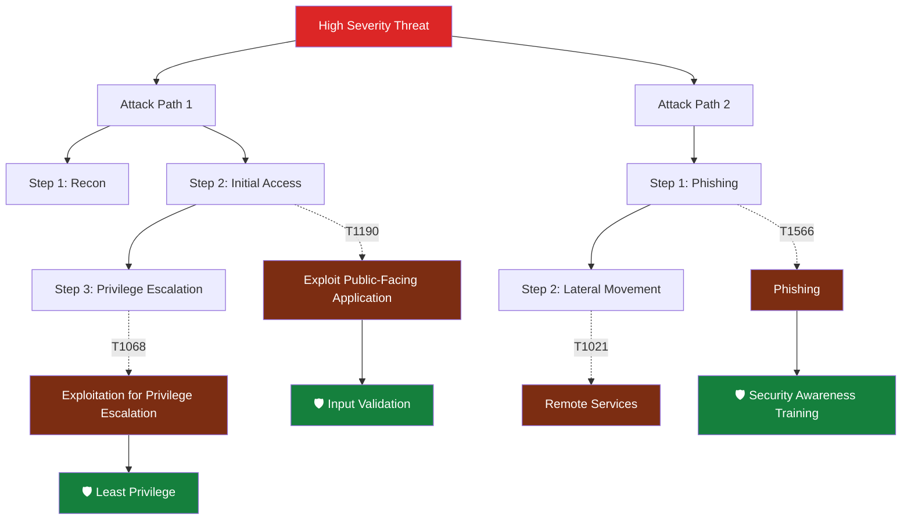
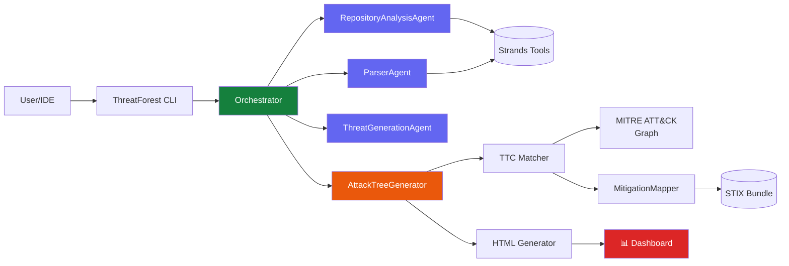

# 🌳 ThreatForest

<div class="hero" markdown>

<div class="hero-content" markdown>

# AI-Driven Threat Modeling
## Powered by AWS Labs Strands Framework

Transform your applications into comprehensive security insights with autonomous AI agents that analyze, generate, and visualize attack trees mapped to MITRE ATT&CK.

[Get Started](getting-started/index.md){ .md-button .md-button--primary }
[View Examples](examples/index.md){ .md-button }

</div>

</div>

---

## ✨ What is ThreatForest?

ThreatForest is an intelligent threat modeling platform that combines the power of AI with industry-standard security frameworks. Built on AWS Labs' **[Strands](https://github.com/awslabs/strands)** agentic framework, it orchestrates multiple specialized AI agents to automatically:

- 🔍 **Analyze** your project architecture and documentation
- 🎯 **Identify** security threats and vulnerabilities
- 🌳 **Generate** detailed attack trees showing exploit paths
- 🔗 **Map** attacks to MITRE ATT&CK techniques
- 🛡️ **Recommend** specific mitigation strategies

<div class="grid cards" markdown>

-   :material-robot-outline:{ .lg .middle } __Autonomous Agents__

    ---

    Three specialized AI agents work together using Strands community tools to explore your repository, parse threats, and generate comprehensive attack trees

    [:octicons-arrow-right-24: Learn about agents](architecture/agents.md)

-   :material-shield-check:{ .lg .middle } __MITRE ATT&CK Integration__

    ---

    Automatically maps attack steps to TTPs (Tactics, Techniques, and Procedures) using semantic similarity and vector embeddings

    [:octicons-arrow-right-24: Understanding TTP mapping](architecture/mitre-attack-mapping.md)

-   :material-chart-tree:{ .lg .middle } __Interactive Dashboards__

    ---

    Explore threats visually with interactive HTML dashboards powered by vis-network, complete with filtering and real-time search

    [:octicons-arrow-right-24: Dashboard features](user-guide/dashboard.md)

-   :material-cog-outline:{ .lg .middle } __Multi-Provider Support__

    ---

    Works with AWS Bedrock, Anthropic, OpenAI, Google Gemini, Ollama (local), and more - choose your preferred LLM provider

    [:octicons-arrow-right-24: Configure providers](advanced/multi-provider.md)

</div>

## 🚀 Quick Example

Generate comprehensive attack trees in minutes:

=== "Step 1: Run ThreatForest"

    ```bash
    # Install ThreatForest
    pipx install threatforest
    
    # Run interactive wizard
    threatforest
    ```

=== "Step 2: Select Options"

    ```
    🌳 ThreatForest - AI-Driven Threat Modeling
    
    Select workflow mode:
      ❯ 🌳 Full Analysis (Recommended)
        🎯 TTP Enrichment Only
        🛡️  Mitigation Mapping Only
    
    Project path: /path/to/my-project
    AWS Profile: default
    Model: Claude 3 Sonnet
    ```

=== "Step 3: View Results"

    ```
    ✓ Analysis Complete!
    
    📁 Output: my-project/threatforest/attack_trees/
    
    Generated Files:
    ├── attack_trees_dashboard.html  ⭐ Interactive visualization
    ├── threatforest_data.json       📊 Structured data export
    ├── threatforest_analysis_report.md
    └── attack_tree_*.md (7 files)
    ```

---

## 🎯 Key Features

### Intelligent Analysis

<div class="feature-grid" markdown>

!!! success "Repository Exploration"
    **RepositoryAnalysisAgent** autonomously navigates your project using Strands tools (`file_read`, `editor`, `image_reader`) to discover:
    
    - Architecture diagrams and documentation
    - Technology stack and dependencies
    - Data flows and trust boundaries
    - Security objectives and constraints

!!! info "Threat Processing"
    **ParserAgent** intelligently parses threat statements from:
    
    - ThreatComposer workspaces (.tc.json)
    - JSON, YAML, and Markdown formats
    - Mixed format documents
    - Legacy threat model files

!!! tip "AI Generation"
    **ThreatGenerationAgent** creates contextual threats when none exist, analyzing:
    
    - Application architecture
    - Technology vulnerabilities
    - Common attack patterns
    - Industry-specific risks

</div>

### Attack Tree Generation



---

## 🔧 Architecture Overview

<div class="architecture-overview" markdown>



**Key Components:**

- **Orchestrator**: Manages workflow stages with state persistence
- **Agents**: Autonomous AI agents powered by Strands framework
- **TTC Matcher**: Semantic similarity matching to MITRE ATT&CK
- **Visualization**: Interactive HTML dashboards with network graphs

[:octicons-arrow-right-24: Detailed Architecture](architecture/overview.md)

</div>

---

## 💡 Use Cases

<div class="use-cases" markdown>

### Security Teams
- Automate threat modeling for new applications
- Generate comprehensive attack trees for risk assessments
- Map threats to MITRE ATT&CK for compliance reporting
- Identify mitigation strategies aligned with security frameworks

### DevSecOps
- Integrate threat modeling into CI/CD pipelines
- Automatically analyze application changes for new threats
- Generate security documentation for deployment reviews
- Track threat evolution across application versions

### Architects & Developers
- Understand security implications of design decisions
- Identify vulnerabilities early in development
- Learn attack patterns relevant to your technology stack
- Get actionable security recommendations

### Compliance & Auditors
- Document threat landscape for compliance requirements
- Demonstrate due diligence in security practices
- Generate reports mapped to industry frameworks
- Track mitigation implementation status

</div>

---

## 📊 What You Get

### Interactive Dashboard ⭐ PRIMARY OUTPUT

<div class="screenshot-container" markdown>


**Features:**
- Visual network graph with pan/zoom
- Interactive node exploration
- Real-time filtering and search
- MITRE ATT&CK technique details
- Expandable mitigation strategies
- Export and sharing capabilities

</div>

### Comprehensive Reports

```
project/threatforest/attack_trees/
├── attack_trees_dashboard.html          # Interactive visualization ⭐
├── attack_tree_T001_sql_injection.md   # Individual attack trees
├── attack_tree_T002_xss_attack.md
├── threatforest_data.json               # Structured data export
└── threatforest_analysis_report.md      # Executive summary
```

---

## 🎓 Learning Path

<div class="learning-path" markdown>

1. **New Users** → Start with [Quick Start Guide](getting-started/quick-start.md)
2. **Understanding Concepts** → Read [Architecture Overview](architecture/overview.md)
3. **Advanced Usage** → Explore [Workflow Customization](advanced/customization.md)
4. **Contributing** → Check [Development Guide](contributing/development.md)

</div>

---

## 🔒 Privacy & Security

!!! warning "Data Privacy"
    ThreatForest sends application details to your chosen LLM provider for analysis. Review your provider's data handling policies, especially for sensitive systems.

**Privacy Options:**

- ✅ **Local Models**: Use Ollama for complete data privacy
- ✅ **AWS Bedrock**: Enterprise-grade data handling with AWS policies
- ✅ **No Storage**: ThreatForest doesn't store or transmit data beyond LLM API calls

[:octicons-arrow-right-24: Security Considerations](advanced/security.md)

---

## 🆘 Need Help?

<div class="grid cards" markdown>

-   :material-book-open-variant:{ .lg .middle } __Documentation__

    ---

    Browse comprehensive guides and API references

    [:octicons-arrow-right-24: Read the docs](getting-started/index.md)

-   :material-bug:{ .lg .middle } __Report Issues__

    ---

    Found a bug? Have a feature request?

    [:octicons-arrow-right-24: GitHub Issues](https://github.com/aws-samples/sample-agentic-attack-tree-generator/issues)

-   :material-frequently-asked-questions:{ .lg .middle } __Troubleshooting__

    ---

    Common issues and solutions

    [:octicons-arrow-right-24: Troubleshooting Guide](advanced/troubleshooting.md)

-   :material-account-group:{ .lg .middle } __Contributing__

    ---

    Join the community and contribute

    [:octicons-arrow-right-24: Contribution Guide](contributing/index.md)

</div>

---

## ⚡ Quick Links

- [Installation Guide](getting-started/installation.md) - Multiple installation methods
- [CLI Reference](user-guide/cli-reference.md) - Complete command documentation
- [Kiro IDE Integration](user-guide/ide-integration.md) - Automatic analysis on save
- [Example Projects](examples/index.md) - Real-world demonstrations
- [API Documentation](api/orchestrator.md) - Programmatic usage

---

<div class="cta-section" markdown>

## Ready to Start?

Transform your threat modeling workflow with AI-powered automation.

[Install ThreatForest](getting-started/installation.md){ .md-button .md-button--primary .md-button--large }
[View on GitHub :fontawesome-brands-github:](https://github.com/aws-samples/sample-agentic-attack-tree-generator){ .md-button .md-button--large }

</div>
