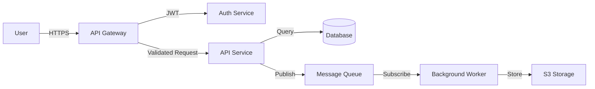
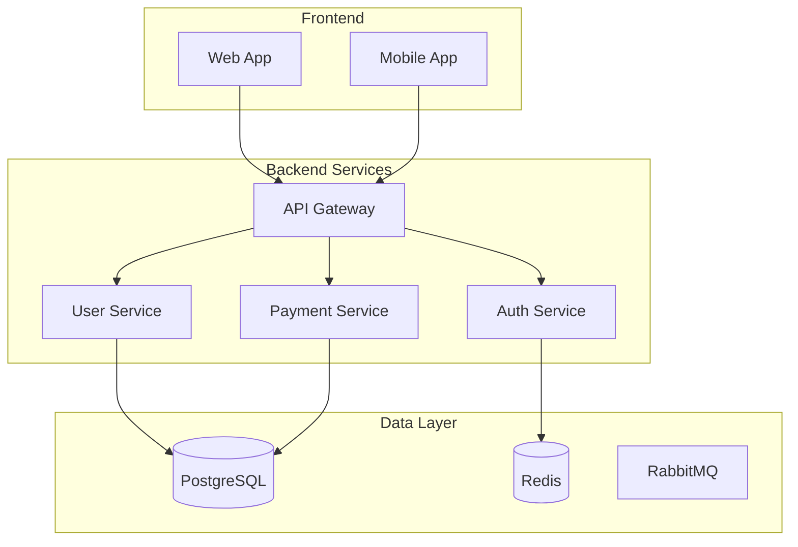
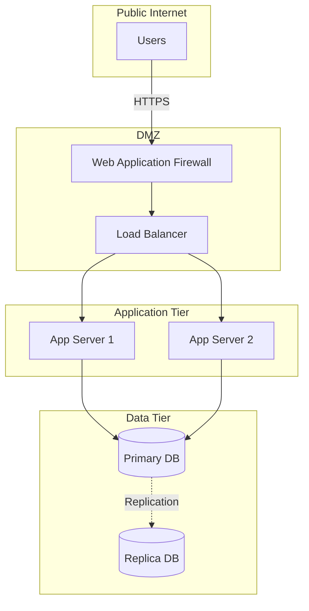
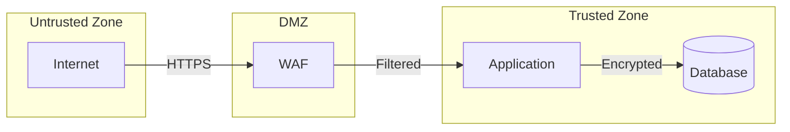

# Preparing Your Project

This guide explains what inputs ThreatForest needs, supported file formats, and how to structure your project for optimal threat analysis results.

## Overview

ThreatForest accepts three main categories of input:

1. **Threat Models** - Pre-defined threat statements (recommended but optional)
2. **Documentation** - README files, architecture docs, technical specifications
3. **Diagrams** - Architecture diagrams, data flow diagrams, system visualizations

!!! tip "Flexible Input Requirements"
    ThreatForest can work with any combination of these inputs. At minimum, provide documentation or diagrams. For best results, include all three categories.

## Threat Models

Threat models provide ThreatForest with pre-defined security concerns to analyze. While optional, they significantly improve analysis quality and focus.

### ThreatComposer Workspace Files ⭐ RECOMMENDED

**File Patterns:** `*.tc`, `*.tc.json`, `*ThreatComposer*.json`

ThreatComposer is AWS's open-source threat modeling tool and ThreatForest's preferred input format.

**Why ThreatComposer?**

- ✅ Structured threat format with priorities
- ✅ Rich application context
- ✅ Industry-standard STRIDE categorization
- ✅ Easy to create and maintain
- ✅ Seamless ThreatForest integration

**Creating a ThreatComposer File:**

1. Visit [https://awslabs.github.io/threat-composer/](https://awslabs.github.io/threat-composer/)
2. Click "Create New Workspace"
3. Fill in application details:
   - Application name
   - Description
   - Architecture overview
4. Add threat statements:
   - Click "Add Threat"
   - Write threat description
   - Set priority (High/Medium/Low)
   - Add STRIDE category
5. Export workspace:
   - Click "Export" → "Download Workspace"
   - Save as `MyApp.tc.json`
6. Place file in your project directory

**Example ThreatComposer Structure:**

```json
{
  "schema": 1,
  "applicationName": "E-Commerce Platform",
  "applicationDescription": "Online shopping platform with payment processing",
  "threats": [
    {
      "id": "T001",
      "numericId": 1,
      "statement": "An attacker could exploit SQL injection vulnerabilities in the product search to access customer data",
      "threatSource": "External Attacker",
      "prerequisites": "Search functionality accepts user input without validation",
      "threatAction": "Inject malicious SQL queries",
      "threatImpact": "Unauthorized access to customer database",
      "impactedGoal": ["Confidentiality"],
      "impactedAssets": ["Customer Database", "Payment Information"],
      "priority": "High",
      "stride": ["Tampering", "Information Disclosure"]
    }
  ]
}
```

**Priority Levels:**

- **High** - Critical threats analyzed first, always included
- **Medium** - Important threats, included in comprehensive analysis
- **Low** - Lower priority, may be skipped in focused analysis

!!! note "Priority-Based Analysis"
    ThreatForest focuses on High-priority threats by default. Configure analysis depth in settings to include Medium and Low priorities.

### Custom Threat Model Files

**File Patterns:** `threats.json`, `threats.yaml`, `threat-model.json`, `security.yaml`

ThreatForest can parse custom threat model formats in JSON, YAML, or Markdown.

**JSON Format:**

```json
{
  "threats": [
    {
      "id": "T001",
      "title": "SQL Injection in Login Form",
      "description": "Attacker exploits insufficient input validation to inject SQL",
      "severity": "High",
      "category": "Injection",
      "affected_components": ["Login API", "User Database"]
    },
    {
      "id": "T002",
      "title": "Cross-Site Scripting in Comments",
      "description": "Malicious scripts injected through comment fields",
      "severity": "Medium",
      "category": "XSS"
    }
  ]
}
```

**YAML Format:**

```yaml
threats:
  - id: T001
    title: SQL Injection in Login Form
    description: Attacker exploits insufficient input validation
    severity: High
    category: Injection
    affected_components:
      - Login API
      - User Database
  
  - id: T002
    title: Cross-Site Scripting in Comments
    description: Malicious scripts injected through comment fields
    severity: Medium
    category: XSS
```

**Markdown Format:**

```markdown
# Threat Model

## T001: SQL Injection in Login Form

**Severity:** High
**Category:** Injection

Attacker exploits insufficient input validation in the login form to inject 
malicious SQL queries, potentially gaining unauthorized access.

**Affected Components:**
- Login API
- User Database

## T002: Cross-Site Scripting in Comments

**Severity:** Medium
**Category:** XSS

Malicious scripts can be injected through comment fields, executing in other 
users' browsers.
```

### Threat Statement Best Practices

**Be Specific:**
```
❌ Bad: "Authentication could be bypassed"
✅ Good: "An attacker could bypass authentication by exploiting weak password 
         reset tokens that use predictable timestamp-based generation"
```

**Include Context:**
```
❌ Bad: "Data breach"
✅ Good: "An attacker with network access could intercept unencrypted API 
         traffic between the mobile app and backend, exposing customer PII"
```

**Describe Impact:**
```
❌ Bad: "SQL injection vulnerability"
✅ Good: "SQL injection in the search API could allow attackers to extract 
         all customer records including payment information, leading to 
         regulatory violations and customer trust loss"
```

**Specify Prerequisites:**
```
✅ Good: "An attacker with valid user credentials could escalate privileges 
         to admin by manipulating the role parameter in the profile update 
         API, which lacks server-side authorization checks"
```

## Documentation Files

Documentation helps ThreatForest understand your application architecture, technology stack, and security context.

### README Files

**File Patterns:** `README.md`, `README.txt`, `README.pdf`

Your README is often the best source of application context.

**What to Include:**

```markdown
# MyApp

## Overview
Brief description of what your application does and its purpose.

## Architecture
High-level architecture overview:
- Frontend: React SPA
- Backend: Node.js REST API
- Database: PostgreSQL
- Cache: Redis
- Message Queue: RabbitMQ

## Components
- **API Gateway** - Routes requests, handles authentication
- **User Service** - Manages user accounts and profiles
- **Payment Service** - Processes transactions via Stripe
- **Notification Service** - Sends emails and push notifications

## Data Flow
1. User submits order through web interface
2. API Gateway validates JWT token
3. Order Service creates order record
4. Payment Service processes payment
5. Notification Service sends confirmation

## Security Considerations
- All API endpoints require JWT authentication
- Payment data encrypted at rest using AES-256
- PII stored in separate encrypted database
- Rate limiting on all public endpoints
```

### Architecture Documentation

**File Patterns:** `ARCHITECTURE.md`, `DESIGN.md`, `docs/architecture.md`

Detailed architecture documentation provides deeper context.

**Recommended Sections:**

- **System Overview** - High-level architecture
- **Component Descriptions** - Detailed component responsibilities
- **Data Models** - Database schemas and data structures
- **API Specifications** - Endpoint definitions and contracts
- **Security Architecture** - Authentication, authorization, encryption
- **Deployment Architecture** - Infrastructure and networking
- **External Dependencies** - Third-party services and APIs

**Example:**

```markdown
# Architecture Documentation

## System Overview
MyApp is a microservices-based e-commerce platform deployed on AWS.

## Components

### API Gateway (Kong)
- Routes all external traffic
- Handles JWT validation
- Implements rate limiting (100 req/min per IP)
- Terminates TLS

### User Service
- Manages user accounts and authentication
- Stores user data in PostgreSQL
- Implements password hashing with bcrypt
- Generates JWT tokens

### Payment Service
- Integrates with Stripe API
- Stores payment methods (tokenized)
- Processes refunds and chargebacks
- Logs all transactions

## Trust Boundaries
- External users → API Gateway (TLS)
- API Gateway → Internal services (mTLS)
- Services → Database (encrypted connection)
- Services → External APIs (TLS)

## Data Classification
- **PII:** Names, emails, addresses (encrypted at rest)
- **Payment Data:** Credit cards (tokenized, not stored)
- **Credentials:** Passwords (hashed with bcrypt)
- **Session Data:** JWT tokens (signed, short-lived)
```

### Technical Specifications

**File Patterns:** `SPEC.md`, `TECHNICAL.md`, `docs/*.md`, `*.pdf`

Any technical documentation helps ThreatForest understand your system.

**Useful Documents:**

- API specifications (OpenAPI/Swagger)
- Database schemas
- Deployment guides
- Security policies
- Compliance documentation
- Integration guides

## Architecture Diagrams

Visual representations of your system architecture significantly improve ThreatForest's analysis quality.

### Supported Formats

| Format | File Extensions | Best For |
|--------|----------------|----------|
| **PNG/JPG** | `.png`, `.jpg`, `.jpeg` | Screenshots, exported diagrams |
| **PDF** | `.pdf` | Professional diagrams, documentation |
| **Mermaid** | `.mmd`, `.mermaid` | Version-controlled diagrams |
| **Draw.io** | `.drawio`, `.dio` | Interactive diagrams |
| **PlantUML** | `.puml`, `.plantuml` | Code-based diagrams |

### Diagram Types

#### Data Flow Diagrams (DFD)

Show how data moves through your system.

**Mermaid Example:**



**What to Show:**
- External actors (users, systems)
- System components
- Data flows with protocols
- Trust boundaries
- Data stores

#### Component Diagrams

Illustrate system components and their relationships.



#### Network Diagrams

Show network topology and security zones.



#### Deployment Diagrams

Illustrate infrastructure and deployment architecture.

**What to Include:**
- Cloud provider (AWS, Azure, GCP)
- Regions and availability zones
- VPCs and subnets
- Security groups and firewalls
- Load balancers
- Container orchestration (ECS, Kubernetes)
- Managed services (RDS, S3, etc.)

### Diagram Best Practices

**Show Trust Boundaries:**


**Label Protocols and Ports:**
```
User --HTTPS:443--> Load Balancer
Load Balancer --HTTP:8080--> App Server
App Server --PostgreSQL:5432--> Database
```

**Indicate Security Controls:**
```
Internet --[TLS 1.3]--> WAF
WAF --[Rate Limiting]--> API Gateway
API Gateway --[JWT Auth]--> Services
Services --[mTLS]--> Database
```

**Show Data Classification:**
```
User Input --[Sanitized]--> API
API --[Validated]--> Business Logic
Business Logic --[Encrypted PII]--> Database
```

## File Discovery

ThreatForest automatically discovers relevant files in your project directory using intelligent pattern matching.

### Discovery Process

1. **Scans Project Directory** - Recursively searches for supported files
2. **Categorizes Files** - Groups by type (threats, docs, diagrams)
3. **Prioritizes Content** - Ranks files by relevance
4. **Extracts Information** - Uses Strands `file_read` tool for intelligent parsing

### File Patterns

**Threat Models:**
```
*.tc
*.tc.json
*ThreatComposer*.json
threats.json
threats.yaml
threat-model.*
security.yaml
```

**Documentation:**
```
README.md
README.txt
README.pdf
ARCHITECTURE.md
DESIGN.md
SECURITY.md
docs/**/*.md
docs/**/*.pdf
*.md (in root)
```

**Diagrams:**
```
*.png
*.jpg
*.jpeg
*.pdf
*.mmd
*.mermaid
*.drawio
*.dio
*.puml
*.plantuml
```

### Exclusions

ThreatForest automatically excludes:
- `node_modules/`
- `.git/`
- `venv/`, `env/`
- `build/`, `dist/`
- `__pycache__/`
- `.pytest_cache/`
- Hidden files (`.*)` except `.md` files

## Project Structure Examples

### Minimal Project

```
my-project/
├── README.md                    # Application overview
└── architecture.png             # System diagram
```

### Recommended Project

```
my-project/
├── README.md                    # Application overview
├── ARCHITECTURE.md              # Detailed architecture
├── MyApp.tc.json               # ThreatComposer workspace
└── diagrams/
    ├── data-flow.mmd           # Data flow diagram
    └── deployment.png          # Deployment architecture
```

### Comprehensive Project

```
my-project/
├── README.md
├── ARCHITECTURE.md
├── SECURITY.md
├── MyApp.tc.json
├── docs/
│   ├── api-spec.md
│   ├── database-schema.md
│   └── deployment-guide.md
└── diagrams/
    ├── data-flow.mmd
    ├── component-diagram.png
    ├── network-topology.pdf
    └── threat-model.drawio
```

## Input Quality Tips

### For Better Threat Analysis

**Provide Context:**

- Describe what your application does
- Explain the business value
- Identify sensitive data
- Document security controls

**Be Specific:**

- Name technologies and versions
- Describe authentication mechanisms
- Explain data encryption
- Document access controls

**Show Relationships:**

- How components communicate
- Where data flows
- What trust boundaries exist
- Which services are external

### For Better Attack Trees

**In Threat Statements:**

- Describe the attacker's goal
- Explain the attack vector
- Identify affected assets
- Assess potential impact

**In Documentation:**

- Include architecture diagrams
- Document data flows
- Explain security controls
- Describe deployment environment

**In Diagrams:**

- Show trust boundaries
- Label data flows
- Indicate security controls
- Highlight external dependencies

## AI-Generated Threats

If you don't provide a threat model, ThreatForest can generate threats automatically using AI analysis of your documentation and diagrams.

### When AI Generation Works Best

**Good Inputs:**

- Detailed architecture documentation
- Clear component descriptions
- Data flow diagrams
- Technology stack information
- Security control documentation

**What AI Generates:**

- Threat statements based on architecture
- STRIDE-categorized threats
- Priority assignments
- Attack vectors

**What AI Generates:**

- Threat statements based on architecture
- STRIDE-categorized threats
- Priority assignments
- Attack vectors
- Potential impacts

**May Miss:**

- Business-specific threats
- Compliance requirements
- Organizational policies
- Custom security controls
- Domain-specific risks

**Recommendation:** Use AI generation as a starting point, then refine with ThreatComposer for production use.

## Next Steps

- **[Running ThreatForest](running-threatforest.md)** - Learn to execute analysis
- **[Understanding Your Results](understanding-results.md)** - Explore outputs
- **[How ThreatForest Works](../how-it-works.md)** - Technical deep dive
