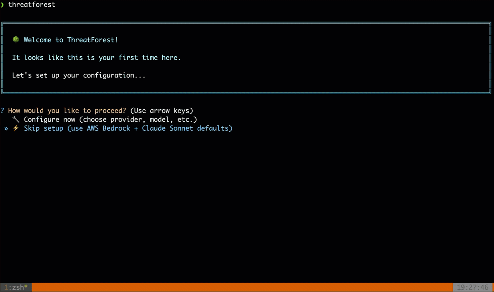
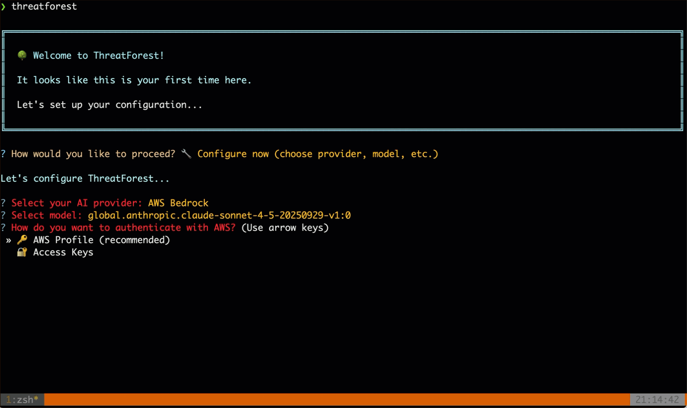
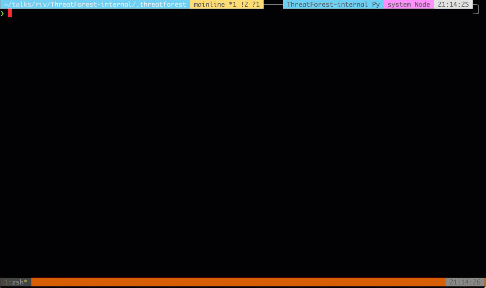
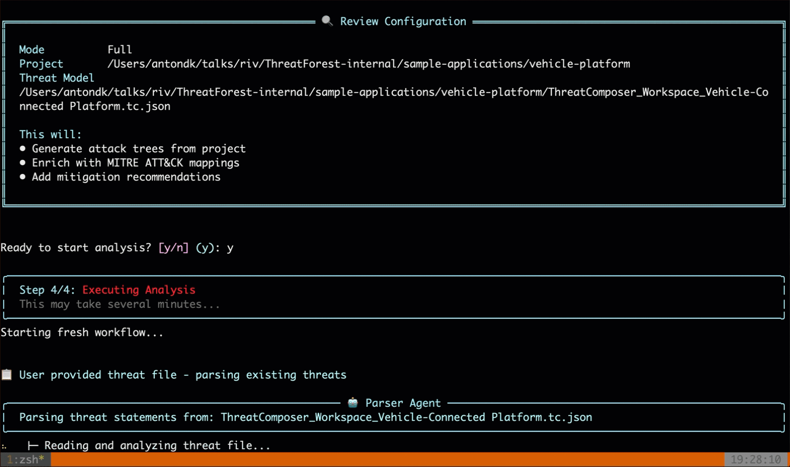

# Running ThreatForest

This guide explains how to run ThreatForest using the interactive wizard, what happens during analysis, and how to manage your workflow.

## Launching ThreatForest

The interactive wizard is the primary way to run ThreatForest:

```bash
threatforest
```

This launches a guided interface that walks you through the entire analysis process.

## The Interactive Wizard

### Welcome Screen

When you launch ThreatForest for the first time, you'll see:

<!-- TODO: Add welcome screen GIF -->

*Initial welcome screen and wizard launch*

The wizard will guide you through the initial setup and then the analysis workflow.

### Step 1: Workflow Selection

Choose your workflow mode:

**Full Analysis** (Recommended)
- Complete end-to-end threat modeling
- Analyzes your project from scratch
- Generates attack trees with MITRE ATT&CK mappings
- Includes mitigation recommendations
- Creates interactive dashboard

This is what most users need and what this guide focuses on.

### Step 2: Project Path

Enter the path to your project directory:



**What ThreatForest Looks For:**
- ThreatComposer files (`*.tc.json`)
- Documentation (`README.md`, `ARCHITECTURE.md`)
- Architecture diagrams (PNG, PDF, Mermaid)
- Threat model files (JSON, YAML, Markdown)

### Step 3: AWS Configuration

If using AWS Bedrock, you'll be prompted for AWS details:



**What's Happening:**
- ThreatForest uses your AWS profile credentials
- Validates access to AWS Bedrock
- Confirms the selected model is available

### Step 4: Model Selection

Choose your AI model:



### Step 5: Confirmation

Review your settings before starting:


## During Analysis

### Progress Tracking

Once analysis begins, you'll see real-time progress:



**What Each Stage Does:**

1. **Setup & Validation** - Validates configuration and project structure
2. **Context Analysis** - Discovers and categorizes project files
3. **Information Extraction** - Analyzes documentation and diagrams
4. **Attack Tree Generation** - Creates detailed attack trees for each threat
5. **TTP Enrichment** - Maps attack steps to MITRE ATT&CK techniques
6. **Mitigation Mapping** - Adds security controls and recommendations
7. **Report Generation** - Creates dashboard and analysis report

### Individual Threat Progress

For each threat being processed:

```
Processing Threat: T001 - SQL Injection in Login Form
├─ Analyzing threat context...                    ✓
├─ Generating attack paths...                     ✓
│  ├─ Path 1: Direct SQL injection               ✓
│  ├─ Path 2: Blind SQL injection                ✓
│  └─ Path 3: Second-order SQL injection         ✓
├─ Mapping MITRE ATT&CK techniques...            ✓
├─ Adding mitigation recommendations...           ✓
└─ Writing attack tree file...                    ✓

Completed in 45 seconds
```

### Estimated Time Remaining

ThreatForest shows estimated completion time:

```
⏱️ Estimated Time Remaining: 3 minutes

Based on:
- 5 threats to process
- 2 threats completed (avg 40s each)
- 3 threats remaining
```

## When Analysis Completes

### Success Message


### Next Steps

After completion, you can:

1. **View Dashboard** - Interactive HTML visualization
2. **Read Attack Trees** - Individual markdown files
3. **Export Data** - JSON file for automation
4. **Review Report** - Executive summary

**Learn More:**
- [Understanding Your Results](understanding-results.md) - Explore all outputs
- [How ThreatForest Works](../how-it-works.md) - Technical deep dive

## Handling Errors

ThreatForest includes automatic error handling and recovery. Common errors are documented in the [FAQ Troubleshooting section](../faq.md#troubleshooting).

## Next Steps

- **[Understanding Your Results](understanding-results.md)** - Explore generated outputs
- **[Preparing Your Project](preparing-your-project.md)** - Optimize your inputs
- **[How ThreatForest Works](../how-it-works.md)** - Learn about the internals
