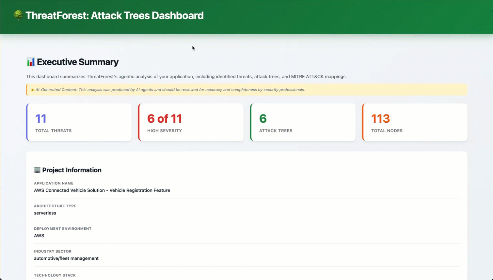
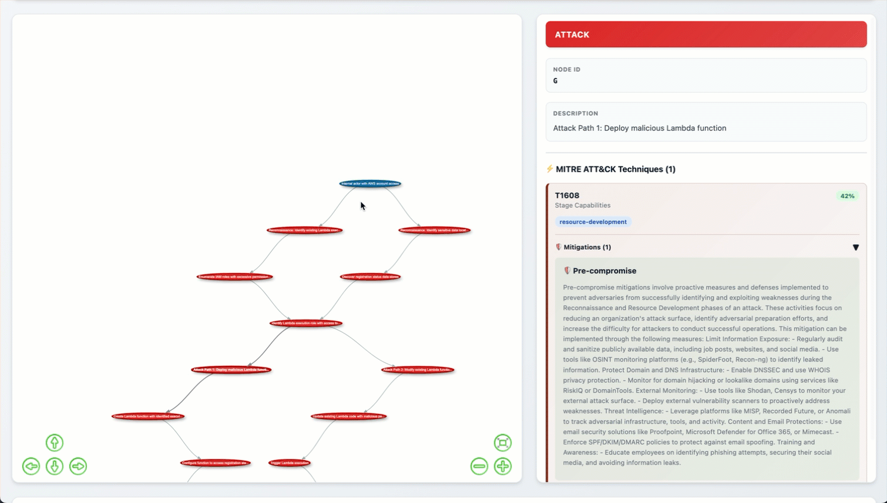
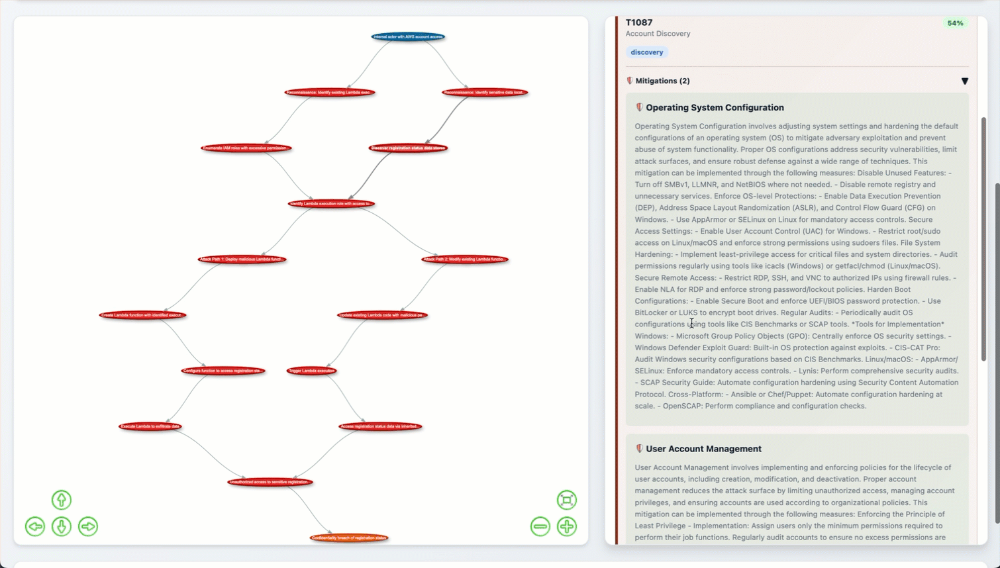

# Understanding Your Results

After ThreatForest completes analysis, you'll have a comprehensive set of outputs. This guide explains what you get, how to explore it, and how to use the results effectively.

## Output Directory Structure

ThreatForest creates a `.threatforest/` directory inside your project:

```
project/
└── .threatforest/
    ├── config.yaml              # Configuration
    ├── .env                     # Secrets (API keys, Langfuse)
    ├── state/                   # Intermediate state files
    │   ├── scanner_context.json
    │   ├── threats.json
    │   ├── attack_trees.json
    │   ├── ttp_mappings.json
    │   └── mitigations.json
    └── output/                  # Final outputs
        ├── attack_trees_dashboard.html   # ⭐ Interactive visualization
        ├── threat_model_report.md        # Executive summary
        └── threatforest_data.json        # JSON export
```

## Exploring Results in the Web Console ⭐ PRIMARY INTERFACE

The web console is your main way to explore results.

- **Threat Model Summary** — lists every threat for a run with severity and category. Open it from the application overview by clicking a version.
- **Version Detail** — click a threat from the summary to view its attack tree, MITRE ATT&CK mappings, and mitigations.

### Standalone HTML Dashboard

Each run also produces a self-contained HTML dashboard you can share or open offline:

```bash
# Mac
open ./project/.threatforest/output/attack_trees_dashboard.html

# Linux
xdg-open ./project/.threatforest/output/attack_trees_dashboard.html

# Windows
start ./project/.threatforest/output/attack_trees_dashboard.html
```

### Dashboard Overview

The dashboard provides:

- **Visual Threat Overview** - See all threats at a glance
- **Interactive Network Graph** - Explore attack trees visually
- **Search and Filter** - Find specific threats or techniques
- **MITRE ATT&CK Integration** - View mapped techniques
- **Metrics and Statistics** - Understand threat landscape

### Main Sections

#### 1. Threat Overview Panel



#### 2. Interactive Network Graph



**Center of dashboard** - Visual representation of all threats:

**Features:**
- Color-coded by severity (Red=High, Orange=Medium, Yellow=Low)
- Click nodes to view details
- Zoom and pan to navigate
- Hover for quick preview
- Drag to reposition

**Interactions:**

- **Click Node** - View threat details in side panel
- **Hover Node** - See quick preview
- **Drag Node** - Reposition for better view
- **Scroll** - Zoom in/out
- **Click Background** - Deselect and reset

#### 3. Threat Detail Panel



**Right sidebar** (appears when threat selected):

**Sections:**

- **Threat Information** - Full statement, severity, affected components
- **Attack Paths** - Step-by-step sequences with impact ratings
- **MITRE ATT&CK Mappings** - Technique IDs, tactics, confidence scores
- **Mitigations** - Security controls and implementation guidance

### Using the Dashboard

#### For Security Architects

**Workflow:**

1. Review overview to understand threat landscape
2. Focus on high-severity threats
3. Examine attack paths to understand vectors
4. Validate architecture controls
5. Export findings for documentation

**Key Features:**

- Network graph for architecture visualization
- Attack path analysis for control validation
- MITRE mapping for industry alignment

#### For Security Engineers

**Workflow:**

1. Filter by category for specific threat types
2. Review technical attack steps
3. Check MITRE techniques for detection alignment
4. Implement security control guidance
5. Track remediation progress

**Key Features:**

- Detailed attack steps
- Technical prerequisites
- Mitigation implementation guidance

#### For Developers

**Workflow:**
1. Search by component to find relevant threats
2. Understand how attacks work
3. Identify vulnerable conditions
4. Apply security fixes
5. Verify all threats are addressed

**Key Features:**

- Component-specific filtering
- Clear attack explanations
- Actionable mitigation steps

### Dashboard Performance

**Optimization for Large Threat Models:**

- Use filters to reduce visible threats
- Collapse details when not needed
- Export subsets for focused analysis

**Performance Metrics:**

- <10 threats: Instant loading
- 10-50 threats: <2 seconds
- 50-100 threats: <5 seconds
- 100+ threats: May require filtering

**Browser Compatibility:**

- ✅ Chrome 90+
- ✅ Firefox 88+
- ✅ Safari 14+
- ✅ Edge 90+

## State Files

Intermediate outputs are written to `.threatforest/state/` after each pipeline stage:

| File | Written by | Contents |
|---|---|---|
| `scanner_context.json` | Scanner Agent | Tech stack, cloud provider, services, auth mechanisms |
| `threats.json` | Threat Agent | Structured threat list |
| `attack_trees.json` | Tree Agent | Attack trees with steps per threat |
| `ttp_mappings.json` | TTP Mapper | MITRE technique mappings with confidence scores |
| `mitigations.json` | Mitigation Agent | MITRE mitigation controls per technique |

!!! info
    State files are preserved between runs. Re-running ThreatForest on the same project overwrites them.

## JSON Data Export

**File:** `threatforest_data.json`

**Purpose:** Structured data for programmatic access and tool integration.

### Schema

```json
{
  "metadata": {
    "analysis_date": "2025-11-28T14:30:00Z",
    "threatforest_version": "1.0.0",
    "project_name": "MyApp",
    "total_threats": 8,
    "high_severity_count": 3,
    "medium_severity_count": 4,
    "low_severity_count": 1
  },
  "threats": [
    {
      "id": "T001",
      "title": "SQL Injection in User Login",
      "severity": "High",
      "category": "Injection",
      "description": "...",
      "affected_components": ["Login API", "User Database"],
      "attack_paths": [...],
      "mitre_techniques": [...],
      "mitigations": [...]
    }
  ]
}
```

### Use Cases

- Custom reporting tools
- CI/CD integration
- Security dashboards
- Metrics tracking
- Data analysis

### Example Usage

```python
import json

# Load threat data
with open('threatforest_data.json', 'r') as f:
    data = json.load(f)

# Count high-severity threats
high_severity = [t for t in data['threats'] if t['severity'] == 'High']
print(f"High-severity threats: {len(high_severity)}")

# Extract MITRE techniques
techniques = set()
for threat in data['threats']:
    for tech in threat.get('mitre_techniques', []):
        techniques.add(tech['technique_id'])
print(f"Unique MITRE techniques: {len(techniques)}")
```

## Analysis Report

**File:** `threat_model_report.md`

**Purpose:** Executive summary with key findings and statistics.

### Contents

- Analysis overview
- Threat statistics
- Severity distribution
- Key findings
- Recommendations
- Coverage metrics

### Example

```markdown
# ThreatForest Analysis Report

**Project:** MyApp E-Commerce Platform
**Analysis Date:** 2025-11-28 14:30:00

## Executive Summary

Analysis identified 8 threats, with 3 classified as high severity 
requiring immediate attention.

## Threat Statistics

- Total Threats: 8
- High Severity: 3 (37.5%)
- Medium Severity: 4 (50%)
- Low Severity: 1 (12.5%)

## Key Findings

### Critical Threats

1. **T001: SQL Injection in User Login**
   - Impact: Database compromise
   - Recommendation: Implement parameterized queries

2. **T002: Authentication Bypass via JWT**
   - Impact: Unauthorized access
   - Recommendation: Strengthen JWT validation

...

## Recommendations

### Immediate Actions
1. Address all high-severity threats within 30 days
2. Implement input validation across all inputs
3. Review authentication mechanisms

...
```

### Use Cases

- Executive briefings
- Security review meetings
- Audit documentation
- Compliance reporting

!!! note "State files"
    State files in `.threatforest/state/` are managed automatically. Do not edit them manually. They are preserved between runs — re-running overwrites them with fresh output.

## Working with Results

### Version Control

**Recommended Approach:**

```bash
# Commit threat models
git add *.tc.json
git commit -m "Update threat model"

# Commit generated outputs
git add .threatforest/output/
git commit -m "Update threat analysis"

# Tag releases
git tag -a v1.0-threat-analysis -m "Initial threat analysis"
```

### Sharing Results

**Dashboard for Presentations:**

- Host on internal web server for team access
- Export to PDF for email distribution
- Screenshot key findings for reports

**JSON for Automation:**

- CI/CD integration
- Custom dashboards
- Metrics tracking

**Markdown for Documentation:**

- Include in security docs
- Version control friendly
- Easy to review in PRs

### Comparing Versions

```bash
# Compare JSON exports between runs
jq -S . .threatforest/output/threatforest_data.json > current.json
jq -S . .threatforest-backup/output/threatforest_data.json > previous.json
diff current.json previous.json
```

## Best Practices

### Organization

- Keep outputs in version control
- Use consistent naming conventions
- Archive old analyses with timestamps
- Document analysis dates in commit messages

### Maintenance

- Regenerate after threat model changes
- Review outputs quarterly
- Track remediation progress
- Update when architecture changes

### Security

- Don't expose outputs publicly (contains sensitive info)
- Use internal hosting only for dashboard
- Sanitize data before external sharing
- Encrypt archives if needed

## Need Help?

Having issues with results or the dashboard? Check the [FAQ Troubleshooting section](../faq.md#troubleshooting) for solutions.

## Next Steps

- **[Running ThreatForest](running-threatforest.md)** - Learn the analysis process
- **[Preparing Your Project](preparing-your-project.md)** - Optimize inputs
- **[How ThreatForest Works](../how-it-works/index.md)** - Technical deep dive
