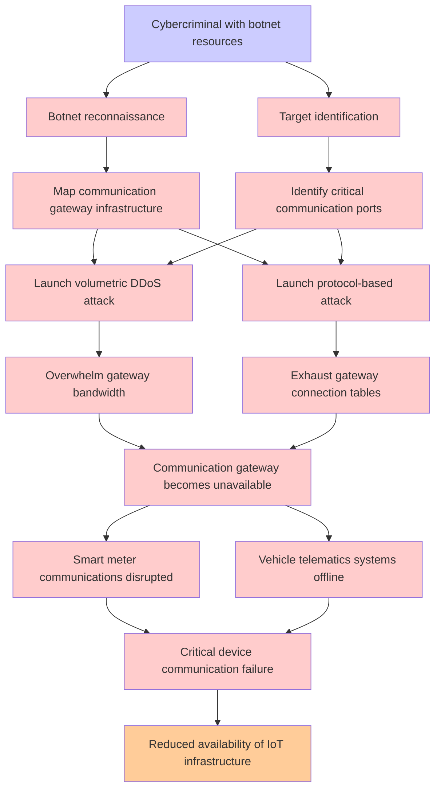

# Attack Tree: Denial of Service

**Threat ID**: T004  
**Threat Number**: 4
**Associated threat statement**: A cybercriminal with botnet resources, can launch distributed denial-of-service attacks against the communication gateway, which leads to disruption of critical device communications, resulting in reduced availability of smart meters and vehicle telematics systems.

## Attack Tree Diagram

## Attack Path Analysis

This attack tree represents the potential attack paths for the identified threat. Each node in the tree represents either:
- **Attack Goal** (orange): The ultimate objective
- **Attack Step** (red): Individual attack actions
- **Fact/Condition** (blue): Prerequisites or conditions
- **Mitigation** (green): Defensive measures

Review this attack tree to:
1. Identify critical attack paths
2. Implement appropriate security controls
3. Monitor for indicators of these attack patterns
4. Develop incident response procedures

---
*Generated by ThreatForest - Attack Tree Analysis*
