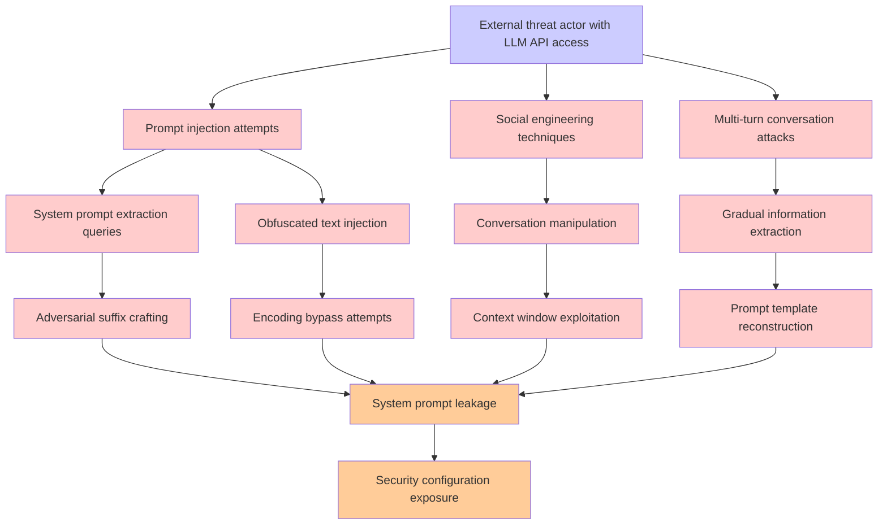

# System Prompt Leakage Attack Tree

```mermaid
graph TD
    A["External threat actor with LLM API access"] --> B["Prompt injection attempts"]
    B --> C["System prompt extraction queries"]
    C --> D["Adversarial suffix crafting"]
    D --> E["System prompt leakage"]
    E --> F["Security configuration exposure"]
    
    A --> G["Social engineering techniques"]
    G --> H["Conversation manipulation"]
    H --> I["Context window exploitation"]
    I --> E
    
    A --> J["Multi-turn conversation attacks"]
    J --> K["Gradual information extraction"]
    K --> L["Prompt template reconstruction"]
    L --> E
    
    B --> M["Obfuscated text injection"]
    M --> N["Encoding bypass attempts"]
    N --> E
    
    classDef attack fill:#ffcccc
    classDef goal fill:#ffcc99
    classDef fact fill:#ccccff
    
    class B,C,D,G,H,I,J,K,L,M,N attack
    class E,F goal
    class A fact
```
