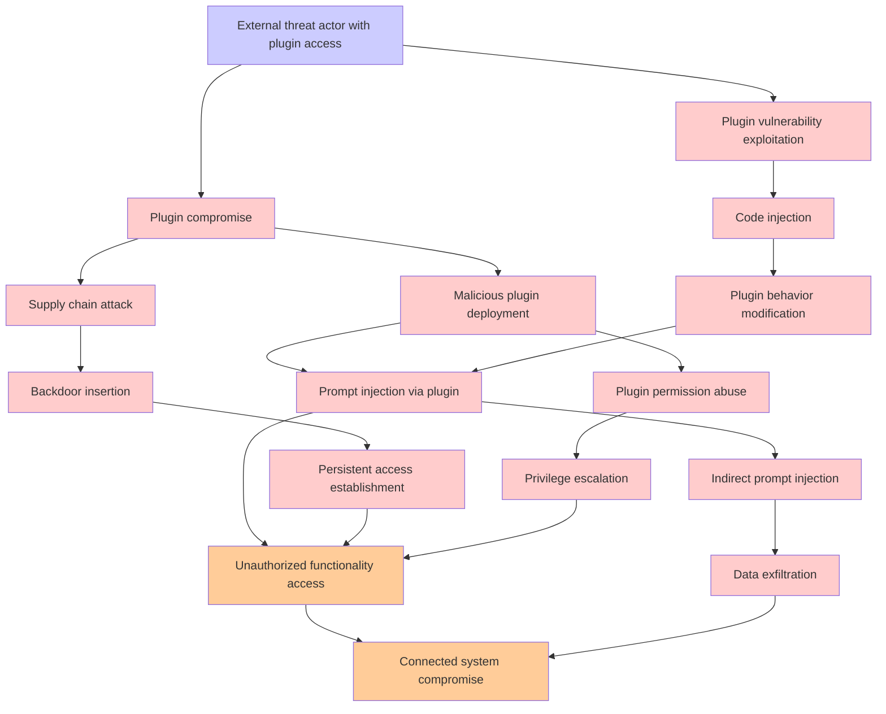

# Compromised Plugin Manipulation Attack Tree

```mermaid
graph TD
    A["External threat actor with plugin access"] --> B["Plugin compromise"]
    B --> C["Malicious plugin deployment"]
    C --> D["Prompt injection via plugin"]
    D --> E["Unauthorized functionality access"]
    E --> F["Connected system compromise"]
    
    A --> G["Plugin vulnerability exploitation"]
    G --> H["Code injection"]
    H --> I["Plugin behavior modification"]
    I --> D
    
    B --> J["Supply chain attack"]
    J --> K["Backdoor insertion"]
    K --> L["Persistent access establishment"]
    L --> E
    
    C --> M["Plugin permission abuse"]
    M --> N["Privilege escalation"]
    N --> E
    
    D --> O["Indirect prompt injection"]
    O --> P["Data exfiltration"]
    P --> F
    
    classDef attack fill:#ffcccc
    classDef goal fill:#ffcc99
    classDef fact fill:#ccccff
    
    class B,C,D,G,H,I,J,K,L,M,N,O,P attack
    class E,F goal
    class A fact
```
