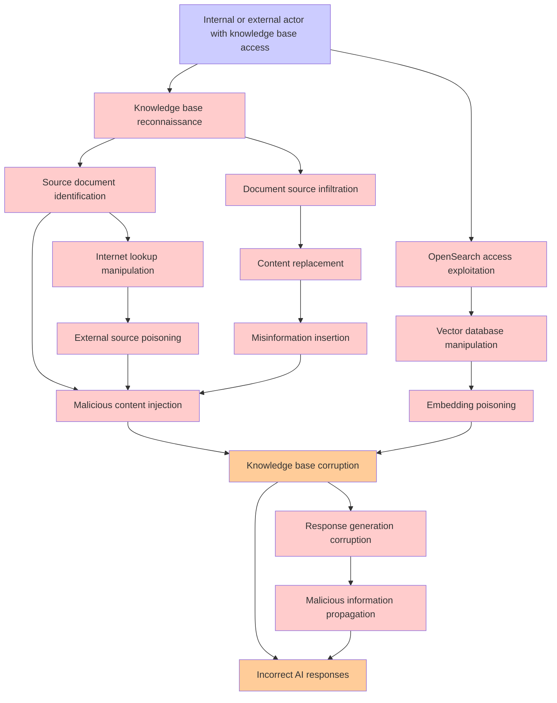

# RAG Knowledge Base Corruption Attack Tree

```mermaid
graph TD
    A["Internal or external actor with knowledge base access"] --> B["Knowledge base reconnaissance"]
    B --> C["Source document identification"]
    C --> D["Malicious content injection"]
    D --> E["Knowledge base corruption"]
    E --> F["Incorrect AI responses"]
    
    A --> G["OpenSearch access exploitation"]
    G --> H["Vector database manipulation"]
    H --> I["Embedding poisoning"]
    I --> E
    
    B --> J["Document source infiltration"]
    J --> K["Content replacement"]
    K --> L["Misinformation insertion"]
    L --> D
    
    C --> M["Internet lookup manipulation"]
    M --> N["External source poisoning"]
    N --> D
    
    E --> O["Response generation corruption"]
    O --> P["Malicious information propagation"]
    P --> F
    
    classDef attack fill:#ffcccc
    classDef goal fill:#ffcc99
    classDef fact fill:#ccccff
    
    class B,C,D,G,H,I,J,K,L,M,N,O,P attack
    class E,F goal
    class A fact
```
