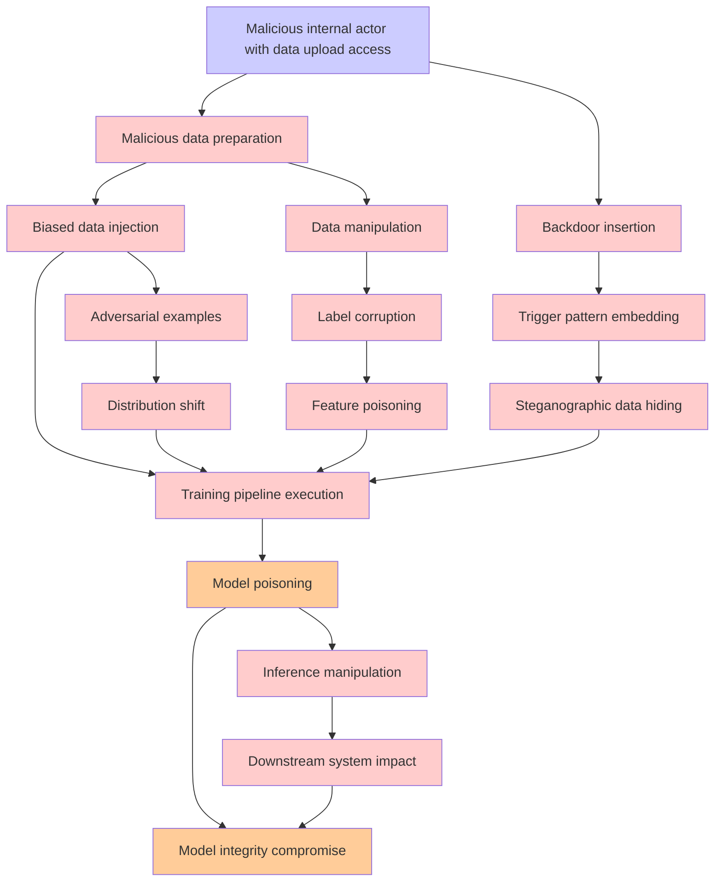

# Training Data Poisoning Attack Tree

```mermaid
graph TD
    A["Malicious internal actor with data upload access"] --> B["Malicious data preparation"]
    B --> C["Biased data injection"]
    C --> D["Training pipeline execution"]
    D --> E["Model poisoning"]
    E --> F["Model integrity compromise"]
    
    A --> G["Backdoor insertion"]
    G --> H["Trigger pattern embedding"]
    H --> I["Steganographic data hiding"]
    I --> D
    
    B --> J["Data manipulation"]
    J --> K["Label corruption"]
    K --> L["Feature poisoning"]
    L --> D
    
    C --> M["Adversarial examples"]
    M --> N["Distribution shift"]
    N --> D
    
    E --> O["Inference manipulation"]
    O --> P["Downstream system impact"]
    P --> F
    
    classDef attack fill:#ffcccc
    classDef goal fill:#ffcc99
    classDef fact fill:#ccccff
    
    class B,C,D,G,H,I,J,K,L,M,N,O,P attack
    class E,F goal
    class A fact
```
