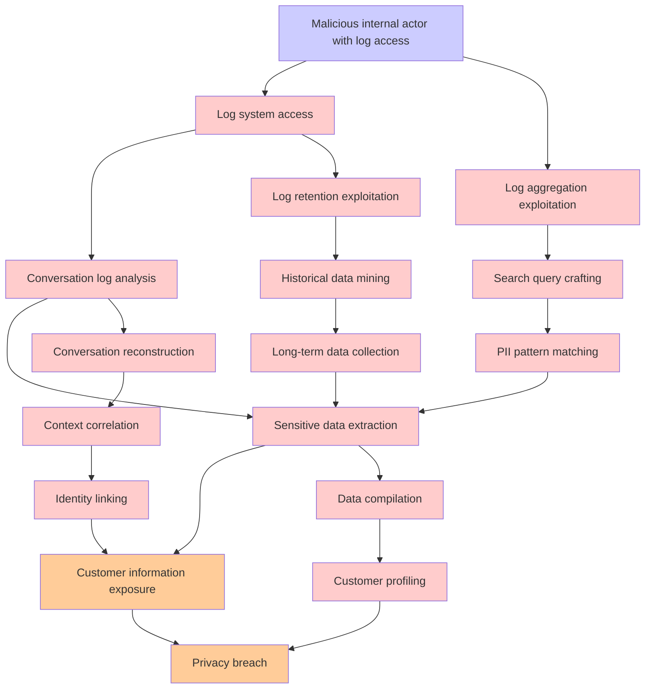

# Production Log Data Exposure Attack Tree

```mermaid
graph TD
    A["Malicious internal actor with log access"] --> B["Log system access"]
    B --> C["Conversation log analysis"]
    C --> D["Sensitive data extraction"]
    D --> E["Customer information exposure"]
    E --> F["Privacy breach"]
    
    A --> G["Log aggregation exploitation"]
    G --> H["Search query crafting"]
    H --> I["PII pattern matching"]
    I --> D
    
    B --> J["Log retention exploitation"]
    J --> K["Historical data mining"]
    K --> L["Long-term data collection"]
    L --> D
    
    C --> M["Conversation reconstruction"]
    M --> N["Context correlation"]
    N --> O["Identity linking"]
    O --> E
    
    D --> P["Data compilation"]
    P --> Q["Customer profiling"]
    Q --> F
    
    classDef attack fill:#ffcccc
    classDef goal fill:#ffcc99
    classDef fact fill:#ccccff
    
    class B,C,D,G,H,I,J,K,L,M,N,O,P,Q attack
    class E,F goal
    class A fact
```
