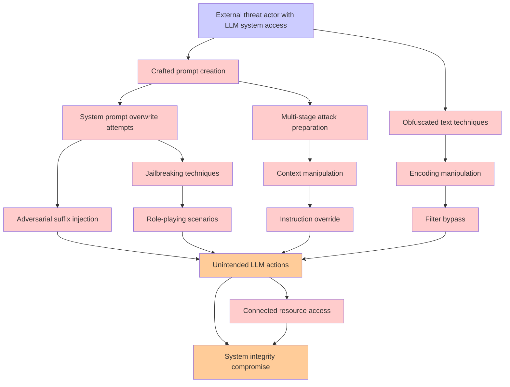

# Direct Prompt Injection Attack Tree

```mermaid
graph TD
    A["External threat actor with LLM system access"] --> B["Crafted prompt creation"]
    B --> C["System prompt overwrite attempts"]
    C --> D["Adversarial suffix injection"]
    D --> E["Unintended LLM actions"]
    E --> F["System integrity compromise"]
    
    A --> G["Obfuscated text techniques"]
    G --> H["Encoding manipulation"]
    H --> I["Filter bypass"]
    I --> E
    
    B --> J["Multi-stage attack preparation"]
    J --> K["Context manipulation"]
    K --> L["Instruction override"]
    L --> E
    
    C --> M["Jailbreaking techniques"]
    M --> N["Role-playing scenarios"]
    N --> E
    
    E --> O["Connected resource access"]
    O --> F
    
    classDef attack fill:#ffcccc
    classDef goal fill:#ffcc99
    classDef fact fill:#ccccff
    
    class B,C,D,G,H,I,J,K,L,M,N,O attack
    class E,F goal
    class A fact
```
