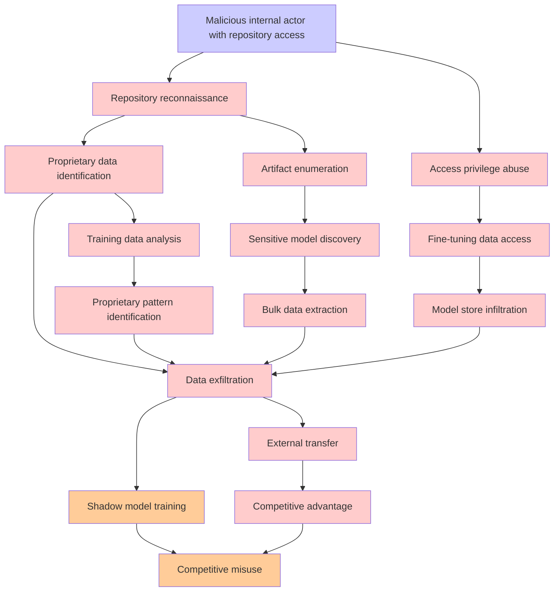

# Model Artifact Exfiltration Attack Tree

```mermaid
graph TD
    A["Malicious internal actor with repository access"] --> B["Repository reconnaissance"]
    B --> C["Proprietary data identification"]
    C --> D["Data exfiltration"]
    D --> E["Shadow model training"]
    E --> F["Competitive misuse"]
    
    A --> G["Access privilege abuse"]
    G --> H["Fine-tuning data access"]
    H --> I["Model store infiltration"]
    I --> D
    
    B --> J["Artifact enumeration"]
    J --> K["Sensitive model discovery"]
    K --> L["Bulk data extraction"]
    L --> D
    
    C --> M["Training data analysis"]
    M --> N["Proprietary pattern identification"]
    N --> D
    
    D --> O["External transfer"]
    O --> P["Competitive advantage"]
    P --> F
    
    classDef attack fill:#ffcccc
    classDef goal fill:#ffcc99
    classDef fact fill:#ccccff
    
    class B,C,D,G,H,I,J,K,L,M,N,O,P attack
    class E,F goal
    class A fact
```
