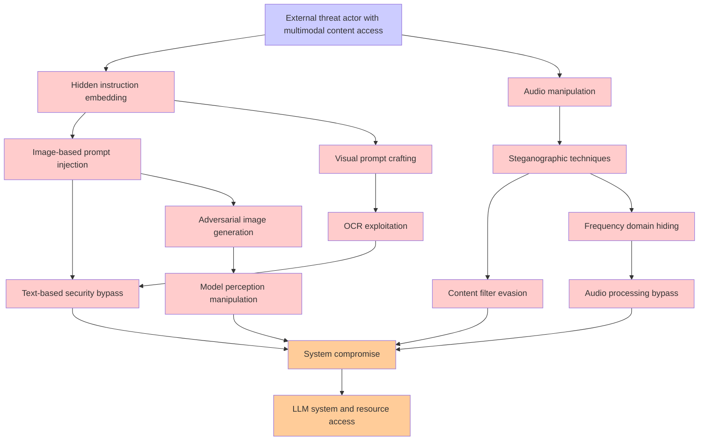

# Multimodal Prompt Injection Attack Tree

```mermaid
graph TD
    A["External threat actor with multimodal content access"] --> B["Hidden instruction embedding"]
    B --> C["Image-based prompt injection"]
    C --> D["Text-based security bypass"]
    D --> E["System compromise"]
    E --> F["LLM system and resource access"]
    
    A --> G["Audio manipulation"]
    G --> H["Steganographic techniques"]
    H --> I["Content filter evasion"]
    I --> E
    
    B --> J["Visual prompt crafting"]
    J --> K["OCR exploitation"]
    K --> D
    
    C --> L["Adversarial image generation"]
    L --> M["Model perception manipulation"]
    M --> E
    
    H --> N["Frequency domain hiding"]
    N --> O["Audio processing bypass"]
    O --> E
    
    classDef attack fill:#ffcccc
    classDef goal fill:#ffcc99
    classDef fact fill:#ccccff
    
    class B,C,D,G,H,I,J,K,L,M,N,O attack
    class E,F goal
    class A fact
```
