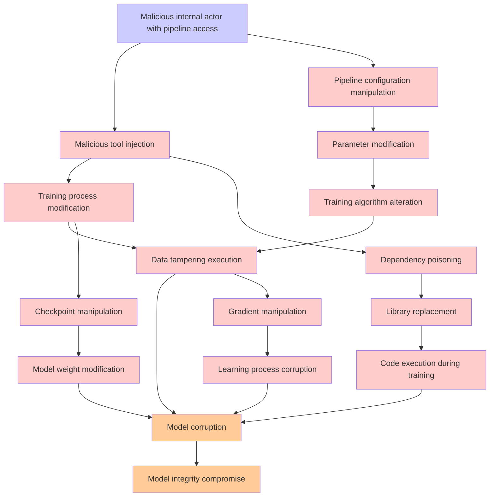

# Training Pipeline Compromise Attack Tree

```mermaid
graph TD
    A["Malicious internal actor with pipeline access"] --> B["Malicious tool injection"]
    B --> C["Training process modification"]
    C --> D["Data tampering execution"]
    D --> E["Model corruption"]
    E --> F["Model integrity compromise"]
    
    A --> G["Pipeline configuration manipulation"]
    G --> H["Parameter modification"]
    H --> I["Training algorithm alteration"]
    I --> D
    
    B --> J["Dependency poisoning"]
    J --> K["Library replacement"]
    K --> L["Code execution during training"]
    L --> E
    
    C --> M["Checkpoint manipulation"]
    M --> N["Model weight modification"]
    N --> E
    
    D --> O["Gradient manipulation"]
    O --> P["Learning process corruption"]
    P --> E
    
    classDef attack fill:#ffcccc
    classDef goal fill:#ffcc99
    classDef fact fill:#ccccff
    
    class B,C,D,G,H,I,J,K,L,M,N,O,P attack
    class E,F goal
    class A fact
```
