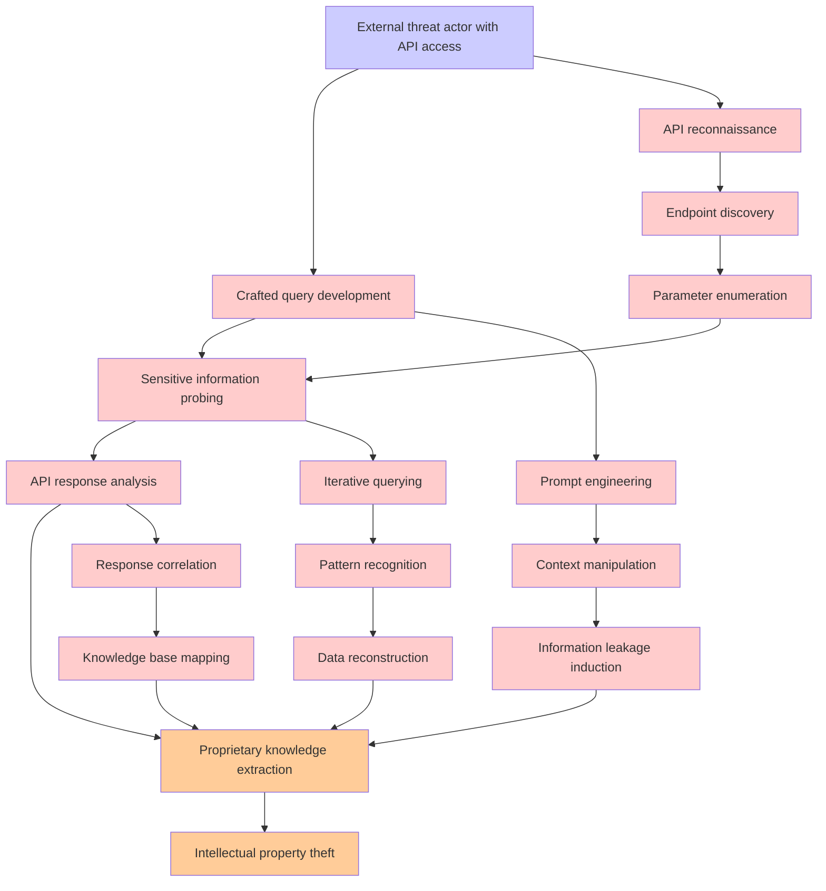

# Inference API Data Exfiltration Attack Tree

```mermaid
graph TD
    A["External threat actor with API access"] --> B["Crafted query development"]
    B --> C["Sensitive information probing"]
    C --> D["API response analysis"]
    D --> E["Proprietary knowledge extraction"]
    E --> F["Intellectual property theft"]
    
    A --> G["API reconnaissance"]
    G --> H["Endpoint discovery"]
    H --> I["Parameter enumeration"]
    I --> C
    
    B --> J["Prompt engineering"]
    J --> K["Context manipulation"]
    K --> L["Information leakage induction"]
    L --> E
    
    C --> M["Iterative querying"]
    M --> N["Pattern recognition"]
    N --> O["Data reconstruction"]
    O --> E
    
    D --> P["Response correlation"]
    P --> Q["Knowledge base mapping"]
    Q --> E
    
    classDef attack fill:#ffcccc
    classDef goal fill:#ffcc99
    classDef fact fill:#ccccff
    
    class B,C,D,G,H,I,J,K,L,M,N,O,P,Q attack
    class E,F goal
    class A fact
```
