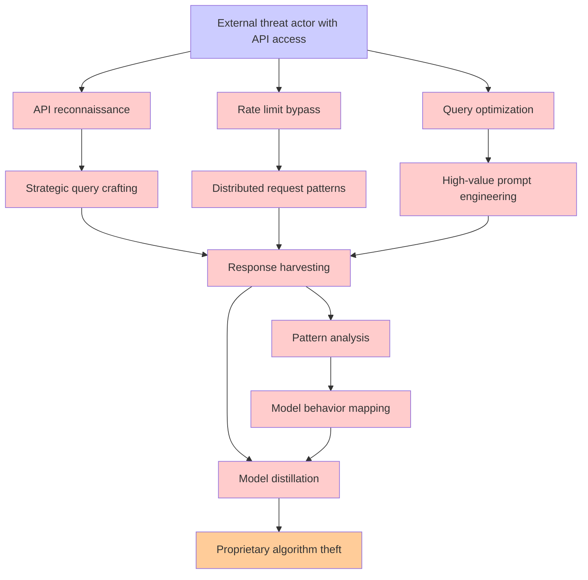

# Model Distillation Attack Tree

```mermaid
graph TD
    A["External threat actor with API access"] --> B["API reconnaissance"]
    B --> C["Strategic query crafting"]
    C --> D["Response harvesting"]
    D --> E["Model distillation"]
    E --> F["Proprietary algorithm theft"]
    
    A --> G["Rate limit bypass"]
    G --> H["Distributed request patterns"]
    H --> D
    
    A --> I["Query optimization"]
    I --> J["High-value prompt engineering"]
    J --> D
    
    D --> K["Pattern analysis"]
    K --> L["Model behavior mapping"]
    L --> E
    
    classDef attack fill:#ffcccc
    classDef goal fill:#ffcc99
    classDef fact fill:#ccccff
    
    class B,C,D,E,G,H,I,J,K,L attack
    class F goal
    class A fact
```
