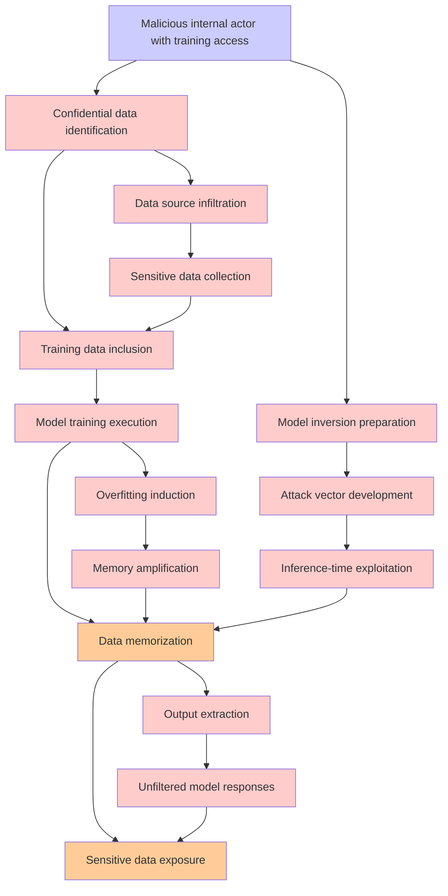

# Confidential Data Exposure Attack Tree

```mermaid
graph TD
    A["Malicious internal actor with training access"] --> B["Confidential data identification"]
    B --> C["Training data inclusion"]
    C --> D["Model training execution"]
    D --> E["Data memorization"]
    E --> F["Sensitive data exposure"]
    
    A --> G["Model inversion preparation"]
    G --> H["Attack vector development"]
    H --> I["Inference-time exploitation"]
    I --> E
    
    B --> J["Data source infiltration"]
    J --> K["Sensitive data collection"]
    K --> C
    
    D --> L["Overfitting induction"]
    L --> M["Memory amplification"]
    M --> E
    
    E --> N["Output extraction"]
    N --> O["Unfiltered model responses"]
    O --> F
    
    classDef attack fill:#ffcccc
    classDef goal fill:#ffcc99
    classDef fact fill:#ccccff
    
    class B,C,D,G,H,I,J,K,L,M,N,O attack
    class E,F goal
    class A fact
```
