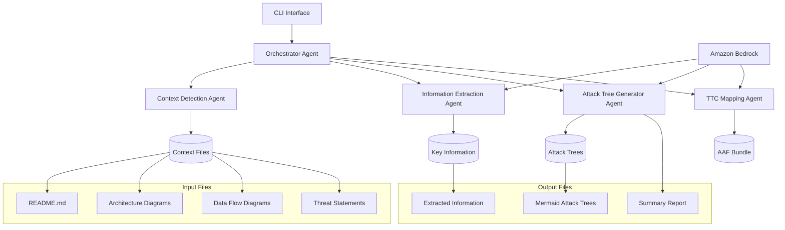

# Design Document

## Overview

ThreatForest (TF) is a multi-agent AI system built on the Strand framework that automates the generation of attack trees from threat statements. The system operates as a command-line application that can be launched from terminals or integrated into IDEs, providing security analysts with automated threat modeling capabilities.

The application follows a pipeline architecture where specialized agents handle different aspects of the threat analysis workflow: context detection, information extraction, attack tree generation, and threat intelligence enhancement. All agents communicate through the Strand framework's orchestration layer and utilize Amazon Bedrock for AI capabilities.

## Architecture

### High-Level Architecture



### Agent Architecture

The system implements a multi-agent architecture using the Strand framework:

1. **Orchestrator Agent**: Main coordinator that manages the workflow and agent communication
2. **Context Detection Agent**: Scans directories and validates context files
3. **Information Extraction Agent**: Processes context files and extracts security metadata
4. **Attack Tree Generator Agent**: Creates Mermaid-formatted attack trees from threat statements
5. **TTC Mapping Agent**: Enhances attack trees with STIX threat intelligence

### Technology Stack

- **Framework**: Strand (for agentic AI orchestration)
- **AI Platform**: Amazon Bedrock (Claude/other models)
- **Language**: Python (primary implementation)
- **CLI Framework**: Click or Typer
- **File Formats**: Markdown, JSON, Mermaid, STIX
- **Threat Intelligence**: AAF Bundle (STIX format)

## Components and Interfaces

### CLI Interface

The command-line interface provides multiple launch options:

```python
# Primary CLI command
tf analyze [directory] --api-key [key] --config [config-file]

# IDE integration
tf ide-plugin --port [port] --workspace [path]

# Configuration management
tf config --set bedrock.region us-east-1
tf config --set severity.threshold high
```

**Interface Specifications:**
- Supports both interactive and batch modes
- Configurable via CLI arguments, environment variables, and config files
- Provides progress indicators and real-time status updates
- Handles graceful shutdown and error recovery

### Orchestrator Agent

The orchestrator manages the overall workflow and agent coordination:

```python
class OrchestratorAgent:
    def __init__(self, strand_client, bedrock_client):
        self.strand = strand_client
        self.bedrock = bedrock_client
        self.agents = {}
    
    async def execute_workflow(self, directory_path):
        # Initialize all agents
        # Execute workflow phases
        # Handle error recovery
        # Generate final summary
```

**Responsibilities:**
- Agent lifecycle management
- Workflow orchestration and sequencing
- Error handling and recovery
- Progress tracking and reporting
- Resource management (API quotas, file handles)

### Context Detection Agent

Scans directories and validates the presence of required context files:

```python
class ContextDetectionAgent:
    def scan_directory(self, path):
        # Detect README files
        # Find architecture diagrams (PNG, SVG, Mermaid)
        # Locate data flow diagrams
        # Parse threat statement files
        # Validate file formats and content
```

**File Detection Patterns:**
- README files: `README.md`, `README.txt`, `readme.*`
- Architecture diagrams: `*.png`, `*.svg`, `*.mmd` (with architecture keywords)
- Data flow diagrams: `dataflow.*`, `dfd.*`, files containing "data flow"
- Threat statements: `threats.md`, `threat-*.json`, files with threat keywords

### Information Extraction Agent

Processes context files to extract key security information:

```python
class InformationExtractionAgent:
    async def extract_information(self, context_files):
        # Parse README for technologies and languages
        # Analyze architecture for security boundaries
        # Extract sector and domain information
        # Identify security objectives (CIA triad)
        # Generate structured metadata
```

**Extraction Targets:**
- Programming languages and frameworks
- Cloud services and infrastructure
- Security controls and boundaries
- Business sector and domain
- Compliance requirements
- Security objectives (Confidentiality, Integrity, Availability)

### Attack Tree Generator Agent

Creates Mermaid-formatted attack trees from threat statements:

```python
class AttackTreeGeneratorAgent:
    async def generate_attack_tree(self, threat_statement, context_info):
        # Parse threat statement structure
        # Filter by severity (High only)
        # Generate attack steps and paths
        # Format as Mermaid diagram
        # Apply color coding and styling
```

**Generation Process:**
1. Parse threat statement JSON structure
2. Extract threat actor, prerequisites, actions, and impacts
3. Generate logical attack paths with dependencies
4. Format according to Mermaid template specifications
5. Apply appropriate color coding (attack, mitigation, goal, fact)

### TTC Mapping Agent

Enhances attack trees with STIX threat intelligence from AAF bundle:

```python
class TTCMappingAgent:
    def __init__(self, aaf_bundle_path):
        self.stix_data = self.load_aaf_bundle(aaf_bundle_path)
    
    async def enhance_attack_tree(self, attack_tree):
        # Parse attack steps from tree
        # Search STIX data for matching techniques
        # Calculate semantic alignment scores
        # Apply mappings above 80% threshold
        # Update attack tree with TTC references
```

**Mapping Algorithm:**
1. Extract attack step descriptions from generated trees
2. Search AAF bundle for relevant STIX techniques
3. Calculate semantic similarity using embeddings
4. Apply TTC mapping only when alignment > 80%
5. Incorporate TTC IDs and descriptions into attack steps

## Data Models

### Context Information Model

```python
@dataclass
class ContextInformation:
    technologies: List[str]
    programming_languages: List[str]
    sector: str
    security_objectives: List[str]  # CIA triad
    architecture_type: str
    compliance_frameworks: List[str]
    extracted_from: List[str]  # Source files
    validation_status: str
    timestamp: datetime
```

### Threat Statement Model

```python
@dataclass
class ThreatStatement:
    id: str
    severity: str  # low, medium, high
    threat_source: str
    prerequisites: str
    threat_action: str
    threat_impact: str
    impacted_assets: List[str]
    impacted_goals: List[str]
    raw_statement: str
```

### Attack Tree Model

```python
@dataclass
class AttackTree:
    threat_id: str
    title: str
    mermaid_content: str
    attack_steps: List[AttackStep]
    ttc_mappings: Dict[str, TTCMapping]
    generated_timestamp: datetime
    
@dataclass
class AttackStep:
    id: str
    description: str
    step_type: str  # attack, mitigation, goal, fact
    dependencies: List[str]
    ttc_reference: Optional[str]
```

### TTC Mapping Model

```python
@dataclass
class TTCMapping:
    attack_step_id: str
    ttc_technique_id: str
    ttc_technique_name: str
    alignment_score: float
    stix_data: Dict
    applied: bool
```

## Error Handling

### Error Categories and Responses

1. **Authentication Errors**
   - Bedrock API key validation failures
   - Region access restrictions
   - Quota exceeded errors

2. **File System Errors**
   - Missing context files
   - Malformed file formats
   - Permission denied errors

3. **Agent Processing Errors**
   - AI model failures or timeouts
   - STIX parsing errors
   - Mermaid generation failures

4. **Workflow Errors**
   - Agent communication failures
   - Resource exhaustion
   - Partial processing scenarios

### Error Recovery Strategies

```python
class ErrorHandler:
    def handle_api_error(self, error):
        # Retry with exponential backoff
        # Switch to alternative models if available
        # Graceful degradation for non-critical features
    
    def handle_file_error(self, error):
        # Provide specific guidance on file requirements
        # Continue with available files where possible
        # Generate partial results with warnings
    
    def handle_agent_error(self, error):
        # Log detailed error information
        # Attempt agent restart
        # Continue workflow with remaining agents
```

## Testing Strategy

### Unit Testing

- **Agent Testing**: Mock Strand framework and Bedrock clients
- **File Processing**: Test with various file formats and edge cases
- **TTC Mapping**: Validate semantic alignment algorithms
- **Mermaid Generation**: Verify output format compliance

### Integration Testing

- **End-to-End Workflow**: Complete pipeline with sample data
- **Agent Communication**: Strand framework integration
- **Bedrock Integration**: API authentication and model interaction
- **File I/O**: Directory scanning and output generation

### Performance Testing

- **Large Directory Scanning**: Performance with many files
- **Concurrent Agent Processing**: Multi-agent coordination
- **API Rate Limiting**: Bedrock quota management
- **Memory Usage**: Large STIX file processing

### Security Testing

- **Input Validation**: Malicious file content handling
- **API Key Security**: Secure credential management
- **File System Security**: Path traversal prevention
- **Output Sanitization**: Safe Mermaid content generation

## Configuration Management

### Configuration Hierarchy

1. **Command-line arguments** (highest priority)
2. **Environment variables**
3. **Project-level config file** (`.tf/config.yaml`)
4. **User-level config file** (`~/.tf/config.yaml`)
5. **Default values** (lowest priority)

### Configuration Schema

```yaml
# .tf/config.yaml
bedrock:
  region: us-east-1
  model: anthropic.claude-3-sonnet
  api_key_source: environment  # environment, file, parameter

processing:
  severity_threshold: high
  max_concurrent_agents: 4
  timeout_seconds: 300

output:
  directory: ./tf-output
  format: mermaid
  include_summary: true

files:
  context_patterns:
    - "README*"
    - "architecture.*"
    - "dataflow.*"
    - "threats.*"
  
ttc:
  aaf_bundle_path: ./aaf-bundle.json
  alignment_threshold: 0.8
  enable_enhancement: true
```

## Deployment and Distribution

### Installation Options

1. **PyPI Package**: `pip install threatforest`
2. **Docker Container**: `docker run threatforest/tf`
3. **Standalone Binary**: Platform-specific executables
4. **IDE Plugin**: VS Code, PyCharm extensions

### Dependencies

- **Core**: `strand-framework`, `boto3`, `click`, `pydantic`
- **AI/ML**: `sentence-transformers`, `numpy`
- **File Processing**: `python-stix2`, `pyyaml`, `markdown`
- **Optional**: `docker`, `pytest`, `black`

### Environment Requirements

- Python 3.9+
- AWS credentials configured
- Internet access for Bedrock API
- Minimum 2GB RAM for STIX processing
- 1GB disk space for models and cache