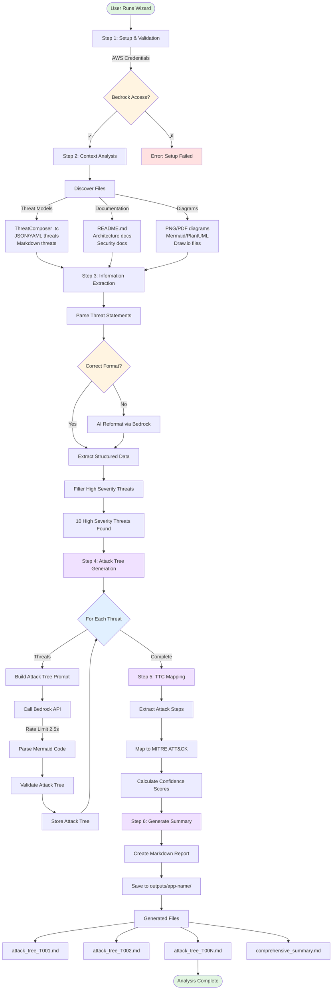

# ThreatForest - AI-Driven Threat Modeling & Attack Tree Generation

## Overview

ThreatForest is an automated threat modeling application that leverages AWS Bedrock AI models to analyze applications and generate comprehensive attack trees with MITRE ATT&CK mappings. It transforms threat statements into visual attack trees, helping security teams understand potential attack paths and prioritize defenses.

## Key Features

- **Automated Threat Analysis**: Extracts and analyzes threat statements from multiple formats (ThreatComposer, JSON, Markdown)
- **AI-Powered Attack Trees**: Generates detailed Mermaid attack trees for high-severity threats using Claude models
- **MITRE ATT&CK Mapping**: Maps attack steps to MITRE ATT&CK techniques with confidence scores
- **Multi-Format Support**: Processes ThreatComposer files (.tc), threat models (JSON/YAML), architecture diagrams (PNG/PDF), and documentation
- **Intelligent Reformatting**: Automatically reformats incorrectly structured threat files using AI
- **Comprehensive Reports**: Generates markdown reports with attack trees, threat summaries, and security recommendations

## Architecture

ThreatForest uses a **Strands-based orchestration** pattern with specialized tools:

### Core Components

1. **Orchestrator** (`strands_agent.py`): Coordinates the workflow across all tools
2. **Setup Tool**: Validates AWS credentials and Bedrock access
3. **Context Analysis Tool**: Discovers and analyzes project files (threats, diagrams, docs)
4. **Information Extraction Tool**: Parses threat statements and extracts structured data
5. **Attack Tree Generator Tool**: Creates Mermaid attack trees for high-severity threats
6. **TTC Mapping Tool**: Maps attack steps to MITRE ATT&CK techniques
7. **Summary Generator Tool**: Produces comprehensive markdown reports

### Technology Stack

- **Language**: Python 3.8+
- **AI Models**: AWS Bedrock (Claude Sonnet 4, Opus 4, Haiku)
- **Orchestration**: Custom Strands-based agent framework
- **Output Format**: Mermaid diagrams, Markdown reports
- **Threat Parsing**: JQ for ThreatComposer, regex for markdown

## Process Flow



## Detailed Workflow

### Step 1: Setup & Validation
- Validates AWS credentials and profile configuration
- Tests Bedrock API access in us-east-1 region
- Verifies selected AI model availability
- Checks project directory structure

### Step 2: Context Analysis
**File Discovery:**
- Scans project directory for threat models, documentation, and diagrams
- Prioritizes ThreatComposer files (.tc.json)
- Identifies architecture diagrams (PNG, PDF, Mermaid, PlantUML, Draw.io)
- Collects README and security documentation

**Enhanced Context Extraction:**
- Uses Bedrock to analyze diagrams and extract architectural context
- Identifies technologies, components, and data flows
- Extracts security controls and deployment information

### Step 3: Information Extraction
**Threat Statement Parsing:**
- Processes ThreatComposer files using JQ parser
- Extracts threats from JSON/YAML threat models
- Parses markdown threat files with structured format

**Format Validation:**
- Checks if threats follow required syntax: "A [threat source] with [prerequisites], can [threat action], which leads to [threat impact], resulting in [reduced goal] of [impacted assets]"
- If incorrect format detected, reformats via Bedrock AI
- Creates `threats_reformatted_threat_statements.md` with corrected format

**Threat Classification:**
- Filters threats by severity (High, Medium, Low)
- Extracts structured fields: threatSource, prerequisites, threatAction, threatImpact, impactedGoal, impactedAssets
- Assigns sequential IDs (T001, T002, etc.)

### Step 4: Attack Tree Generation
**For Each High-Severity Threat:**
1. Loads attack tree generation prompt template
2. Builds context with threat details and application info
3. Calls Bedrock API with rate limiting (2.5s between calls)
4. Implements exponential backoff retry (3 attempts: 2s, 4s, 8s)
5. Extracts Mermaid code from AI response
6. Validates attack tree structure (nodes, connections, classifications)
7. Saves individual attack tree markdown file

**Attack Tree Structure:**
- **Goal Nodes** (orange): Ultimate attacker objectives
- **Attack Nodes** (red): Malicious actions and exploits
- **Fact Nodes** (blue): Initial conditions and vulnerabilities
- **Mitigation Nodes** (green): Defensive measures (optional)

### Step 5: MITRE ATT&CK Mapping (Optional)
- Extracts attack steps from generated trees
- Maps steps to MITRE ATT&CK techniques using:
  - Local STIX data (if available)
  - Bedrock AI analysis (fallback)
- Calculates confidence scores for mappings
- Enriches attack trees with technique IDs and tactics

### Step 6: Summary Generation
**Comprehensive Report Includes:**
- Executive summary with threat overview
- Application context and technologies
- High-severity threat list with descriptions
- Attack tree summaries with key attack paths
- MITRE ATT&CK technique mappings
- Security recommendations
- Output file inventory

## Input Formats

### Threat Models (Recommended)

#### ThreatComposer Workspace (.tc.json) ⭐ **BEST**
```json
{
  "applicationInfo": {
    "name": "My Application",
    "description": "E-commerce platform"
  },
  "threats": [
    {
      "id": "uuid",
      "statement": "A [source] with [prerequisites], can [action]...",
      "priority": "High"
    }
  ]
}
```

#### Generic Threat Model (JSON/YAML)
```json
{
  "application_info": {
    "name": "My App",
    "technologies": ["AWS", "React", "Node.js"]
  },
  "threats": [
    {
      "id": "T001",
      "statement": "Threat statement following required syntax",
      "priority": "High",
      "category": "Injection"
    }
  ]
}
```

#### Markdown Threat File
```markdown
# Threat Statements

## High Priority Threats

#### T001 - SQL Injection

**Threat Statement**: A malicious attacker with network access, can perform SQL injection attacks, which leads to unauthorized data access, resulting in reduced confidentiality of customer database.

- **Threat Source**: Malicious attacker
- **Prerequisites**: Network access
- **Threat Action**: Perform SQL injection attacks
- **Threat Impact**: Unauthorized data access
- **Reduced Goal**: Confidentiality
- **Impacted Assets**: Customer database
- **Priority**: High
```

### Supporting Files

- **Architecture Diagrams**: PNG, PDF, JPG, Mermaid (.mmd), PlantUML (.puml), Draw.io (.drawio)
- **Documentation**: README.md, security docs, API docs, deployment guides
- **Configuration**: YAML/JSON config files with security settings

## Output Structure

```
outputs/
└── application-name/
    ├── attack_tree_T001_Threat_Category.md
    ├── attack_tree_T002_Threat_Category.md
    ├── ...
    ├── attack_tree_T010_Threat_Category.md
    └── comprehensive_summary.md
```

### Attack Tree File Format
Each attack tree file contains:
- Threat statement and metadata
- Mermaid attack tree diagram
- Attack step descriptions
- MITRE ATT&CK mappings (if enabled)
- Validation results

## Configuration

### AWS Requirements
- **Region**: us-east-1 (Bedrock)
- **Credentials**: AWS profile or default credentials
- **Permissions**: bedrock:InvokeModel

### Recommended Models
1. **Claude Sonnet 4** (`us.anthropic.claude-sonnet-4-20250514-v1:0`) - Best balance ⭐
2. **Claude Opus 4.1** (`us.anthropic.claude-opus-4-1-20250805-v1:0`) - Most powerful
3. **Claude 3.5 Sonnet** (`anthropic.claude-3-5-sonnet-20241022-v2:0`) - Fast
4. **Claude 3.5 Haiku** (`anthropic.claude-3-5-haiku-20241022-v1:0`) - Fastest

### Rate Limiting & Retry Configuration
```python
rate_limit_delay = 2.5  # seconds between API calls
max_retries = 3         # retry attempts
base_backoff = 2        # exponential backoff base (2s, 4s, 8s)
```

## Usage

### Quick Start
```bash
# Setup virtual environment
python3 -m venv venv
source venv/bin/activate
pip install -r requirements.txt

# Run wizard
python threatforest_wizard.py
```

### Wizard Steps
1. **AWS Configuration**: Select profile, verify Bedrock access
2. **Model Selection**: Choose AI model (Claude Sonnet 4 recommended)
3. **Project Path**: Select directory with threat models and docs
4. **Review**: Confirm settings and discovered files
5. **Analysis**: Run complete ThreatForest workflow

### Expected Runtime
- **Setup & Context**: 10-30 seconds
- **Information Extraction**: 30-60 seconds
- **Attack Tree Generation**: 5-10 seconds per threat (with rate limiting)
  - 10 threats ≈ 50-100 seconds
- **Summary Generation**: 10-20 seconds
- **Total**: ~2-4 minutes for 10 high-severity threats

## Error Handling

### Bedrock Throttling
- Automatic exponential backoff (2s → 4s → 8s)
- User-visible error messages in terminal
- Comprehensive error logging

### Format Issues
- Automatic threat file reformatting via AI
- Fallback to legacy extraction methods
- Validation warnings for incomplete data

### Missing Context
- AI generates threats if none found
- Uses available documentation and diagrams
- Provides warnings about limited context

## Best Practices

### For Optimal Results
1. **Use ThreatComposer**: Create workspace at https://awslabs.github.io/threat-composer/
2. **Include Priorities**: Ensure threats have High/Medium/Low classifications
3. **Add Context**: Include README with technology stack and architecture
4. **Use Diagrams**: Visual representations help AI understand system boundaries
5. **Follow Syntax**: Use required threat statement format for consistency

### File Organization
```
project/
├── README.md                          # Application overview
├── ThreatComposer_Workspace.tc       # Threat model
├── architecture.png                   # System diagram
├── docs/
│   ├── security-requirements.md
│   └── api-documentation.md
└── diagrams/
    ├── data-flow.mmd
    └── deployment.pdf
```

## Troubleshooting

### No Attack Trees Generated
- Check: Are threats marked as "High" severity/priority?
- Check: Is Bedrock accessible in us-east-1?
- Check: Are AWS credentials valid?

### Only 5 Attack Trees Generated
- **Fixed**: Removed hardcoded limit in wizard
- All high-severity threats now processed

### Incorrect Threat Counts
- **Fixed**: Added `_fix_threat_counts()` to correct header counts
- Counts now match actual threats in file

### Bedrock Throttling
- **Fixed**: Added rate limiting (2.5s) and exponential backoff
- Errors now visible in terminal with retry status

## Limitations

- **High-Severity Only**: Attack trees generated only for High priority threats
- **Sequential Processing**: Threats processed one at a time (rate limiting)
- **Bedrock Dependency**: Requires AWS Bedrock access in us-east-1
- **English Only**: Optimized for English language threat statements

## Future Enhancements

- [ ] Parallel attack tree generation for faster processing
- [ ] Support for Medium/Low severity threat trees (configurable)
- [ ] Interactive attack tree editing
- [ ] Export to other formats (PDF, HTML, JSON)
- [ ] Integration with CI/CD pipelines
- [ ] Multi-language support
- [ ] Custom attack tree templates
- [ ] Threat prioritization recommendations

## Contributing

ThreatForest is an internal tool. For issues or enhancements:
1. Check existing documentation
2. Review logs in `threatforest_output/`
3. Contact the development team

## License

Internal Amazon tool - proprietary.

---

**Version**: 1.0  
**Last Updated**: 2025-10-03  
**Maintained By**: ThreatForest Development Team
