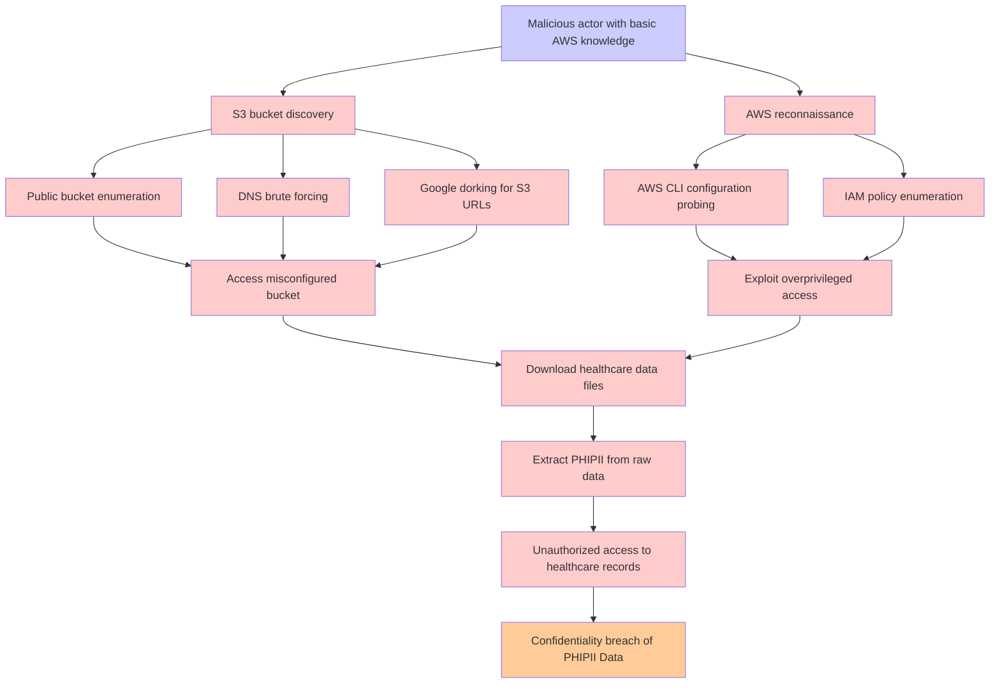

# Attack Tree: Storage Configuration Breach

**Threat ID**: T002  
**Associated threat statement**: A malicious actor with basic AWS knowledge, can exploit misconfigured S3 bucket permissions, which leads to exposure of raw healthcare data to unauthorized users or public access, resulting in reduced confidentiality of PHI/PII Data.

## Attack Tree Diagram

## Attack Path Analysis

This attack tree represents the potential attack paths for the identified threat. Each node in the tree represents either:
- **Attack Goal** (orange): The ultimate objective
- **Attack Step** (red): Individual attack actions
- **Fact/Condition** (blue): Prerequisites or conditions
- **Mitigation** (green): Defensive measures

Review this attack tree to:
1. Identify critical attack paths
2. Implement appropriate security controls
3. Monitor for indicators of these attack patterns
4. Develop incident response procedures

---
*Generated by ThreatForest - Attack Tree Analysis*
