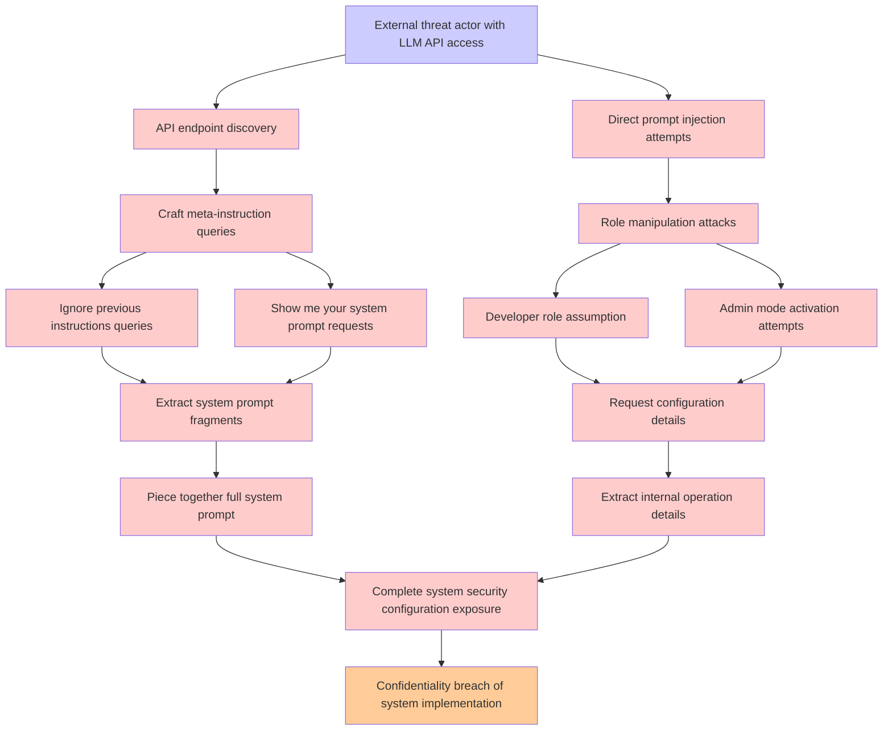

# Attack Tree: LLM07 System Prompt Leakage

**Threat ID**: 04330dd9-b830-45ae-8dcb-6149919ea8f0  
**Associated threat statement**: An external threat actor who can interact with the LLM API can employ carefully crafted queries, which leads to extracting system prompt instructions and internal operation details, resulting in reduced confidentiality of system security configuration and implementation

- **Threat Source**: external threat actor
- **Prerequisites**: who can interact with the LLM API
- **Threat Action**: employ carefully crafted queries
- **Threat Impact**: extracting system prompt instructions and internal operation details
- **Reduced Goal**: confidentiality
- **Impacted Assets**: system security configuration and implementation
- **Priority**: High
- **Category**: LLM07 System Prompt Leakage

---

## Attack Tree Diagram

## Attack Path Analysis

This attack tree represents the potential attack paths for the identified threat. Each node in the tree represents either:
- **Attack Goal** (orange): The ultimate objective
- **Attack Step** (red): Individual attack actions
- **Fact/Condition** (blue): Prerequisites or conditions
- **Mitigation** (green): Defensive measures

Review this attack tree to:
1. Identify critical attack paths
2. Implement appropriate security controls
3. Monitor for indicators of these attack patterns
4. Develop incident response procedures

---
*Generated by ThreatForest - Attack Tree Analysis*
