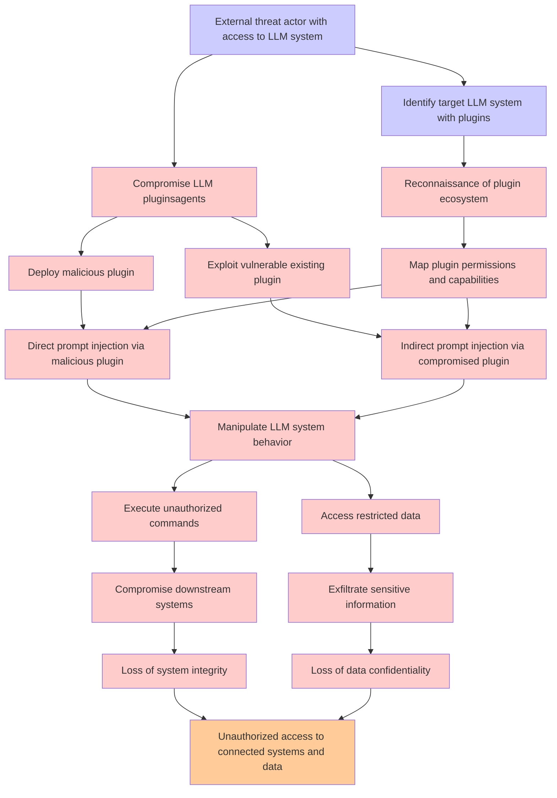

# Attack Tree: LLM01 Prompt Injection, LLM06 Excessive Agency

**Threat ID**: 0a054002-03d9-41cb-8b1d-1c9492c3fbb6  
**Associated threat statement**: An external threat actor who enables compromised LLM plugins or agents in an LLM system can manipulate it via indirect or direct prompt injection, which leads to access unauthorized functionality or data, resulting in reduced confidentiality and/or integrity of connected and downstream systems and data

- **Threat Source**: external threat actor
- **Prerequisites**: who enables compromised LLM plugins or agents in a LLM system
- **Threat Action**: manipulate it via indirect or direct prompt injection
- **Threat Impact**: access unauthorized functionality or data
- **Reduced Goal**: confidentiality, integrity
- **Impacted Assets**: connected and downstream systems and data
- **Priority**: High
- **Category**: LLM01 Prompt Injection, LLM06 Excessive Agency

---

## Attack Tree Diagram

## Attack Path Analysis

This attack tree represents the potential attack paths for the identified threat. Each node in the tree represents either:
- **Attack Goal** (orange): The ultimate objective
- **Attack Step** (red): Individual attack actions
- **Fact/Condition** (blue): Prerequisites or conditions
- **Mitigation** (green): Defensive measures

Review this attack tree to:
1. Identify critical attack paths
2. Implement appropriate security controls
3. Monitor for indicators of these attack patterns
4. Develop incident response procedures

---
*Generated by ThreatForest - Attack Tree Analysis*
