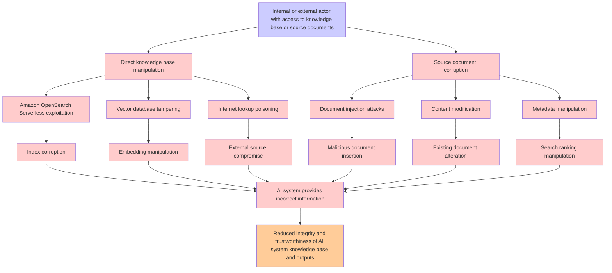

# Attack Tree: LLM08 VectorEmbedding Weakness

**Threat ID**: 12c09063-e456-445d-adee-5b84840fa213  
**Associated threat statement**: An internal or external actor with access to the knowledge base or its source documents can corrupt or manipulate the RAG knowledge base (e.g. Amazon OpenSearch Serverless, Internet lookup), which leads to AI system providing incorrect or malicious information, resulting in reduced integrity and/or trustworthiness of AI system's knowledge base and outputs.

- **Threat Source**: internal or external actor
- **Prerequisites**: with access to the knowledge base or its source documents
- **Threat Action**: corrupt or manipulate the RAG knowledge base (e.g. Amazon OpenSearch Serverless, Internet lookup)
- **Threat Impact**: AI system providing incorrect or malicious information
- **Reduced Goal**: integrity, trustworthiness
- **Impacted Assets**: AI system's knowledge base and outputs.
- **Priority**: High
- **Category**: LLM08 VectorEmbedding Weakness

---

## Attack Tree Diagram

## Attack Path Analysis

This attack tree represents the potential attack paths for the identified threat. Each node in the tree represents either:
- **Attack Goal** (orange): The ultimate objective
- **Attack Step** (red): Individual attack actions
- **Fact/Condition** (blue): Prerequisites or conditions
- **Mitigation** (green): Defensive measures

Review this attack tree to:
1. Identify critical attack paths
2. Implement appropriate security controls
3. Monitor for indicators of these attack patterns
4. Develop incident response procedures

---
*Generated by ThreatForest - Attack Tree Analysis*
