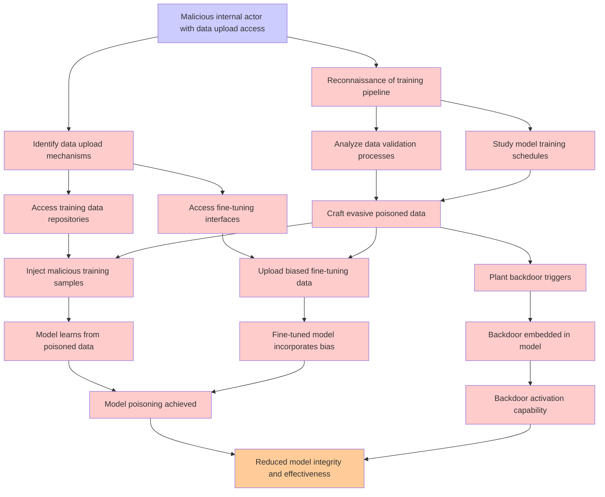

# Attack Tree: LLM04 Data/Model Poisoning

**Threat ID**: 1696e6d2-1656-4f1f-8484-a4f0490e102e  
**Associated threat statement**: A malicious internal actor with access to upload training or fine tuning data can intentionally introduce manipulated, biased or malicious data, which leads to model poisoning or backdoors, resulting in reduced integrity and/or effectiveness of the LLM model

- **Threat Source**: malicious internal actor
- **Prerequisites**: with access to upload training or fine tuning data
- **Threat Action**: intentionally introduce manipulated, biased or malicious data
- **Threat Impact**: model poisoning or backdoors
- **Reduced Goal**: integrity, effectiveness
- **Impacted Assets**: the LLM model
- **Priority**: High
- **Category**: LLM04 Data/Model Poisoning

---

## Attack Tree Diagram

## Attack Path Analysis

This attack tree represents the potential attack paths for the identified threat. Each node in the tree represents either:
- **Attack Goal** (orange): The ultimate objective
- **Attack Step** (red): Individual attack actions
- **Fact/Condition** (blue): Prerequisites or conditions
- **Mitigation** (green): Defensive measures

Review this attack tree to:
1. Identify critical attack paths
2. Implement appropriate security controls
3. Monitor for indicators of these attack patterns
4. Develop incident response procedures

---
*Generated by ThreatForest - Attack Tree Analysis*
