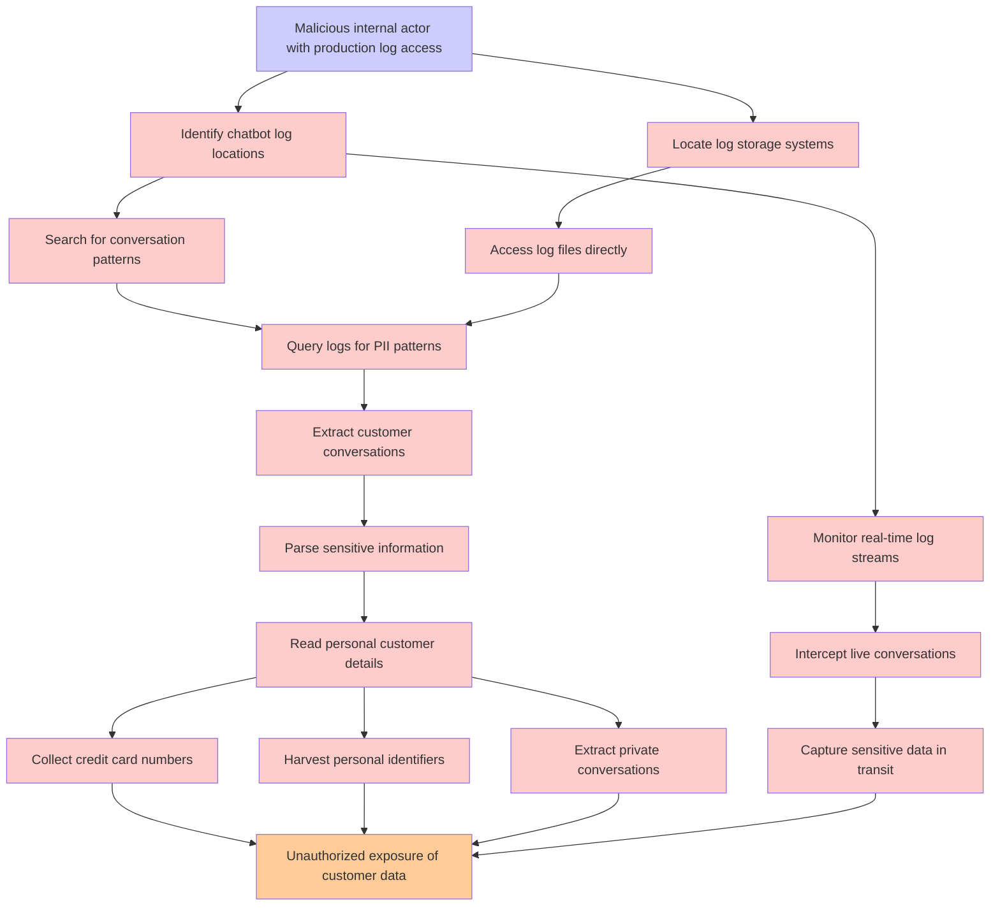

# Attack Tree: LLM02 SensitiveInfo Disclosure

**Threat ID**: 26ae875e-296d-4151-99a9-dbd6287d851a  
**Associated threat statement**: A malicious internal actor who has access to production logs can read sensitive customer information contained in chatbot conversation logs, which leads to unauthorized exposure of personal customer details, resulting in reduced confidentiality of impacted individuals and sensitive data

- **Threat Source**: malicious internal actor
- **Prerequisites**: who has access to production logs
- **Threat Action**: read sensitive customer information contained in chatbot conversation logs
- **Threat Impact**: unauthorized exposure of personal customer details
- **Reduced Goal**: confidentiality
- **Impacted Assets**: impacted individuals and sensitive data
- **Priority**: High
- **Category**: LLM02 SensitiveInfo Disclosure

---

## Attack Tree Diagram

## Attack Path Analysis

This attack tree represents the potential attack paths for the identified threat. Each node in the tree represents either:
- **Attack Goal** (orange): The ultimate objective
- **Attack Step** (red): Individual attack actions
- **Fact/Condition** (blue): Prerequisites or conditions
- **Mitigation** (green): Defensive measures

Review this attack tree to:
1. Identify critical attack paths
2. Implement appropriate security controls
3. Monitor for indicators of these attack patterns
4. Develop incident response procedures

---
*Generated by ThreatForest - Attack Tree Analysis*
