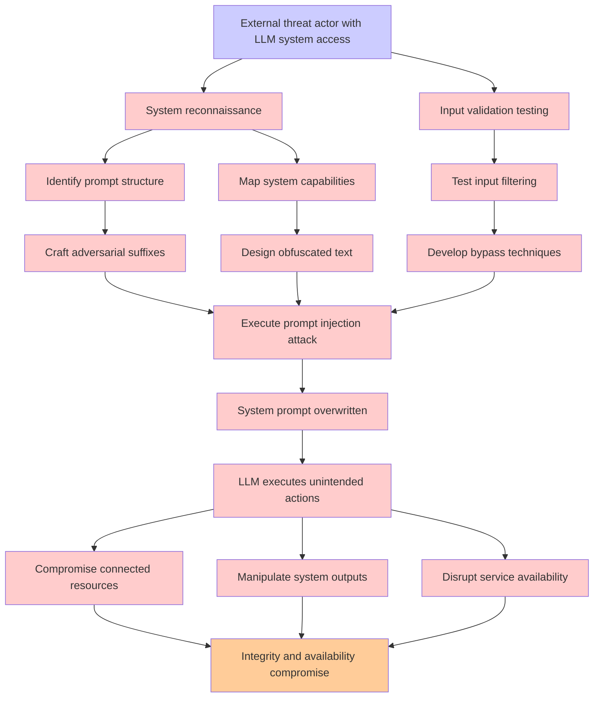

# Attack Tree: LLM01 Prompt Injection

**Threat ID**: 3c4b9ded-09ef-4bc1-8fdd-845009e1a273  
**Associated threat statement**: An external threat actor with ability to interact with an LLM system can overwrite the system prompt with crafted prompts, including through adversarial suffixes and obfuscated text, which leads to force unintended actions from the LLM, resulting in reduced integrity and/or availability of LLM system and connected resources

- **Threat Source**: external threat actor
- **Prerequisites**: with ability to interact with an LLM system
- **Threat Action**: overwrite the system prompt with crafted prompts, including through adversarial suffixes and obfuscated text
- **Threat Impact**: force unintended actions from the LLM
- **Reduced Goal**: integrity, availability
- **Impacted Assets**: LLM system and connected resources
- **Priority**: High
- **Category**: LLM01 Prompt Injection

---

## Attack Tree Diagram

## Attack Path Analysis

This attack tree represents the potential attack paths for the identified threat. Each node in the tree represents either:
- **Attack Goal** (orange): The ultimate objective
- **Attack Step** (red): Individual attack actions
- **Fact/Condition** (blue): Prerequisites or conditions
- **Mitigation** (green): Defensive measures

Review this attack tree to:
1. Identify critical attack paths
2. Implement appropriate security controls
3. Monitor for indicators of these attack patterns
4. Develop incident response procedures

---
*Generated by ThreatForest - Attack Tree Analysis*
