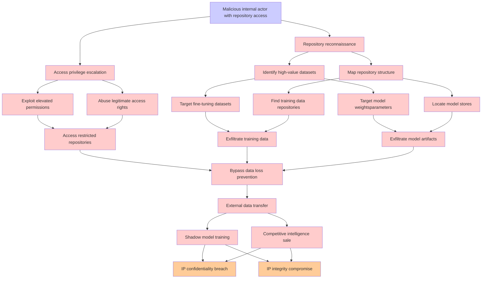

# Attack Tree: LLM03 Supply Chain, LLM02 SensitiveInfo Disclosure

**Threat ID**: 463f80c0-9786-4cfb-a3fb-30cc07f47ae1  
**Associated threat statement**: A malicious internal actor with access to model artifact repositories (for example, fine tuning data, model stores) can exfiltrate proprietary LLM data, which leads to competitive misuse or training of shadow models, resulting in reduced confidentiality and/or integrity of intellectual property

- **Threat Source**: malicious internal actor
- **Prerequisites**: with access to model artifact repositories (for example, fine tuning data, model stores)
- **Threat Action**: exfiltrate proprietary LLM data
- **Threat Impact**: competitive misuse or training of shadow models
- **Reduced Goal**: confidentiality, integrity
- **Impacted Assets**: intellectual property
- **Priority**: High
- **Category**: LLM03 Supply Chain, LLM02 SensitiveInfo Disclosure

---

## Attack Tree Diagram

## Attack Path Analysis

This attack tree represents the potential attack paths for the identified threat. Each node in the tree represents either:
- **Attack Goal** (orange): The ultimate objective
- **Attack Step** (red): Individual attack actions
- **Fact/Condition** (blue): Prerequisites or conditions
- **Mitigation** (green): Defensive measures

Review this attack tree to:
1. Identify critical attack paths
2. Implement appropriate security controls
3. Monitor for indicators of these attack patterns
4. Develop incident response procedures

---
*Generated by ThreatForest - Attack Tree Analysis*
