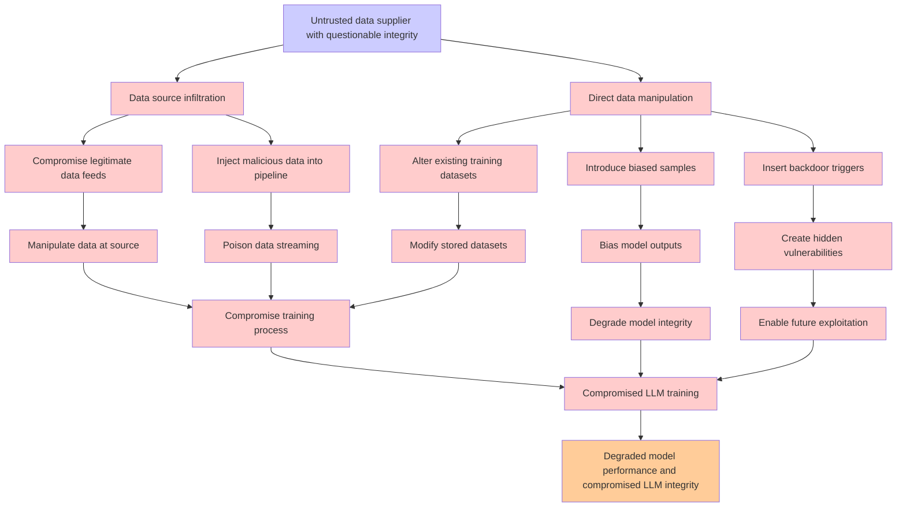

# Attack Tree: LLM04 Data/Model Poisoning

**Threat ID**: 7dc2a880-a3fa-4e34-ad0a-ae38e559e635  
**Associated threat statement**: An untrusted data supplier with questionable integrity can provide manipulated, biased, or malicious training data, which leads to degraded model performance and compromised training, resulting in reduced integrity and/or robustness of the LLM model

- **Threat Source**: untrusted data supplier
- **Prerequisites**: with questionable integrity
- **Threat Action**: provide manipulated, biased, or malicious training data
- **Threat Impact**: degraded model performance and compromised training
- **Reduced Goal**: integrity, robustness
- **Impacted Assets**: the LLM model
- **Priority**: High
- **Category**: LLM04 Data/Model Poisoning

---

## Attack Tree Diagram

## Attack Path Analysis

This attack tree represents the potential attack paths for the identified threat. Each node in the tree represents either:
- **Attack Goal** (orange): The ultimate objective
- **Attack Step** (red): Individual attack actions
- **Fact/Condition** (blue): Prerequisites or conditions
- **Mitigation** (green): Defensive measures

Review this attack tree to:
1. Identify critical attack paths
2. Implement appropriate security controls
3. Monitor for indicators of these attack patterns
4. Develop incident response procedures

---
*Generated by ThreatForest - Attack Tree Analysis*
