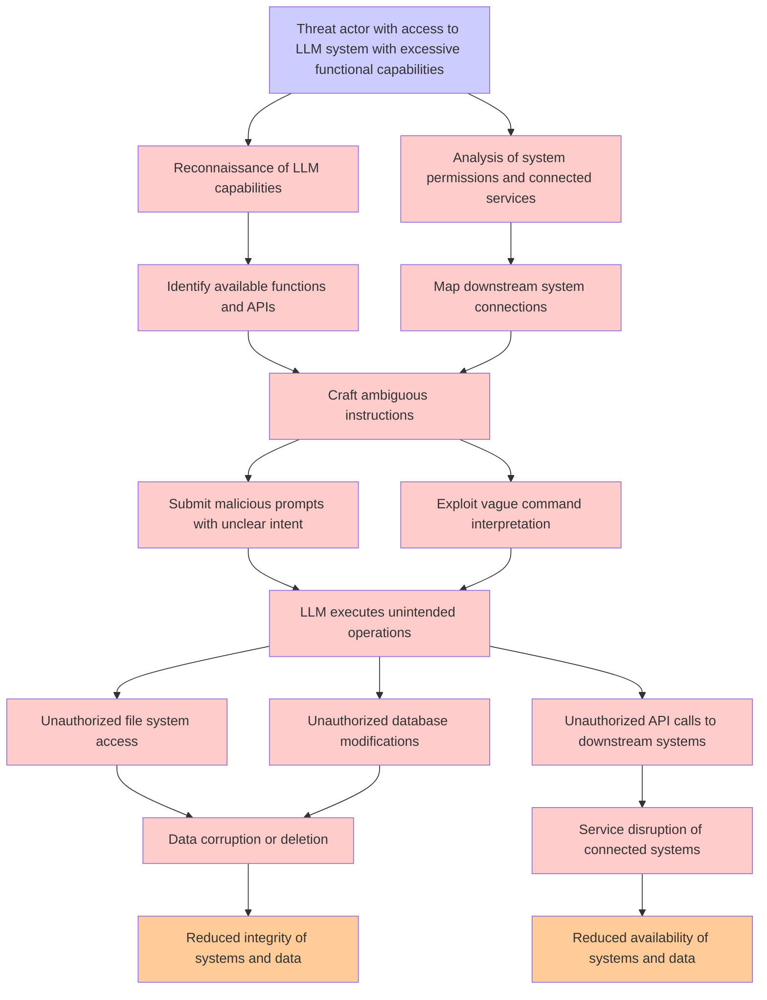

# Attack Tree: LLM06 Excessive Agency

**Threat ID**: 8b755706-59d2-41c4-9075-0013b92af39a  
**Associated threat statement**: An external or internal threat actor who has access to an LLM system with excessive functional capabilities can abuse those capabilities when operating under ambiguous instructions, which leads to unauthorized operations, resulting in reduced integrity and/or availability of connected and downstream systems and data

- **Threat Source**: external or internal threat actor
- **Prerequisites**: who has access to an LLM system with excessive functional capabilities
- **Threat Action**: abuse those capabilities when operating under ambiguous instructions
- **Threat Impact**: unauthorized operations
- **Reduced Goal**: integrity, availability
- **Impacted Assets**: connected and downstream systems and data
- **Priority**: High
- **Category**: LLM06 Excessive Agency

---

## Attack Tree Diagram

## Attack Path Analysis

This attack tree represents the potential attack paths for the identified threat. Each node in the tree represents either:
- **Attack Goal** (orange): The ultimate objective
- **Attack Step** (red): Individual attack actions
- **Fact/Condition** (blue): Prerequisites or conditions
- **Mitigation** (green): Defensive measures

Review this attack tree to:
1. Identify critical attack paths
2. Implement appropriate security controls
3. Monitor for indicators of these attack patterns
4. Develop incident response procedures

---
*Generated by ThreatForest - Attack Tree Analysis*
